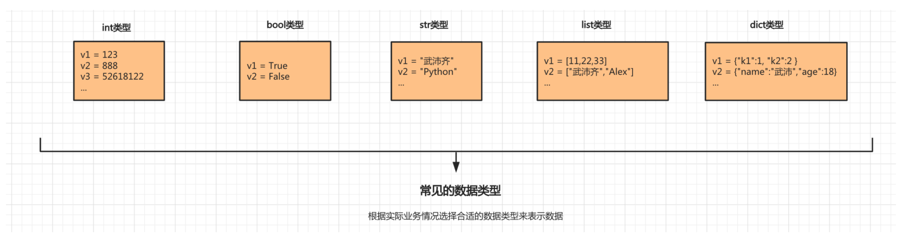
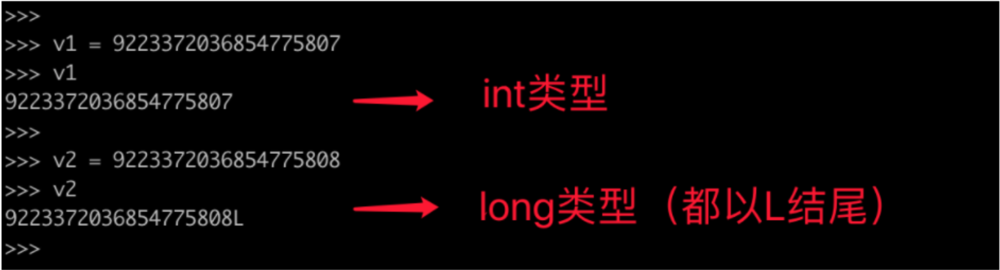
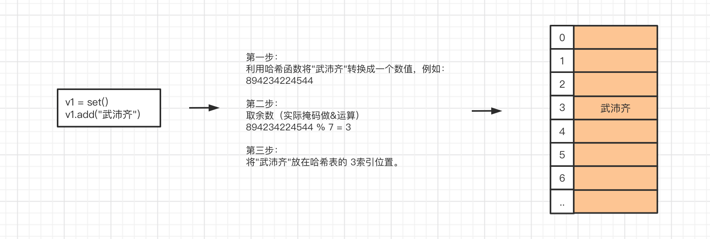
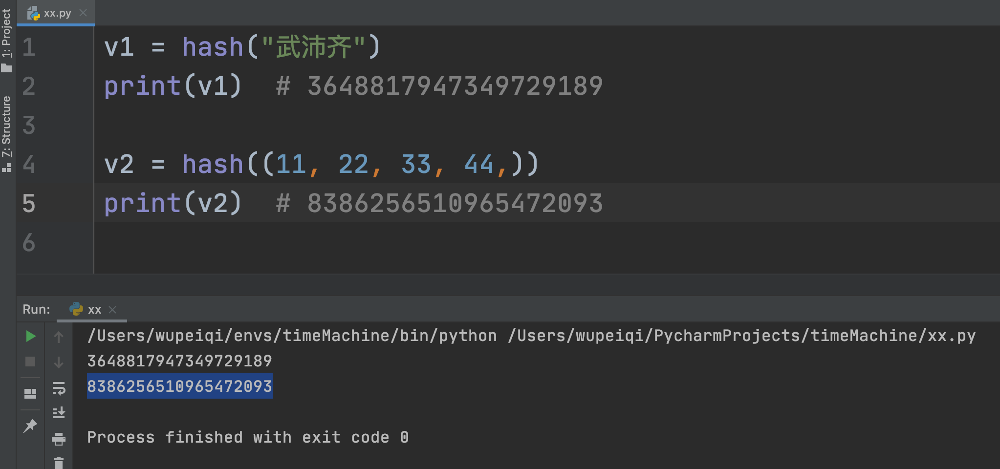
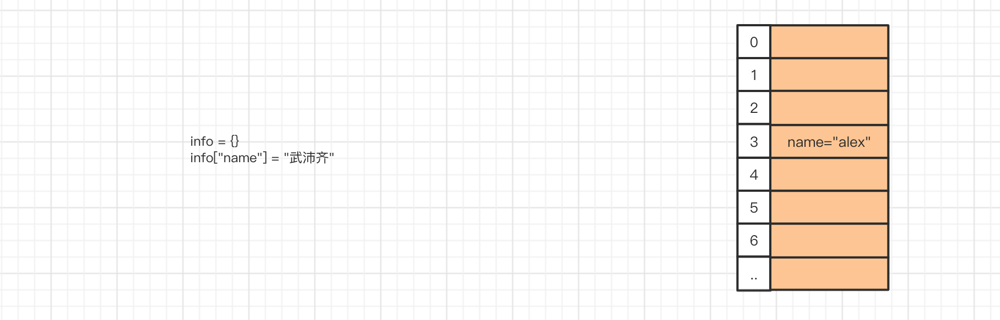
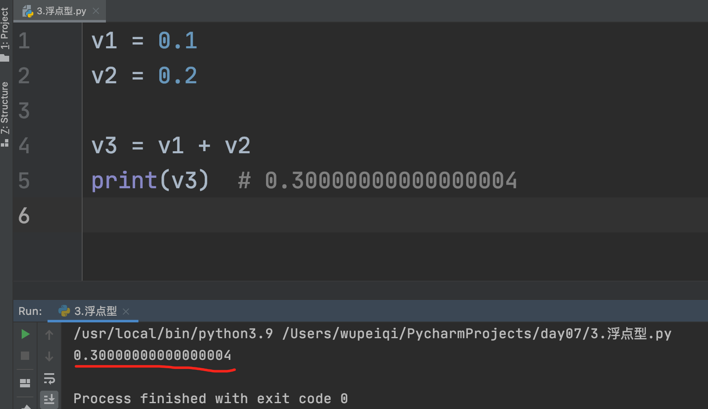

# day01-计算机基础和环境搭建

课程目标：

- 计算机基础知识

- Python环境搭建

课程概要：

- 计算机基础
- 编程的本质
- Python的介绍
- Python环境的搭建

## 1. 计算机基础

### 1.1 基本概念

- 计算机的组成

  ```
  计算机是由多个硬件组合而成，常见的硬件：CPU、硬盘、内存、网卡、显示器、机箱、电源...
  ```

- 操作系统

  ```
  用于协调计算机的各个硬件，让硬件之间进行协调工作，以完成某个目标
  常见的操作系统分类：
  - windows，优点：生态牛、工具多；缺点：略慢、收费。【个人】
  	- xp
  	- win7
  	- win10
  	...
  - linux，优点：资源占用少、免费（用Linux做服务器）；缺点：工具少、告别游戏。【企业服务器】
  	- centos
  	- ubuntu
  	- redhat
  	...
  - mac，优点：生态还可、工具基本都有、用户体验和交互强；缺点：不能玩游戏（底层Linux）
  ```

- 软件（应用程序）

  ```
  安装操作系统之后，安装常用的软件：微信、QQ...
  软件来源：程序员开发、代码编写1.2编程语言
  ```

### 1.2 编程语言

常见编程语言：Java、C#、Python、PHP、C...

- Python语法规则

  ```python
  print("你好")
  ```

- Golang语法规则

  ```go
  fmt.Println("你好")
  ```

### 1.3 编译器/解释器

编译器/解释器，将代码翻译成计算机能够识别的命令。

```
A-Python开发了软件1				B开发了GoLang软件2

	Python解释器					GoLang编译器

					操作系统
			cpu 硬盘 网卡 内存 电源...
```

解释器和编译器的区别：

- 解释器：实时翻译。拿到1000行代码后，解释一句交给操作系统一句。
  - 直接执行用编程语言编写的指令的程序
- 编译器：全文翻译。拿到2000行代码后会将它编译成一个临时文件（计算机能够识别），再把文件交给操作系统读取。
  - 把源代码转换成(翻译)低级语言的程序

Python、PHP、Javascript、Ruby，一般称为**解释型语言**。

C、C++、Go、Java，一般称为**编译型语言**。

## 2. 学习编程的本质

三件事：

- 选择一门编程语言，在自己的电脑上安装该编程语言相关的 编译器/解释器。
- 学习编程语言的语法规则，根据语法规则+业务背景设计并开发你的软件（代码集合）。
- 使用编译器/解释器 运行自己写的代码。

## 3. Python的介绍

### 3.1 语言的分类

- 翻译的维度
  - 解释性语言，Python、PHP、Javascript、Ruby...
  - 编译型语言，C、C++、Go、Java...

- 高低的维度

  - 低级编程语言，代码可以直接被计算机识别。

    ```
    机器语言，“0”、“1”--机器码，交给计算机执行，如：1010000100100。
    汇编语言，MOV、INC，...，指令（代替机器码），交给计算机执行。
    ```

  - 高级编程语言，代码无法直接被计算机识别，但可以通过某种方式转换为计算机可以识别的语言。

    ```
    C、C++、Java、Python、Ruby...这类编程语言在编写时几乎是写英语作文。
    交由相关的编译器或者解释器，翻译成机器码，然后再交给计算机去执行。
    ```

  **注意**：现在基本都使用高级编程语言（开发效率高）。

### 3.2 Python介绍

> Pythonde 创始人为吉多·范罗苏姆（Guido van Rossum）。1989年的圣诞节期间，Guido开始写Python语言的编译器。Python这个名字，来自Guido所挚爱的电视剧Monty Python‘s Flying Circus。他希望这个新的叫做Python的语言，能符合他的理想：创造一种C和Shell之间，功能全面，易学易用，可拓展的语言。

全球众多编程语言中，目前Python位居TIOBE排行榜第三名并且一直呈上升趋势。

- 语法简洁&适合零基础，相比较于其他编程语言Python的学习成本非常低，甚至可以让其他行业的人快速掌握编程技能，通过编程提高工作效率，例如：

​		Excel自动化办公、文件和文件夹的处理等。

- 类库强大，Python自诞生之初就任其自然生长，经过多年的发展，造就其在很多领域都是积累了很多方便的类库，自然也成为了运维自动化、数据分析、机器学习首选编程语言。

- 开发效率高，结合Python语法精炼和类库齐全的特点，所以在使用Python进行开发时可以用更少的代码完成更多的功能，大大提升开发效率。例如：

  Python10行代码实现的功能，用其他语言可能需要100+行才能完成。

### 3.3 Python的解释器种类（了解）

因Python的爆火，很多公司开发了Python的解释器（用来翻译python代码成为计算机能够识别的命令）。

- CPython【主流】，底层由C语言开发出来的Python解释器。
- Jython，是由Java语言开发出来的Python解释器，方便让Python和Java代码做集成。
- IronPython，基于C#语言开发出来的Python解释器，方便让Python和C#代码做集成。
- RubyPython，...
- PyPy，是对CPython的优化，执行效率提高了。引入编译器的功能，本质上将Python代码进行编译，再去执行编译后的代码。
- ...

**注意**：常说的Python解释器，默认指的是CPython解释器。


### 3.4 CPython解释器的版本

主要有两大版本：

- 2.x，目前最新的Python2.7.18（2020后不再维护）
- 3.x，目前最新的3.9.0版本。


## 4. 环境搭建

- Python解释器，将编写的代码翻译成计算机能够识别的指令。
  - 主流CPython
  - 3.9.0版本
- 学习编程本质上的3件事
  - 安装CPython3.9.0版本解释器
  - 学习Python语法并写代码
  - 解释器运行代码

### 4.1 安装Python解释器

#### 4.1.1 mac系统

- 官网下载Python解释器（3.9.0）

```
https://www.python.org/
```

- 安装

```
默认Python解释器安装目录：
/Library/Frameworks/Python.framework/Versions/3.9

在bin目录下有一个python3.9文件，就是Python解释器的启动文件:
/Library/Frameworks/Python.framework/Versions/3.9/bin/python3.9

```

- 写一个简单的Python代码运行解释器

hello.py

```python
name = input("请输入用户名：")
print("欢迎使用NB系统：", name)
```

​	运行代码hello.py文件：

```
- 打开终端
- 终端输入：解释器 代码文件
/Library/Frameworks/Python.framework/Versions/3.9/bin/python3.9 /users/xxx/Documents/hello.py
```

- 【补充】系统环境变量

  ```
  - 假设有30个Python文件要运行
  	/Library/Frameworks/Python.framework/Versions/3.9/bin/python3.9 /users/xxx/Documents/hello1.py
  	...
  	/Library/Frameworks/Python.framework/Versions/3.9/bin/python3.9 /users/xxx/Documents/hello2.py
  	
  - 不用每次都写解释器的路径
  	- 将/Library/Frameworks/Python.framework/Versions/3.9/bin 添加到系统的环境变量中
  		python3.9 /users/xxx/Documents/hello1.py
  		...
  		python3.9 /users/xxx/Documents/hello2.py
  
  - 如何添加系统环境变量：
  	- 默认Python解释器在安装过程中已经自动添加了
  	- 自己添加：
  		- 打开用户目录下的 .bash_profile文件(.zprofile)
  		- 在文件中添加：
  		PATH="/Library/Frameworks/Python.framework/Versions/3.9/bin:${PATH}"
  		export PATH
  ```


#### 4.1.2 windows系统

- 官网下载Python解释器（3.9.0）

```
- https://www.python.org/downloads/release/python-390/
- Windows x86-64 executable installer
```

- 安装

```
Python解释安装目录：D:yaoyk/Python39
Python解释器：D:yaoyk/Python39/python.exe
```

- 写一个简单的Python代码运行解释器

hello.py

```
name = input("请输入用户名：")
print("欢迎使用NB系统：", name)
```

运行代码hello.py文件：

```
- 打开终端
  cmd
- 在终端输入 解释器路径 代码路径
  D:yaoyk/Python39/python.exe D:\yaoyk\PythonProject\projects\hello.py
```

- 优化配置

```
- 假设有30个Python文件要用解释器运行
	D:yaoyk/Python39/python.exe D:\yaoyk\PythonProject\projects\hello.py
	D:yaoyk/Python39/python.exe D:\yaoyk\PythonProject\projects\hello.py
	...
	D:yaoyk/Python39/python.exe D:\yaoyk\PythonProject\projects\hello.py
- 添加系统环境变量中，不用再写Python解释器的路径
- 如何添加系统环境变量：
	- 默认Python解释器在安装过程中已经自动添加
	- 此电脑->右键“属性”->高级系统设置->环境变量->Path
	- 安装Python解释器时勾选 “Add to system path”
```


### 4.2 安装Pycharm编辑器

快速编写代码工具，用Pycharm可以大大提高编写代码的效率 + 用解释器去运行代码。

- 下载Pycharm

```
- mac https://www.jetbrains.com/pycharm/
- windows https://www.jetbrains.com/pycharm/download/other.html
```

- 安装
- 快速使用，写代码+运行
- 破解Pycharm（专业版）


## 总结

1. 了解硬件 & 操作系统 & 软件（应用系统）之间的关系。
2. 了解常见的操作系统都有哪些。
3. 了解编译器和解释器的区别和作用。
4. 编程语言进行分类
5. 了解Python解释器的种类
6. 了解CPython解释器的版本
7. 学会如何安装Python解释器。
8. 了解什么环境变量的作用。
9. 了解Python和Pycharm的区别。

## 作业

1. 简述硬件 & 操作系统 & 软件（应用系统）之间的关系。

   ```
   计算机是由多个硬件组成，例如：CPU、硬盘、内存、网卡、主板等。
   操作系统则是安装在计算机上用于协调各硬件进行配合工作的，他将用户的一些行为转化为计算机能够识别的命令，并协调各个硬件配合完成相关命令。
   软件，是由程序员开发并安装在操作系统的程序（本质上是一大堆的代码），例如：微信、QQ、金山毒霸等。
   ```

2. 列举常见的操作系统都有哪些。

   ```
   常见的操作系统有三类：
   - win：win7、win10、xp 等
   - linux：centos、ubuntu、redhat 等。
   - mac：Catalina、Mojave、Sierra 等。
   ```

3. 简述编译器和解释器的区别和作用。

   ```
   编译器和解释器的作用是将各编程语言的代码进行翻译，从而使得计算机能够识别并执行。
   编译器，全文翻译，将代码编译成`临时文件`，再执行临时文件。
   解释器，实施翻译，对代码实行边解释边执行。
   ```

4. 编程语言进行分类

   ```
   解释的角度：编译型和解释性。
   高低的角度：高级编程语言和低级编程语言。
   ```

5. Python解释器的种类有哪些？

   ```
   CPython、Jython、IronPython、pypy等
   ```

6. CPython解释器的版本有哪些？你现在用的是哪个版本？

   ```
   2.x和3.x，目前课堂上使用的是最新的3.9.0版本。
   ```

7. 系统环境变量的作用是什么？

   ```
   在将某个目录添加至环境变量后，如果在终端想要去运行此目录下的文件，则只需要输入文件名即可（无需再写前缀），系统会自动读取环境变量中的路径并自动拼接。
   ```

8. Python和Pycharm的区别是什么？

   ```
   Python是解释器，用于将Python解释成计算机能够识别的命令。
   Pycharm是IDE（类似编辑器），用于方便快速的编写Python代码并实现运行Python代码的一个工具。
   ```


# day02-快速上手

课程目标：学习Python最基础的语法知识，可以用代码快速实现一些简单的功能。

课程概要：

- 初识编码（密码本）
- 编程初体验
- 输出
- 初识数据类型
- 变量
- 注释
- 输入
- 条件语句

## 1. 编码

计算机中所有的数据本质上都是以0和1的组合来存储。

在计算机中会将中文内存转换成010100100010101...，最终存储到硬盘上。

在计算中有这么一个编码的概念（密码本）。

```
    武     ->      01111111 00011010 010110110
    沛     ->      01001111 10010000 001110100
    齐     ->      11111111 00000000 010101010
```

在计算中有很多种编码。

```
每种编码都有自己的一套密码本，都维护这自己的一套规则，如：
    utf-8编码：
        武     ->      01111111 00011010 010110110
        沛     ->      01001111 10010000 001110100
        齐     ->      11111111 00000000 010101010
    gbk编码：
        武     ->      11111111 00000010
        沛     ->      01001111 01111111
        齐     ->      00110011 10101010
所以，使用的不同的编码保存文件时，硬盘的文件中存储的0/1也是不同的。
```

注意事项：以某个编码的形式保存文件，以后就要以这种编码去打开这个文件，否则就会出现乱码。············

```
UTF-8编码去保存武沛齐：01111111 00011010 010110110 01001111 10010000 001110100 11111111 00000000 010101010
GBK编码形式去打开：乱码
```

## 2. 编程初体验

- 编码必须要保持：保存和打开一致，否则会乱码

- 默认Python解释器是以UTF-8编码的形式打开文件。如果想要修改Python的默认解释器编码，可以：

  ```python
  # -*- coding:utf-8 -*-
  print("哈哈")
  ```

- 建议：所有Python代码文件的都要以UTF-8编码保存和读取。

## 3. 输出

将结果或或内容想要呈现给用户。

```python
print("输出什么信息")
```

关于输出：

- 默认print在尾部会加换行符

```python
print("看着风景美如画")
print("本想吟诗增天下")

输出：
看着风景美如画
本想吟诗增天下
```

- 想要不换行，则可以加end=""

```python
print("看着风景美如画",end=",")
print("本想吟诗增天下",end=".")

输出：
看着风景美如画,本想吟诗增天下.
```

### 练习题

1. 使用print输出自己的姓名
2. 使用print输出
   春眠不觉晓，
   出处闻啼鸟，
   夜来风雨声，
   花落知多少。
3. 是用print输出
   春眠不觉晓，出处闻啼鸟，夜来风雨声，花落知多少。

```python
# -*- coding:utf-8 -*-
print("春眠不觉晓，", end=',')
print("出处闻啼鸟。", end='。')
print("夜来风雨声，", end='，')
print("花落知多少。", end='。')

print("春眠不觉晓，")
print("出处闻啼鸟。")
print("夜来风雨声，")
print("花落知多少。")
```

## 4. 初识数据类型

有int、str、bool 等，写完代码交给Python解释器去运行。

### 4.1 整型（int）

整型，整数

整型，在写代码时用于表示整数相关的东西，例如：年龄、存款、尺寸、手机号等。

一般我们提到的：5、18、22、99、… 等整数 在Python中都称为是整型，且支持 加/减/乘/除/取余/指数 等操作。

```python
print(666)

print(2 + 10)

print(2 * 10)

print(10 / 2)

print(10 % 3)

print(2 ** 4)
```

### 4.2 字符串（str）

字符串，文本信息，必须由引号引起来。

单行字符串

```python
print("中国'北京'昌平区") # 根据实际情况引号套引号时要不同 
print('中国北京昌平区')
```

多行字符串

```python
print("""中国北京昌平区""")
print('''中国北京昌平区''') # 可以换行回车
```

对于字符串：

- 加，两个字符串可以通过加号拼接起来。

```python
print( "alex" + "是金角大王吧" )
```


- 乘，让整形和字符串进行相乘，以实现让字符串重复出现N次并拼接起来。

```python
print(3 * "我想吃饺子")
```

### 4.3 布尔类型

布尔类型中共有两个值：True/False

```python
print(1 > 2)
print(False)

print(1 == 1)
print(True)

# 例子
name = input("请输入你的用户名:")

if name == "alex":
    print("用户登录成功")
else:
    print("用户登录失败")
```

补充：

```python
1 > 2 
1 == 3
"alex" == "eric"
1 == "alex"

1 > "alex"  无法进行比较大小
```

### 4.4 类型转换

- int，整型定义时，必须是数字且无引号
- str，字符串定义时，必须用双引号括起来
- bool，布尔值定义时，只能写True和False

不同的数据类型都有不同的功能，例如：整型可以加减乘除 而 字符串只能加(拼接)和乘法。
如果想要做转换可遵循一个基本规则：想转换什么类型就让他包裹一些。

例如：str(666) = "666"是将整型转换为字符串、int(“888”)是将字符串转 888。

转换为整型：

```python
# 字符串转换为整形（度可度之人）
  int("666")
  int("999")
  "6" + "9" 的结果应该是： "69"
  int("6") + int("9") 的结果是：15

  int("alex是sb") 报错
  
# 布尔类型转换为整形
  int(True)  转换完等于 1
  int(False) 转换完等于 0
```

转换为字符串：

```python
# 整形转字符串
str(345)
str(666) + str(9) 结果为："6669"

# 布尔类型转换为字符串
str(True)  "True"
str(False) "False"
```

转换为布尔类型：

```python
# 整形转布尔
bool(1) True
bool(2) True
bool(0) False
bool(-10) True

# 字符串转布尔
bool("alex") True
bool("砂玻帮你") True
bool("") False
bool(" ") True
```

- 其他所有类型转换为布尔类型时，除了 空字符串、0以为其他都是True。

- 字符串转整形时，只有那种 "988" 格式的字符串才可以转换为整形，其他都报错。

- 想要转换为那种类型，就用这类型的英文包裹一下就行。 

### 练习题

1. 计算整型50乘以10再除以5的商并使用print输出。

2. 判断整型8是否大于10的结果并使用print输出。

3. 计算整型30除以2得到的余数并使用print输出。

4. 使用字符串乘法实现 把字符串”我爱我的祖国”创建三遍并拼接起来最终使用print输出。

5. 判断 字符串”wupeiqi”和”alex”是否相等的结果并使用print输出。

6. 判断 整型666和整型666是否相等的结果并使用print输出。

7. 判断 字符串”666”和整型666是否相等的结果并使用print输出。

8. 看代码写结果（禁止运行代码）：

   ```python
   print( int("100")*3 )
   print( int("123") + int("88") )
   print( str(111) + str(222) )
   print( str(111)*3 )
   print( int("8") > 7 )
   print( str(111) == 111 )
   print( bool(-1) )
   print( bool(0) )
   print( bool("") )
   print( bool("你好") )
   print( True == True)
   print( True == False)
   print( bool("") == bool(0) )
   ```

注意：类型转换不是改变原来值，实际在底层是新创建了一个值。例如有整数 6 ，然后使用 str(6) 转化了一下得到 “6”,实际上这个字符串”6”是依据整数6新创建的。

## 5. 变量

变量，别名和外号，让变量名指向某个值，格式：【变量名 = 值】，可以通过变量名来操作其对应的值。

```python
name = "武沛齐"
print(name) # 武沛齐

age = 18
name = "alex"
flag = 1 > 18
address = "北京昌平" + "沙河"
addr = "北京昌平" + "沙河" + name   # "北京昌平沙河alex"

print(addr)
print(flag)

age = 18
number = 1 == 2
```

注意：

- 给变量赋值 `age = 18`
- 让age代指值 `age=18`

### 5.1 变量名的规范

```python
age = 18
name = "alex"
flag = 1 > 18
address = "北京昌平" + "沙河"
```

三个规范（只要有一条就会报错）：

- 变量名只能由 字母、数字、下划线 组成。

- 不能以数字开头

  ```
  na9me9 = "alex"
  ```

- 不能用Python内置的关键字

  ```
  def = "alex"
  break = 123
  ```

  ```python
  # 关键字
  *[‘and’, ‘as’, ‘assert’, ‘break’, ‘class’, ‘continue’, ‘def’, ‘del’, ‘elif’, ‘else’, ‘except’, ‘exec’, ‘finally’, ‘for’, ‘from’, ‘global’, ‘if’, ‘import’, ‘in’, ‘is’, ‘lambda’, ‘not’, ‘or’, ‘pass’, ‘print’, ‘raise’, ‘return’, ‘try’, ‘while’, ‘with’, ‘yield’]*
  ```

  两个建议：

  - 下划线连接命名（小写）

    ```
    father_name = "wupeiqi"
    brother_age = 19
    ```

  - 见名知意

    ```
    age = 18
    color = "red"
    current_user_name = "吉诺比利"
    ```


### 5.2 变量内存指向关系

内存指向（在电脑的内存中是怎么存储的）

**情景一**

```python
name = "wupeiqi"
```

在计算机的内存中创建一块区域保存字符串”wupeiqi”，name变量名则指向这块区域。


**情景二**

```python
name = "wupeiqi"
name = "alex"
```

在计算机的内存中创建一块区域保存字符串”wupeiqi”，name变量名则指向这块区域。然后又再内存中创建了一块域保存字符串”alex”，name变量名则指向”alex”所在的区域，不再指向”wupeiqi”所在区域（无人指向的数据会被标记为垃圾，由解释器自动化回收）


**情景三**

```python
name = "wupeiqi"
new_name = name
```

在计算机的内存中创建一块区域保存字符串”wupeiqi”，name变量名则指向这块区域。new_name变量名指向name变量，因为被指向的是变量名，所以自动会转指向到name变量代表的内存区域。


**情景四**

```python
name = "wupeiqi"
new_name = name
name = "alex"
```

在计算机的内存中创建一块区域保存字符串”wupeiqi”，name变量名则指向这块区域(灰色线)， 然后new_name指向name所指向的内存区域，最后又创建了一块区域存放”alex”，让name变量指向”alex”所在区域.


**情景五**

```python
num = 18
age = str(num)
```

在计算机的内存中创建一块区域保存整型18，name变量名则指向这块区域。通过类型转换依据整型18再在内存中创建一个字符串”18”, age变量指向保存这个字符串的内存区域。


至此，关于变量的内存相关的说明已讲完，由于大家都是初学者，关于变量的内存管理目前只需了解以上知识点即可，更多关于内存管理、垃圾回收、驻留机制等问题在后面的课程中会讲解。

#### 练习题

1. 看代码结果

   ```python
   alex_length = 3
   wupeiqi_length = 18
   total = alex_length + wupeiqi_length
   print(total)
   ```

2. 按要求写代码

   ```python
   # 假设age为小明的年龄
   age = 18
   # 问：已知小李比小明大3岁，计算小李年龄赋值给ming_age变量并输出。
   ming_age = age + 3
   print(ming_age)
   # 问：已知大刘比小明和小李年龄的和还要大5岁，计算大刘的年龄赋值给liu_age变量并输入。
   liu_age = age + ming_age + 5
   print(liu_age)
   ```

3. 看代码写结果

   ```python
   nickname = "一米八大高个"
   username = nickname
   
   username = "弟弟"
   print(nickname)
   print(username)
   ```

4. 看代码写结果

   ```python
   nickname = "一米八大高个"
   username = nickname
   nickname = "弟弟"
   
   print(nickname)
   print(username)
   ```

5. 看代码写结果

   ```python
   nickname = "一米八大高个"
   username = "弟弟"
   text = username + nickname
   print(text)
   ```

6. 看代码写结果

   ```python
   nickname = "一米八大高个"
   username = nickname
   nickname = "弟弟"
   text = username + nickname
   print(text)
   ```

7. 看代码写结果

   ```python
   string_number = "20"
   num = int(string_number)
   
   data = string_number * 3
   print(data) # "202020"
   
   value = num * 3
   print(value) # 60
   ```

## 6. 注释

写代码时候，如果想要对某写内容进行注释处理，即：解释器忽略不会按照代码去运行。

- 单行注释

  ```python
  # 声明一个name变量
  name = "alex"
  
  age = 19 # 这表示当前用户的年龄
  
  注意：快捷点 command + ?  、   control + ?
  ```

- 多行注释

  ```python
  # 声明一个name变量
  # 声明一个name变量
  # 声明一个name变量
  name = "alex"
  
  
  """
  多行注释内容
  多行注释内容
  多行注释内容
  """
  age = 19
  ```


## 7. 输入

输入，可以实现程序和用户之间的交互。

```PYTHON
# 1. 右边 input("请输入用户名：") 是让用户输入内容。
# 2. 将用户输入的内容赋值给name变量。
name = input("请输入用户名：")

if name == "alex":
  print("登录成功")
else:
  print("登录失败")
```

```PYTHON
data = input(">>>")
print(data)
```

**特别注意**：用户输入的任何内容本质上都是字符串。

1. 提示输入姓名，然后给姓名后面拼接一个“烧饼”，提示输入姓名，然后给姓名后面拼接一个“烧饼”，最终打印结果。

   ```python
   name = input("请输入用户名：")
   text = name + "烧饼"
   print(text)
   ```

2. 提示输入 姓名/位置/行为，然后做拼接并打印：xx 在 xx 做 xx 。

   ```python
   name = input("请输入用户名：")
   address = input("请输入位置：")
   action = input("请输入行为：")
   
   text = name + "在" + address + action
   print(text)
   ```

3. 提示输入两个数字，计算两个数的和。

   ```python
   number1 = input("请输入一个数字：") # "1"
   number2 = input("请输入一个数字：") # "2"
   
   value = int(number1) + int(number2)
   print(value)
   ```


## 8. 条件语句

```
if 条件 :
    条件成立之后的代码...
    条件成立之后的代码...
    条件成立之后的代码...
else:
    条件不成立之后执行的代码...
    条件不成立之后执行的代码...
    条件不成立之后执行的代码...
```

```python
name = input("请输入用户名:")
if name == "alex":
  print("sb")
else:
  print("db")
```

### 8.1  基本条件语句

- 示例1

  ```python
  print("开始")
  if True:
    print("123")
  else:
    print("456")
  print("结束")
  
  # 输出结果
  开始
  123
  结束
  ```

- 示例2

  ```python
  print("开始")
  if 5==5:
    print("123")
  else:
    print("456")
  print("结束")
  ```

- 示例3

  ```python
  num = 19
  if num > 10:
  	print("num变量对应值大于10")
  else:
  	print("num变量对应值不大于10")
  ```

- 示例4

  ```python
  username = "wupeiqi"
  password = "666"
  if username == "wupeiqi" and password == "666":
  	print("恭喜你，登录成功")
  else:
  	print("登录失败")
  ```

- 示例5

  ```python
  username = "wupeiqi"
  
  if username == "wupeiqi" or username == "alex":
  	print("VIP大会员用户")
  else:
  	print("普通用户")
  ```

- 示例6

  ```python
  number = 19
  if number%2 == 1:
  	print("number是奇数")
  else:
  	print("number是偶数")
  ```

  ```python
  number = 19
  data = number%2 == 1
  if data:
  	print("number是奇数")
  else:
  	print("number是偶数")
  ```

- 示例7

  ```python
  if 条件:
    成立
  ```

  ```python
  print("开始")
  if 5 == 5:
    print("5等于5")
  print("结束")
  ```


#### 练习题

1. 提示用户输入用户名和密码，用户名等于"wupeiqi"且密码等于"uuu"就输出登录成功；否则输出登录失败。
2. 猜数字，提示用户输入一个数字，判断数字如果大于10，就输出猜错了；否则输出猜对了。
3. 提示用户输入一个数字，判断是否为偶数，是偶数则输出 偶偶偶数，否则输出 奇奇奇数。

### 8.2 多条件判断

```python
if 条件A:
  A成立，执行此缩进中的所有代码
  ...
elif 条件B:
  B成立，执行此缩进中的所有代码
  ...
elif 条件C:
  C成立，执行此缩进中的所有代码
  ...
else:
  上述ABC都不成立。
```

```python
num = input("请输入数字")
data = int(num)
if data>6:
  print("太大了")
elif data == 6:
  print("刚刚好")
else:
  print("太小了")
```

```python
score = input("请输入分数")
data = int(score)

if data > 90:
  print("优")
elif data > 80:
  print("良")
elif data > 70:
  print("中")
elif data > 60:
  print("差")
else:
  print("不及格")
```

### 8.3条件嵌套

### 

```python
if 条件A:
  ...
elif 条件B:
  ...
```

```python
if 条件A:
    if 条件A1:
        ...
    else：
   	    ...
elif 条件B:
    ...
```

模拟10086客服

```python
print("欢迎致电10086，我们提供了如下服务： 1.话费相关；2.业务办理；3.人工服务")

choice = input("请选择服务序号")

if choice == "1":
    print("话费相关业务")
    cost = input("查询话费请按1;交话费请按2")
    if cost == "1":
        print("查询话费余额为100")
    elif cost == "2":
        print("交互费")
    else:
        print("输入错误")
elif choice == "2":
    print("业务办理")
elif choice == "3":
    print("人工服务")
else:
    print("序号输入错误")
```

## 总结

1. 什么是编码？打开文件时为什么会出现乱码？
2. pycharm如何设置文件编码？
3. python解释器去打开代码文件时，默认使用编码是什么？如何修改？
4. print输入
5. 各数据类型格式 以及 相关之间如何实现转换？
6. 变量的命名规范
7. 用户通过input输的内容均为字符串类型。
8. 条件语句。


## 今日作业

1. 谈谈你了解的编码以及为什么会出现乱码的现象？

   ```python
   编码相当于是一个`密码本`，其中存储着文字和01010的对应关系。
   乱码的出现时因为文件的存储方式和打开方式不一致导致。另外，如何数据丢失也可能会造成乱码。
   假如：
   	武，对应存储的是：100100001000000111。如果文件中的内容丢失只剩下100100001000000，则读取时候就可能出现乱码。
   ```

2. Python解释器默认编码是什么？如何修改？

   ```
   Python解释器默认编码：utf-8
   在文件的顶部通过设置： # -*- coding:编码 -*- 实现修改。
   ```

3. 用print打印出下面内容：

   ```
   ⽂能提笔安天下,
   武能上⻢定乾坤.
   ⼼存谋略何⼈胜,
   古今英雄唯是君。
   ```

   ```python
   print("⽂能提笔安天下,")
   print("武能上⻢定乾坤.")
   print("⼼存谋略何⼈胜,")
   print("古今英雄唯是君。")
   ```

   ```python
   text = """
   ⽂能提笔安天下,
   武能上⻢定乾坤.
   ⼼存谋略何⼈胜,
   古今英雄唯是君。
   """
   print(text)
   ```

4. 变量名的命名规范和建议？

   ```
   三条规范（必须遵循，否则定义变量会报错）
     - 变量名只能由 字母、数字、下划线 组成。
     - 变量名不能以数字开头。
     - 变量名不能是Python内置关键字
   二条建议（遵循可以显得更加专业，不遵循也可以正常运行不报错）
   	- 下划线命名法，多个单词表示的变量名用下划线连接（均小写）
   	- 见名知意，通过阅读变量名就能知道此变量的含义。
   ```

5. 如下那个变量名是正确的？

   ```python
   name = '武沛齐'
   _ = 'alex'
   _9 = "老男孩"
   9name = "宝浪"   # 错误
   oldboy(edu = 666 # 错误
   ```

6. 设定一个理想数字比如：66，让用户输入数字，如果比66大，则显示猜测的结果大了；如果比66小，则显示猜测的结果小了;只有等于66，显示猜测结果正确。

   ```python
   num = input("请输入数字")
   data = int(num)
   if data > 66:
       print("大了")
   elif data < 66:
       print("小了")
   else:
       print("正确")
   ```

7. 提示⽤户输入 "爸爸" ，判断⽤户输入的对不对。如果对, 提示真聪明, 如果不对, 提示你是傻逼么。

   ```python
   text = input("请输入内容")
   if text == "爸爸":
       print("真聪明")
   else:
       print("你是傻逼么")
   ```

8. 写程序，成绩有ABCDE5个等级，与分数的对应关系如下.

   ```python
   A    90-100
   B    80-89
   C    60-79
   D    40-59
   E    0-39
   ```

   要求用户输入0-100的数字后，你能正确打印他的对应成绩等级.

   ```python
   score = input("请输入分数")
   data = int(score)
   
   if data >= 90 and data <= 100:
     print("A")
   elif data >= 80 and data <90:
     print("B")
   elif data >= 60 and data <80:
     print("C")
   elif data >= 40 and data <60:
     print("D")
   elif data >= 0 and data <40:
     print("E")
   else:
     print("输入错误")
   ```

   ```python
   score = input("请输入分数")
   data = int(score)
   
   if 90 <= data <= 100:
       print("A")
   elif 80 <= data < 90:
       print("B")
   elif 60 <= data < 80:
       print("C")
   elif 40 <= data < 60:
       print("D")
   elif 0 <= data < 40:
       print("E")
   else:
       print("输入错误")
   ```


# day03-Python基础

课程目标：掌握Python基础中的必备语法知识。

课程概要：

- 循环语句
- 字符串格式化
- 运算符（面试题）

## 1. 循环语句

- while循环
- for循环（后期）

```python
while 条件:
    ...
    ...
    ...
```

```python
print("123")
while 条件:
  ...
  ...
  ...
print(456)
```


### 1.1 循环语句基本使用

示例1：

```python
print("开始")
while True:
    print("Alex是个小都比")
print("结束")

# 输出：
开始
Alex是个小都比
Alex是个小都比
Alex是个小都比
Alex是个小都比
...
```

示例2：

```python
print("开始")
while 1 > 2:
	print("如果祖国遭受到侵犯，热血男儿当自强。")
print("结束")

# 输出：
开始
结束
```

示例3：

```python
data = True
print("开始")
while data:
	print("如果祖国遭受到侵犯，热血男儿当自强。")
print("结束")

# 输出：
开始
如果祖国遭受到侵犯，热血男儿当自强。
如果祖国遭受到侵犯，热血男儿当自强。
如果祖国遭受到侵犯，热血男儿当自强。
...
```

示例4：

```python
print("开始")
flag = True
while flag:
	print("滚滚黄河，滔滔长江。")
	flag = False
print("结束")

# 输出：
开始
滚滚黄河，滔滔长江。
结束
```

示例5：

```python
print("开始")
num = 1
while num < 3:
	print("滚滚黄河，滔滔长江。")
	num = 5
print("结束")

# 输出：
开始
滚滚黄河，滔滔长江。
结束
```

示例6：

```python
print("开始")
num = 1
while num < 5:
	print("给我生命，给我力量。")
	num = num + 1
print("结束")

# 输出：
开始
给我生命，给我力量。
给我生命，给我力量。
给我生命，给我力量。
给我生命，给我力量。
结束
```

```
练习题：重复3次输出我爱我的祖国。
num = 1
while num < 4:
	print("我爱我的祖国")
	num = num + 1
	
我爱我的祖国
我爱我的祖国
我爱我的祖国
```

### 1.2 综合小案例

请实现一个用户登录系统，如果密码错误则反复提示让用户重新输入，直到输入正确才停止。

```python
# 请实现一个用户登录系统，如果密码错误则反复提示让用户重新输入，直到输入正确才停止。

print("开始运行路飞系统")

flag = True
while flag:
    user = input("请输入用户名：")
    pwd = input("请输入密码：")
    if user == "wupeiqi" and pwd == "luffy":
        print("登录成功")
        flag = False
    else:
        print("用户名或密码错误")

print("系统结束")
```

#### 练习题

1. 补充代码实现
   猜数字，设定一个理想数字比如：66，一直提示让用户输入数字，如果比66大，则显示猜测的结果大了；如果比66小，则显示猜测的结果小了;只有输入等于66，显示猜测结果正确，然后退出循环。

   ```python
     number = 66
     flag = True
     while flag:
     	...
   ```

2. 使用循环输出1~100所有整数。

3. 使用循环输出 1 2 3 4 5 6   8 9 10，即：10以内除7以外的整数。

4. 输出 1~100 内的所有奇数。

5. 输出 1~100 内的所有偶数。

6. 求 1~100 的所有整数的和。

7. 输出10 ~ 1 所有整数。

```python
# 1. 猜数字，设定一个理想数字比如：66，一直提示让用户输入数字，如果比66大，则显示猜测的结果大了；如果比66小，则显示猜测的结果小了;只有输入等于66，显示猜测结果正确，然后退出循环。
"""
data = True
while data:
    num = input("请输入数字：")
    num = int(num)
    if num > 66:
        print("大了")
    elif num < 66:
        print("小了")
    else:
        print("正确")
        data = False
"""

# 2. 使用循环输出1~100所有整数。
"""
num = 1
while num < 101:
    print(num)
    num = num + 1
"""
# 3. 使用循环输出 1 2 3 4 5 6   8 9 10，即：10以内除7以外的整数。
"""
num = 1
while num < 11:
    if num == 7:
        pass
    else:
        print(num)
    num = num + 1
"""
"""
num = 1
while num < 11:
    if num != 7:
        print(num)
    num = num + 1
"""
# 4. 输出 1~100 内的所有奇数。
"""
num = 1
while num < 101:
    if num % 2 == 1:
        print(num)
    num = num + 1
"""

# 5. 输出 1~100 内的所有偶数。
"""
num = 1
while num < 101:
    if num % 2 == 0:
        print(num)
    num = num + 1
"""
# 6. 求 1~100 的所有整数的和。
"""
total = 0 # 0 + 1 /  0 + 1 + 2 / 0 + 1 + 2 + 3 ...
num = 1
while num < 101:
    total = total + num
    num = num + 1
print(total)
"""
# 7. 输出 10 ~ 1 所有整数。
"""
num = 10
while num > 0:
    print(num)
    num = num - 1
"""
```

### 1.3 break

break，用于在while循环中帮你终止循环。

```python
print("开始")
while True:
	print("1")
  break
	print("2")
print("结束")

# 输出
开始
1
结束
```

通过示例来更深入理解break的应用。

示例1：

```python
print("开始")
while True:
	print("红旗飘飘，军号响。")
	break
	print("剑已出鞘，雷鸣电闪。")
	print("从来都是狭路相逢勇者胜。")
print("结束")
```

示例2：

```python
print("开始")
i = 1
while True:
	print(i)
	i = i + 1
	if i == 101:
		break
print("结束")

# 输出
开始
1
2
...
100
结束
```

示例3：

```python
print("开始运行系统")
while True:
	user = input("请输入用户名：")
	pwd =  input("请输入密码：")
	if user == 'wupeiqi' and pwd = "oldboy":
		print("登录成功")
		break
	else:
		print("用户名或密码错误，请重新登录")
print("系统结束")

# 输出
开始运行系统
>>> 用户名
>>> 密码
正确，登录成功
	系统结束
不正确，一直循环输出
```

所以，以后写代码时候，想要结束循环可以通过两种方式实现了，即：条件判断 和 break关键字，两种在使用时无好坏之分，只要能实现功能就行。

### 1.4 continue

continue，在循环中用于 结束本次循环，开始下一次循环。

```python
print("开始")
while True:
  print(1)
  continue
  print(2)
  print(3)
print("结束")
```

示例1：

```python
print("开始")
while True:
	print("红旗飘飘，军号响。")
	continue
	print("剑已出鞘，雷鸣电闪。")
	print("从来都是狭路相逢勇者胜。")
print("结束")

# 输出
开始
红旗飘飘，军号响。
红旗飘飘，军号响。
红旗飘飘，军号响。
红旗飘飘，军号响。
...
```

示例2：

```python
print("开始")
i = 1
while i < 101:
	if i == 7:
		i = i + 1
		continue
	print(i)
	i = i + 1
print("结束")

# 输出
开始
1
2
3
4
5
6
8
9
10
...
100
结束
```

示例3：

```python
print("开始")
i = 1
while True:
	if i == 7:
		i = i + 1
		continue
	print(i)
	i = i + 1
	if i == 101:
		break
print("结束")

# 输出
开始
1
2
3
4
5
6
8
9
10
...
100
结束
```

写在最后，对于break和continue都是放在循环语句中用于控制循环过程的，一旦遇到break就停止所有循环，一旦遇到continue就停止本次循环，开始下次循环。

当然，通过如果没有了break和continue，我们用while条件的判断以及其他协助也能完成很多功能，有了break和continue可以在一定程度上简化我们的代码逻辑。


### 1.5 while else

当while后的条件不成立时，else中的代码就会执行。

```python
while 条件:
  代码
else:
  代码
```

```python
while False:
  pass
else:
  print(123)
```

```python
num = 1
while num < 5:
  print(num)
  num = num + 1
else:
  print(666)

# 输出 
1
2
3
4
666
```

```python
while True:
  print(123)
	break
else:
  print(666)

# 输出
123
```


## 2.字符串格式化

字符串格式化，使用跟便捷的形式实现字符串的拼接。

### 2.1 %

#### 2.1.1 基本格式化操作

```python
name = "武沛齐"
# 占位符
# text = "我叫%s，今年18岁" %"武沛齐"
text = "我叫%s，今年18岁" %name
```

```python
name = "武沛齐"
age = 18

# text = "我叫%s，今年%s岁" %("武沛齐",18)
# text = "我叫%s，今年%s岁" %(name,age)
text = "我叫%s，今年%d岁" %(name,age)
```

https://www.cnblogs.com/wupeiqi/articles/5484747.html

```python
message = "%(name)s你什么时候过来呀？%(user)s今天不在呀。" % {"name": "死鬼", "user": "李杰"}
print(message)
```

#### 2.1.2 百分比

```python
text = "兄弟，这个片我已经下载了90%了，居然特么的断网了"
print(text)
```

```python
text = "%s，这个片我已经下载了90%%了，居然特么的断网了" %"兄弟"
print(text)
# 输出：
兄弟，这个片我已经下载了90%了，居然特么的断网了
```

一旦字符串格式化中存现百分比的显示，请一定要呀加 %% 以实现输出 %。


### 2.2 format（推荐）

```python
text = "我叫{0}，今年18岁".format("武沛齐")

text = "我叫{0}，今年{1}岁".format("武沛齐",18)

text = "我叫{0}，今年{1}岁，真是的姓名是{0}。".format("武沛齐",18)
```

```python
text = "我叫{}，今年18岁".format("武沛齐")

text = "我叫{}，今年{}岁".format("武沛齐",18)

text = "我叫{}，今年{}岁，真是的姓名是{}。".format("武沛齐",18,"武沛齐")
```

```python
text = "我叫{n1}，今年18岁".format(n1="武沛齐")

text = "我叫{n1}，今年{age}岁".format(n1="武沛齐",age=18)

text = "我叫{n1}，今年{age}岁，真是的姓名是{n1}。".format(n1="武沛齐",age=18)
```

```python
text = "我叫{0}，今年{1}岁"
data1 = text.format("武沛齐",666)
data2 = text.format("alex",73)
```

```python
text = "我叫%s，今年%d岁"
data1 = text %("武沛齐",20)
data2 = text %("alex",84)
```


### 2.3 f

到Python3.6版本，更便捷。

```python
text = f"嫂子喜欢{'跑步'}，跑完之后满身大汗"
```

```python
action = "跑步"
text = f"嫂子喜欢{action}，跑完之后满身大汗"
```

```python
name = "喵喵"
age = 19
text = f"嫂子的名字叫{name}，今年{age}岁"
print(text)
```

```python
text = f"嫂子的名字叫喵喵，今年{19 + 2}岁"
print(text)
```

```python
# 在Python3.8引入
text = f"嫂子的名字叫喵喵，今年{19 + 2=}岁"
print(text)
```

```python
# 进制转换
v1 = f"嫂子今年{22}岁"
print(v1)

v2 = f"嫂子今年{22:#b}岁"
print(v2)

v3 = f"嫂子今年{22:#o}岁"
print(v3)

v4 = f"嫂子今年{22:#x}岁"
print(v4)
```

```python
# 理解
text = f"我是{'alex'}，我爱大铁锤"

name = "alex"
text = f"我是{name}，我爱大铁锤"

name = "alex"
text = f"我是{ name.upper() }，我爱大铁锤"

# 输出：我是ALEX，我爱大铁锤
```


## 3. 运算符

提到运算符，我想大家首先想到的就是加、减、乘、除之类， 本节要系统的跟大家来聊一聊，我们写代码时常见的运算符可以分为5种：

- 算数运算符，例如：加减乘除
  

  ```python
  print( 9//2 )
  ```

- 比较运算符，例如：大于、小于
  

  注意：python3中不支持 `<>`

  ```python
  if 1 >2:
    pass
  while 1>2:
    pass
  
  data = 1 == 2
  ```

- 赋值运算，例如：变量赋值
  

  ```python
  num = 1
  while num < 100:
    print(num)
    # num = num + 1
    num += 1
  ```

- 成员运算，例如：是否包含
  

  ```python
  v1 = "le" in "alex"  # True/False
  # 让用户输入一段文本，检测文本中是否包含敏感词。
  text = input("请输入内容：")
  if "苍老师" in text:
    print("少儿不宜")
  else:
    print(text)
  ```

- 逻辑运算，例如：且或非
  

  ```python
  if username == "alex" and pwd == "123":
    pass
  
  data = 1 > 2
  if not data:
    pass
  ```

  

### 3.1 运算符优先级

运算符的优先级有很多，常见的没几个，推荐你记住3个即可：

- 算数优先级优先级 大于 比较运算符

  ```python
  if 2 + 10 > 11:
  	print("真")
  else:
  	print("假")
  ```

- 比较运算符优先级 大于 逻辑运算符

  ```python
  if 1>2 and 2<10:
  	print("成立")
  else:
  	print("不成立")
  ```

- 逻辑运算符内部三个优先级 not > and > or

  ```python
  if not 1 and 1>2 or 3 == 8:
  	print("真")
  else:
  	print("假")
  ```

上述这3个优先级从高到低总结：`加减乘除 > 比较 > not and or `。绝招：加括号。


### 3.2 面试题

逻辑运算中：and  or

```python
v1 = name == "alex" and pwd == "123"
# v1 = True and False

if name == "alex" and pwd == "123":
  pass
```


```python
v2 = "wupeiqi" and "alex"

# 第一步：将and前后的只转换为布尔值 True and True
# 第二步：判断本次操作取悦于谁？由于前面的是True，所以本次逻辑判断取决于后面的值。
# 所以，后面的只等于多少最终结果就是多少。 v2 = "alex"


v3 = "" and "alex"
# 第一步：将and前后的只转换为布尔值 False and True
# 第二步：判断本次操作取悦于谁？由于前面的是False，所以本次逻辑判断取决于前面的值。
# 所以，前面的只等于多少最终结果就是多少。 v3 = ""

v4 = 1 or 8 
# 第一步：将and前后的只转换为布尔值 True or True
# 第二步：判断本次操作取悦于谁？由于前面的是True，所以本次逻辑判断取决于前面的值。
# v4 = 1

v5 = 0 or 8 
# 第一步：将and前后的只转换为布尔值 False or True
# 第二步：判断本次操作取悦于谁？由于前面的是False，所以本次逻辑判断取决于后面的值。
# v5 = 8
```


### 练习题

```python
v1 = 1 or 2
v2 = -1 or 3
v3 = 0 or -1
v4 = 0 or 100
v5 = "" or 10
v6 = "wupeiqi" or ""
v7 = 0 or ""

print(v1,v2,v3,v4,v5,v6,v7)
1 -1 -1 100 10 wupeiqi

# or，看第一个值，如果第一个值为真，结果就应该是第一个值，否则就结果就是第二个值。
```

```python
v1 = 4 and 8
v2 = 0 and 6
v3 = -1 and 88
v4 = "" and 7
v5 = "武沛齐" and ""
v6 = "" and 0
v7 = 0 and "中国"

print(v1,v2,v3,v4,v5,v6,v7)
8 0 88    0

# and，看第一个值，如果第一个值真，结果就应该是第二个值，否则结果就是第一个值。
```

### 面试题

如果多个and 和or的情况，先计算and再计算or.

```python
v1 = 0 or 4 and 3 or 7 or 9 and 6
     0 or 3 or 7 or 9 and 6
     0 or 3 or 7 or 6
     3 or 7 or 6
     3 or 6
     3
v2 = 8 or 3 and 4 or 2 and 0 or 9 and 7
		 8
  
  
v3 = 0 or 2 and 3 and 4 or 6 and 0 or 3
		 4
```

先计算not，在计算and，最后计算or

```python
v4 = not 8 or 3 and 4 or 2
		 4
```


## 总结

1. while循环语句
2. break和continue关键字的作用
3. 三种字符串格式化的方式
4. 基本运算符（逻辑运算符涉及的相关面试题）


## 今日作业

1. 判断下列逻辑语句的True,False

   ```python
   1 > 1 or 3 < 4 or 4 > 5 and 2 > 1 and 9 > 8 or 7 < 6 的结果为：True
   not 2 > 1 and 3 < 4 or 4 > 5 and 2 > 1 and 9 > 8 or 7 < 6 的结果为：False
   ```

2. 求出下列逻辑语句的值。

   ```python
   8 or 3 and 4 or 2 and 0 or 9 and 7  的结果为：8
   0 or 2 and 3 and 4 or 6 and 0 or 3  的结果为：4
   ```

3. 下列结果是什么？

   ```python
   6 or 2 > 1 的结果为：6
   3 or 2 > 1 的结果为：3
   0 or 5 < 4 的结果为：False
   5 < 4 or 3 的结果为：3
   2 > 1 or 6 的结果为：True
   3 and 2 > 1 的结果为：True
   0 and 3 > 1 的结果为：0
   2 > 1 and 3 的结果为：3
   3 > 1 and 0 的结果为：0
   3 > 1 and 2 or 2 < 3 and 3 and 4 or 3 > 2 的结果为：2
   ```

4. 实现用户登录系统，并且要支持连续三次输错之后直接退出，并且在每次输错误时显示剩余错误次数（提示：使⽤字符串格式化）。

   ```python
   """
   count = 0
   while count < 3:
       count += 1
       user = input("请输入用户名：")
       pwd = input("请输入密码：")
       if user == "wupeiqi" and pwd == "123":
           print("成功")
           break
       else:
           message = "用户名或者密码错误，剩余错误次数为{}次".format(3 - count)
           print(message)
   """
   
   """
   count = 3
   while count > 0:
       count -= 1
       user = input("请输入用户名：")
       pwd = input("请输入密码：")
       if user == "wupeiqi" and pwd == "123":
           print("成功")
           break
       else:
           message = "用户名或者密码错误，剩余错误次数为{}次".format(count)
           print(message)
   """
   ```

5. 猜年龄游戏 
   要求：允许用户最多尝试3次，3次都没猜对的话，就直接退出，如果猜对了，打印恭喜信息并退出。

   ```python
   count = 0
   while count < 3:
       count += 1
       age = input("请输入年龄：")
       age = int(age)
       if age == 73:
           print("恭喜你猜对了")
           break
       else:
           print("猜错了")
   
   print("程序结束")
   ```

   

6. 猜年龄游戏升级版
   要求：允许用户最多尝试3次，每尝试3次后，如果还没猜对，就问用户是否还想继续玩，如果回答Y，就继续让其猜3次，以此往复，如果回答N，就退出程序，如何猜对了，就直接退出。

   ```python
   count = 0
   while count < 3:
       count += 1
       age = input("请输入年龄：")
       age = int(age)
       if age == 73:
           print("恭喜你猜对了")
           break
       else:
           print("猜错了")
   
       if count == 3:
           choice = input("是否想继续玩(Y/N)？")
           if choice == "N":
               break
           elif choice == "Y":
               count = 0
               continue
           else:
               print("内容输入错误")
               break
   
   print("程序结束")
   ```

   

# day04-进制和编码

课程目标：讲解计算机中一些必备的常识知识，让学员了解一些常见名词背后的含义（重在理解）。

课程概要：

- python代码的运行方式
- 进制
- 计算机中的单位
- 编码


## 1.Python代码运行方式

- 脚本式

  ```python
  python3 ~/PycharmProjects/day03/6.作业题讲解.py
  ```

- 交互式

  ```python
  python3
  ```

  


## 2.进制

计算机中底层所有的数据都是以 `010101`的形式存在（图片、文本、视频等）。

- 二进制

  ```python
  0
  1
  10
  ```

  

- 八进制

- 十进制

- 十六进制


### 2.1 进制转换


```python
v1 = bin(25) # 十进制转换为二进制
print(v1) # "0b11001"

v2 = oct(23) # 十进制转换为八进制
print(v2) # "0o27"

v3 = hex(28) # 十进制转换为十六进制
print(v3) # "0x1c"
```

```python
i1 = int("0b11001",base=2) # 25

i2 = int("0o27",base=8) # 23 

i3 = int("0x1c",base=16) # 28 
```


## 3. 计算机中的单位

由于计算机中本质上所有的东西以为二进制存储和操作的，为了方便对于二进制值大小的表示，所以就搞了一些单位。

- b（bit），位

  ```
  1，1位
  10，2位
  111，3位
  1001，4位
  ```

- B（byte），字节

  ```
  8位是一个字节。
  
  10010110，1个字节
  10010110 10010110，2个字节
  ```

- KB（kilobyte），千字节

  ```
  1024个字节就是1个千字节。
  
  10010110 11010110  10010111 .. ，1KB
  1KB = 1024B= 1024 * 8 b
  ```

- M（Megabyte），兆

  ```
  1024KB就是1M
  1M= 1024KB = 1024 * 1024 B = 1024 * 1024 * 8 b
  ```

- G（Gigabyte），千兆

  ```
  1024M就是1G
  1 G=  1024 M=  1024 *1024KB = 1024 * 1024 * 1024 B =  1024 * 1024 * 1024 * 8 b
  ```

- T（Terabyte），万亿字节

  ```
  1024个G就是1T
  ```

- ...其他更大单位 PB/EB/ZB/YB/BB/NB/DB 不再赘述。


<span style="color:red;">做个小练习</span>：

- 假设1个汉字需要2个字节(2B=16位来表示，如：1000101011001100)，那么1G流量可以通过网络传输多少汉字呢？（计算机传输本质上也是二进制）

  ```
  1G = 1024M = 1024 * 1024KB = 1024 * 1024 * 1024 B
  每个汉字需要2个字节表示
  1024 * 1024 * 1024/2 = ?
  ```

- 假设1个汉字需要2个字节(2B=16位来表示，如：1000101011001100)，那么500G硬盘可以存储多少个汉字？

  ```python
  500G = 500 * 1024M = 500 * 1024 * 1024KB = 500 * 1024 * 1024 * 1024 B
  500 * 1024 * 1024 * 1024 / 2 = ?
  ```

  

## 4.编码

编码，文字和二进制之间的一个对照表。


### 4.1 ascii编码

ascii规定使用1个字节来表示字母与二进制的对应关系。

```
00000000
00000001    w
00000010    B
00000011    a
...
11111111

2**8 = 256
```


### 4.2 gb-2312编码

gb-2312编码，由国家信息标准委员会制作（1980年）。

gbk编码，对gb2312进行扩展，包含了中日韩等文字（1995年）。

在与二进制做对应关系时，由如下逻辑：

- 单字节表示，用一个字节表示对应关系。2**8 = 256
- 双字节表示，用两个字节表示对应关系。2**16 = 65536种可能性。


### 4.3 unicode

unicode也被称为万国码，为全球的每个文字都分配了一个码位（二进制表示）。

- ucs2 

  ```
  用固定的2个字节去表示一个文字。
  
  00000000 00000000     悟
  ...
  
  2**16 = 65535
  ```

- ucs4

  ```
  用固定的4个字节去表示一个文字。
  00000000 00000000 00000000 00000000  无
  ...
  2**32 = 4294967296
  ```

  

```
文字     十六进制            二进制 
 ȧ        0227           1000100111
 ȧ        0227         00000010 00100111                       ucs2
 ȧ        0227         00000000 00000000 00000010 00100111     ucs4
 
 乔       4E54           100111001010100
 乔       4E54         01001110 01010100                       ucs2
 乔       4E54         00000000 00000000 01001110 01010100     ucs4
 
 😆      1F606        11111011000000110
 😆      1F606        00000000 00000001 11110110 00000110      ucs4
```


无论是ucs2和ucs4都有缺点：浪费空间？

```python
文字     十六进制     二进制
A        0041      01000001
A        0041      00000000 01000001
A        0041      00000000 00000000 00000000 01000001
```

unicode的应用：在文件存储和网络传输时，不会直接使用unicode，而在内存中会unicode。

### 4.4 utf-8编码

包含所有文字和二进制的对应关系，全球应用最为广泛的一种编码（站在巨人的肩膀上功成名就）。

本质上：utf-8是对unicode的压缩，用尽量少的二进制去与文字进行对应。

```
  unicode码位范围            utf-8      
   0000 ~ 007F              用1个字节表示
   0080 ~ 07FF              用2个字节表示
   0800 ~ FFFF              用3个字节表示
  10000 ~ 10FFFF            用4个字节表示
```

具体压缩的流程：

- 第一步：选择转换模板

  ```
    码位范围（十六进制）                转换模板
     0000 ~ 007F              0XXXXXXX
     0080 ~ 07FF              110XXXXX 10XXXXXX
     0800 ~ FFFF              1110XXXX 10XXXXXX 10XXXXXX
    10000 ~ 10FFFF            11110XXX 10XXXXXX 10XXXXXX 10XXXXXX
    
    例如：
        "B"  对应的unicode码位为 0042，那么他应该选择的一个模板。
        "ǣ"  对应的unicode码位为 01E3，则应该选择第二个模板。
        "武" 对应的unicode码位为 6B66，则应该选择第三个模板。
        "沛" 对应的unicode码位为 6C9B，则应该选择第三个模板。
        "齐" 对应的unicode码位为 9F50，则应该选择第三个模板。
         😆  对应的unicode码位为 1F606，则应该选择第四个模板。            
  
  注意：一般中文都使用第三个模板（3个字节），这也就是平时大家说中文在utf-8中会占3个字节的原因了。
  ```

- 第二步：在模板中填入数据

  ```
  - "武"  ->  6B66  ->  110 101101 100110
  - 根据模板去套入数据
  	1110XXXX 10XXXXXX 10XXXXXX
  	1110XXXX 10XXXXXX 10100110
  	1110XXXX 10101101 10100110
  	11100110 10101101 10100110
  在UTF-8编码中 ”武“  11100110 10101101 10100110
  
  - 😆  ->  1F606  ->  11111 011000 000110
  - 根据模板去套入数据
  	11110000 10011111 10011000 10000110
  ```

  

### 4.5 Python相关的编码

```
字符串（str）     "alex媳妇叫铁锤"             unicode处理               一般在内存
字节（byte）      b"alexfdsfdsdfskdfsd"      utf-8编码 or gbk编码       一般用于文件或网络处理
```

```python
v1 = "武"

v2 = "武".encode("utf-8")
v2 = "武".encode("gbk")
```

将一个字符串写入到一个文件中。

```python
name = "嫂子热的满身大汗"
data = name.encode("utf-8")

# 打开一个文件
file_object = open("log.txt",mode="wb")
# 在文件中写内容
file_object.write(data)
# 关闭文件
file_object.close()
```


## 总结

本章的知识点属于理解为主，了解这些基础之后有利于后面知识点的学习，接下来对本节所有的知识点进行归纳总结：

1. 计算机上所有的东西最终都会转换成为二进制再去运行。

2. ascii编码、unicode字符集、utf-8编码本质上都是字符与二进制的关系。

   - ascii，字符和二进制的对照表。
   - unicode，字符和二进制（码位）的对照表。
   - utf-8，对unicode字符集的码位进行压缩处理，间接也维护了字符和二进制的对照表。

3. ucs2和ucs4指的是使用多少个字节来表示unicode字符集的码位。

4. 目前最广泛的编码为：utf-8，他可以表示所有的字符且存储或网络传输也不会浪费资源（对码位进行压缩了）。

5. 二进制、八进制、十进制、十六进制其实就是进位的时机不同。

6. 基于Python实现二进制、八进制、十进制、十六进制之间的转换。

7. 一个字节8位

8. 计算机中常见单位b/B/KB/M/G的关系。

9. 汉字，用gbk编码需要用2个字节；用utf-8编码需要用3个字节。

10. 基于Python实现将字符串转换为字节（utf-8编码）

    ```python
    # gbk2个字节，utf-8 3个字节
    # 字符串类型
    name = "武沛齐"
    
    print(name) # 武沛齐
    # 字符串转换为字节类型
    data = name.encode("utf-8")
    print(data) # b'\xe6\xad\xa6\xe6\xb2\x9b\xe9\xbd\x90'
    
    # 把字节转换为字符串
    old = data.decode("utf-8")
    print(old)
    ```

11. 基于Python实现将字符串转换为字节（gbk编码）

    ```python
    # 字符串类型
    name = "武沛齐"
    print(name) # 武沛齐
    # 字符串转换为字节类型
    data = name.encode("gbk")
    # print(data) # b'\xe6\xad\xa6\xe6\xb2\x9b\xe9\xbd\x90'  utf8，中文3个字节
    print(data) # b'\xce\xe4\xc5\xe6\xc6\xeb'              gbk，中文2个字节
    
    # 把字节转换为字符串
    old = data.decode("gbk")
    print(old)
    ```

    

# day05-数据类型（上）

接下来的3天的课程都是来讲解数据类型的知识点，常见的数据类型：

- **int，整数类型（整形）**
- **bool，布尔类型**
- **str，字符串类型**
- list，列表类型
- tuple，元组类型
- dict，字典类型
- set，集合类型
- float，浮点类型（浮点型）


每种数据类型都有自己的特点及应用场景，以后的开发中需要根据实际的开发情况选择合适的数据类型。



每种数据类型的讲解，会按照以下4个维度来进行：

1. 定义
2. 独有功能
3. 公共功能
4. 类型转换
5. 其他


今日课程目标：掌握整形、布尔类型、字符串的必备知识。

今日课程概要：

- 整形
- 布尔类型
- 字符串类型


## 1.整型

整型其实就是十进制整数的统称，比如：1、68、999都属于整型。他一般用于表示 年龄、序号等。

### 1.1 定义

```python
number = 10
age = 99
```

### 1.2 独有功能

无

```python
v1 = 5
print(bin(v1))  # 0b101
# 调用v1（int）的独有功能，获取v1的二进制有多少个位组成。
result1 = v1.bit_length()
print(result1)  # 3

v2 = 10
print(bin(10))  # 0b1010
# 调用v2（int）的独有功能，获取v2的二进制有多少个位组成。
result2 = v2.bit_length()
print(result2)  # 4
```

### 1.3 公共功能

加减乘除

```python
v1 = 4
v2 = 8
v3 = v1 + v2
```

### 1.4 转换

在项目开发和面试题中经常会出现一些 "字符串" 和 布尔值 转换为 整型的情况。

```python
# 布尔值转整型
n1 = int(True)  # True转换为整数 1
n2 = int(False) # False转换为整数 0

# 字符串转整型
v1 = int("186",base=10) # 把字符串看成十进制的值，然后再转换为 十进制整数，结果：v1 = 186
v2 = int("0b1001",base=2) # 把字符串看成二进制的值，然后再转换为 十进制整数，结果：v1 = 9 (0b表示二进制)
v3 = int("0o144",base=8)  # 把字符串看成八进制的值，然后转换为 十进制整数，结果：v1 = 100 (0o表示八进制)
v4 = int("0x59",base=16)  # 把字符串看成十六进制的值，然后转换为 十进制整数，结果：v1 = 89 （0x表示十六进制）

# 浮点型（小数）
v1 = int(8.7) # 8
```

所以，如果以后别人给你一个按 二进制、八进制、十进制、十六进制 规则存储的字符串时，可以轻松的通过int转换为十进制的整数。

### 1.5 其他

#### 1.5.1 长整型

- Python3：整型（无限制）
- Python2：整型、长整形

在python2中跟整数相关的数据类型有两种：int(整型)、long（长整型），他们都是整数只不过能表示的值范围不同。



- int，可表示的范围：-9223372036854775808～9223372036854775807
- long，整数值超出int范围之后自动会转换为long类型（无限制）。

在python3中去除了long只剩下：int（整型），并且 int 长度不在限制。

#### 1.5.2 地板除

- Py3：

  ```python
  v1 = 9/2 
  print(v1) # 4.5
  ```

- py2:

  ```python
  v1 = 9/2 
  print(v1) # 4
  ```

  ```python
  from __future__ import division 
  
  v1 = 9/2 
  print(v1) # 4.5
  ```

  

## 2. 布尔类型

布尔值，其实就是 “真”、“假” 。

### 2.1 定义

```python
data = False
alex_is_sb = True
```

### 2.2 独有功能

无

### 2.3 公共功能

无

```python
v1 = True + True
print(v1) # 2
```

### 2.4 转换

在以后的项目开发中，会经常使用其他类型转换为布尔值的情景，此处只要记住一个规律即可。

```
整数0、空字符串、空列表、空元组、空字典转换为布尔值时均为False
其他均为True
```

```python
# 练习题：查看一些变量为True还是False
v1 = bool(0)
v2 = bool(-10)
v3 = bool(10)
v4 = bool("武沛齐")
v5 = bool("")
v6 = bool(" ")
v7 = bool([]) # [] 表示空列表
v8 = bool([11，22，33]) # [11，22，33] 表示非空列表
v9 = bool({}) # {} 表示空字典
v10 = bool({"name":"武沛齐","age":18}) # {"name":"武沛齐","age":18} 表示非空字典
```

### 2.5 其他

#### 2.5.1 做条件自动转换

如果在 `if` 、`while` 条件后面写一个值当做条件时，他会默认转换为布尔类型，然后再做条件判断。

```python
if 0:
	print("太六了")
else:
  print(999)

if "武沛齐":
	print("你好")

if "alex":
	print("你是傻逼？")
else:
	print("你是逗比？")
```

```python
while 1>9:
  pass
```

```python
if 值:
  pass

while 值:
  pass
```


## 3.字符串类型

字符串，我们平时会用他来表示文本信息。例如：姓名、地址、自我介绍等。

### 3.1 定义

```python
v1 = "包治百病"
v2 = '包治百病'
v3 = "包'治百病"
v4 = '包"治百病'
v5 = """
吵架都是我的错，
因为大家打不过。
"""
# 三个引号，可以支持多行/换行表示一个字符串，其他的都只能在一行中表示一个字符串。
```


### 3.2 独有功能（18/48）

```python
"xxxxx".功能(...)

v1 = "xxxxx"
v1.功能(...)
```


1. 判断字符串是否以 XX 开头？得到一个布尔值

   ```python
   v1 = "叨逼叨的一天，烦死了"
   
   # True
   result = v1.startswith("叨逼叨的一天")
   
   print(result) # 值为True
   ```

   ```python
   # 案例
   v1 = input("请输入住址：")
   
   if v1.startswith("北京市"):
   	print("北京人口")
   else:
   	print("非北京人口")
   ```

2. 判断字符串是否以 XX 结尾？得到一个布尔值

   ```python
   v1 = "叨逼叨的一天，烦死了"
   
   result = v1.endswith("烦死了")
   
   print(result) # 值为True
   ```

   ```python
   # 案例
   address = input("请输入地址：")
   
   if address.endswith('村'):
   	print("农业户口")
   else:
   	print("非农户口")
   ```

3. 判断字符串是否为十进制数？得到一个布尔值

   ```python
   v1 = "1238871"
   result = v1.isdecimal()
   print(result) # True
   ```

   ```python
   # 案例,两个数相加。
   
   v1 = input("请输入值：") # ”666“
   v2 = input("请输入值：") # ”999“
   if v1.isdecimal() and v2.isdecimal():
   	data = int(v1) + int(v2)
   	print(data)
   else:
   	print("请正确输入数字")
   ```

   ```python
   v1 = "123"
   print(v1.isdecimal()) # True
   
   v2 = "①"
   print(v2.isdecimal()) # False
   
   v3 = "123"
   print(v3.isdigit()) # True
   
   v4 = "①"
   print(v4.isdigit()) # True
   ```

4. 去除字符串两边的 空格、换行符、制表符，得到一个新字符串

   ```python
   data = input("请输入内容：") #武沛齐,武沛齐   
   print(data)
   ```

   ```python
   msg = " H e ll o啊，树哥 "
   data = msg.strip()
   print(data) # 将msg两边的空白去掉，得到"H e ll o啊，树哥"
   ```

   ```python
   msg = " H e ll o啊，树哥 "
   data = msg.lstrip()
   print(data) # 将msg两边的空白去掉，得到"H e ll o啊，树哥 "
   ```

   ```python
   msg = " H e ll o啊，树哥 "
   data = msg.rstrip()
   print(data) # 将msg两边的空白去掉，得到" H e ll o啊，树哥"
   ```

   补充：去除 空格、换行符、制表符。

   ```python
   # 案例
   code = input("请输入4位验证码：") #  FB87 
   data = code.strip()
   if data == "FB87":
   	print('验证码正确')
   else:
   	print("验证码错误")
   ```

   再补充：去除字符串两边指定的内容

   ```python
   msg = "哥H e ll o啊，树哥"
   data = msg.strip("哥")
   print(data) # 将msg两边的空白去掉，得到"H e ll o啊，树"
   ```

   ```python
   msg = "哥H e ll o啊，树哥"
   data = msg.lstrip("哥")
   print(data) # 将msg两边的空白去掉，得到"H e ll o啊，树哥"
   ```

   ```python
   msg = "哥H e ll o啊，树哥"
   data = msg.rstrip("哥")
   print(data) # 将msg两边的空白去掉，得到"哥H e ll o啊，树"
   ```

5. 字符串变大写，得到一个新字符串

   ```python
   msg = "my name is oliver queen"
   data = msg.upper()
   
   print(msg) # my name is oliver queen
   print(data) # 输出为：MY NAME IS OLIVER QUEEN
   ```

   ```python
   # 案例
   code = input("请输入4位验证码：") #  FB88   fb88 
   value = code.upper() #  FB88  
   data = value.strip() # FB88
   
   if data == "FB87":
   	print('验证码正确')
   else:
   	print("验证码错误")
     
   # 注意事项
   """
   code的值"fb88 "
   value的值"FB88 "
   data的值"FB88"
   """
   ```

6. 字符串变小写，得到一个新字符串

   ```python
   msg = "My Name Is Oliver Queen"
   data = msg.lower()
   
   print(data) # 输出为：my name is oliver queen
   ```

   ```python
   # 案例
   code = input("请输入4位验证码：")
   value = code.strip().lower()
   if value == "fb87":
   	print('验证码正确')
   else:
   	print("验证码错误")
   ```

7. 字符串内容替换，得到一个新的字符串

   ```python
   data = "你是个好人，但是好人不合适我"
   value = data.replace("好人","贱人")
   print(data)  # "你是个好人，但是好人不合适我"
   print(value) # "你是个贱人，但是贱人不合适我"
   ```

   ```python
   # 案例
   video_file_name = "高清无码爱情动作片.mp4"
   
   new_file_name = video_file_name.replace("mp4","avi") # "高清无码爱情动作片.avi"
   
   final_file_name = new_file_name.replace("无码","步兵") # "高清步兵爱情动作片.avi"
   
   print(final_file_name)
   ```

   ```python
   # 案例
   video_file_name = "高清无码爱情动作片.mp4"
   
   new_file_name = video_file_name.replace("mp4","avi") # "高清无码爱情动作片.avi"
   
   final_file_name = video_file_name.replace("无码","步兵") # "高清步兵爱情动作片.mp4"
   
   print(final_file_name)
   ```

   ```python
   # 案例
   content = input("请输入评论信息") # alex是一个草包
   content = content.replace("草","**") # alex是一个**包
   content = content.replace("泥马","***") # alex是一个**包
   print(content) # alex是一个**包
   ```

   ```python
   char_list = ["草拟吗","逗比","二蛋","钢球"]
   
   content = input("请输入评论信息")
   for item in char_list:
     content = content.repalce(item,"**")
   
   print(content)
   ```

8. 字符串切割，得到一个列表

   ```python
   data = "武沛齐|root|wupeiqi@qq.com"
   result = data.split('|') # ["武沛齐","root","wupeiqi@qq.com"]
   print(data) # "武沛齐|root|wupeiqi@qq.com"
   print(result) # 输出 ["武沛齐","root","wupeiqi@qq.com"] 根据特定字符切开之后保存在列表中，方便以后的操作
   ```

   ```python
   # 案例：判断用户名密码是否正确
   info = "武沛齐,root"   # 备注：字符串中存储了用户名和密码
   user_list = info.split(',')    # 得到一个包含了2个元素的列表 [ "武沛齐" , "root" ]
   
   # user_list[0]
   # user_list[1]
   
   user = input("请输入用户名：")
   pwd = input("请输入密码：")
   
   if user == user_list[0] and pwd == user_list[1]:
   	print("登录成功")
   else:
   	print("用户名或密码错误")
   ```

   扩展

   ```python
   data = "武沛齐|root|wupeiqi@qq.com"
   v1 = data.split("|")   # ['武沛齐', 'root', 'wupeiqi@qq.com']
   print(v1)
   
   v2 = data.split("|", 2) # ['武沛齐', 'root|wupeiqi@qq.com']
   print(v2)
   ```

   再扩展

   ```python
   data = "武沛齐,root,wupeiqi@qq.com"
   
   v1 = data.rsplit(',')
   print(v1) # ['武沛齐', 'root', 'wupeiqi@qq.com']
   
   v2 = data.rsplit(',',1)
   print(v2) # ['武沛齐,root', 'wupeiqi@qq.com']
   ```

   应用场景：

   ```python
   file_path = "xxx/xxxx/xx.xx/xxx.mp4"
   
   data_list = file_path.rsplit(".",1) # ["xxx/xxxx/xx.xx/xxx","mp4"]
   data_list[0]
   data_list[1]
   ```

9. 字符串拼接，得到一个新的字符串

   ```python
   data_list = ["alex","是","大烧饼"]
   v1 = "_".join(data_list) # alex_是_大烧饼
   print(v1)
   ```

10. 格式化字符串，得到新的字符串

    ```python
    name = "{0}的喜欢干很多行业，例如有：{1}、{2} 等"
    data = name.format("老王","护士","嫩模")
    print(data) # 老王的喜欢干很多行业，例如有：护士、嫩模 等
    print(name) # "{0}的喜欢干很多行业，例如有：{1}、{2} 等"
    ```

    ```python
    name = "{}的喜欢干很多行业，例如有：{}、{} 等"
    data = name.format("老王","护士","嫩模")
    print(data) # 老王的喜欢干很多行业，例如有：护士、嫩模 等
    ```

    ```python
    name = "{name}的喜欢干很多行业，例如有：{h1}、{h2} 等"
    data = name.format(name="老王",h1="护士",h2="嫩模")
    print(data) # 老王的喜欢干很多行业，例如有：护士、嫩模 等
    ```

11. 字符串转换为字节类型

    ```python
    data = "嫂子"  # unicode，字符串类型
    
    v1 = data.encode("utf-8")  # utf-8，字节类型
    v2 = data.encode("gbk")  # gbk，字节类型
    
    print(v1)  # b'\xe5\xab\x82 \xe5\xad\x90'
    print(v2)  # b'\xc9\xa9 \xd7\xd3'
    
    s1 = v1.decode("utf-8") # 嫂子
    s2 = v2.decode("gbk") # 嫂子
    print(s1)
    print(s2)
    ```

12. 将字符串内容居中、居左、居右展示

    ```python
    v1 = "王老汉"
    # data = v1.center(21, "-")
    # print(data) #---------王老汉---------
    
    # data = v1.ljust(21, "-")
    # print(data) # 王老汉------------------
    
    # data = v1.rjust(21, "-")
    # print(data) # ------------------王老汉
    ```

13. 帮助你填充0

    ```python
    data = "alex"
    v1 = data.zfill(10)
    print(v1) # 000000alex
    ```

    ```python
    # 应用场景：处理二进制数据
    data = "101" # "00000101"
    v1 = data.zfill(8)
    print(v1) # "00000101"
    ```

#### 练习题

1. 写代码实现判断用户输入的值否以 "al"开头,如果是则输出 "是的" 否则 输出 "不是的"

2. 写代码实现判断用户输入的值否以"Nb"结尾,如果是则输出 "是的" 否则 输出 "不是的"

3. 将 name 变量对应的值中的 所有的"l"替换为 "p",并输出结果

4. 写代码实现对用户输入的值判断，是否为整数，如果是则转换为整型并输出，否则直接输出"请输入数字"

5. 对用户输入的数据使用"+"切割，判断输入的值是否都是数字？
   提示：用户输入的格式必须是以下+连接的格式，如 5+9 、alex+999

6. 写代码实现一个整数加法计算器(两个数相加)
   需求：提示用户输入：5+9或5+9或5+9，计算出两个值的和（提示：先分割再转换为整型，再相加）

7. 写代码实现一个整数加法计算器(两个数相加)
   需求：提示用户输入：5 +9或5+ 9或5 + 9，计算出两个值的和（提示：先分割再去除空白、再转换为整型，再相加）

8. 补充代码实现用户认证。
   需求：提示用户输入手机号、验证码，全都验证通过之后才算登录成功（验证码大小写不敏感）

   ```python
   import random
   code = random.randrange(1000,9999) # 生成动态验证码
   msg = "欢迎登录PythonAV系统，您的验证码为：{},手机号为：{}".format(code,"15131266666")
   print(msg)
   # 请补充代码
   ```

9. 补充代码实现数据拼接

   ```python
   data_list = []
   while True:
       hobby = input("请输入你的爱好（Q/q退出）：")
       if hobby.upper() == 'Q':
           break
       # 把输入的值添加到 data_list 中，如：data_list = ["小姨子","哥们的女朋友"]
       data_list.append(hobby) 
       # 将所有的爱好通过符号 "、"拼接起来并输出
   ```

   

### 3.3 公共功能

1. 相加：字符串 + 字符串

   ```python
   v1 = "alex" + "大sb"
   print(v1)
   ```

2. 相乘：字符串 * 整数

   ```python
   data = "嫂子" * 3
   print(data) # 嫂子嫂子嫂子
   ```

3. 长度

   ```python
   data = "嫂子满身大汉"
   value = len(data) 
   print(value) # 6
   ```

4. 获取字符串中的字符，索引

   ```python
   message = "来做点py交易呀"
   #          0 1 2345 6 7
   #           ... -3 -2 -1
   print(message[0]) # "来"
   print(message[1]) # "做"
   print(message[2]) # "点"
   
   print(message[-1]) # 呀
   print(message[-2]) # 呀
   print(message[-3]) # 呀
   ```

   注意：字符串中是能通过索引取值，无法修改值。【字符串在内部存储时不允许对内部元素修改，想修改只能重新创建。】

   ```python
   message = "来做点py交易呀"
   index = 0
   while index < len(message):
   	value = message[index]
       print(value)
       index += 1
   ```

   ```python
   message = "来做点py交易呀"
   index = len(message) - 1
   while index >=0:
       value = message[index]
       print(value)
       index -= 1
   ```

5. 获取字符串中的子序列，切片

   ```python
   message = "来做点py交易呀"
   
   print(message[0:2]) # "来做"
   print(message[3:7]) # "py交易"
   print( message[3:] ) # "py交易呀"
   print( message[:5] ) # "来做点py"
   
   print(message[4:-1]) # "y交易"
   print(message[4:-2]) # "y交"
   
   print( message[4:len(message)] ) # "y交易呀"
   ```

   注意：字符串中的切片只能读取数据，无法修改数据。【字符串在内部存储时不允许对内部元素修改，想要修改只能重新创建】

   ```python
   message = "来做点py交易呀"
   
   value = message[:3] + "Python" + message[5:]
   print(value)
   ```

6. 步长，跳着去字符串的内容

   ```python
   name = "生活不是电影，生活比电影苦"
   
   print( name[ 0:5:2 ] )   # 输出：生不电 【前两个值表示区间范围，最有一个值表示步长】
   print( name[ :8:2 ] )    # 输出：生不电，  【区间范围的前面不写则表示起始范围为0开始】、
   # 此处老师讲解时，错把 name[ 2::3 ]看成了name[ 2::2 ]，更正下。（感谢 B站 放酱啊噗啊噗 同学的反馈）
   # print( name[ 2::2 ] )    # 输出：不电，活电苦
   # print( name[ 2::3 ] )    # 输出：不影活影
   
   print( name[ 2::3 ] )    # 输出：不电，活电苦 【区间范围的后面不写则表示结束范围为最后】
   print( name[ ::2 ] )     # 输出：生不电，活电苦 【区间范围不写表示整个字符串】
   print( name[ 8:1:-1 ] )  # 输出：活生，影电是不 【倒序】
   ```

   ```python
   name = "生活不是电影，生活比电影苦"
   
   print(name[8:1:-1])  # 输出：活生，影电是不 【倒序】
   print(name[-1:1:-1])  # 输出：苦影电比活生，影电是不 【倒序】
   
   # 面试题：给你一个字符串，请将这个字符串翻转。
   value = name[-1::-1]
   print(value)  # 苦影电比活生，影电是不活生
   ```

7. 循环

   - while循环

     ```python
     message = "来做点py交易呀"
     index = 0
     while index < len(message):
     	value = message[index]
         print(value)
         index += 1
     ```

   - for循环

     ```python
     message = "来做点py交易呀"
     for char in message:
         print(char)
     ```

   - range，帮助我们创建一系列的数字

     ```python
     range(10) # [0,1,2,3,4,5,6,7,8,9]
     range(1,10) # [1,2,3,4,5,6,7,8,9]
     range(1,10,2) # [1,3,5,7,9]
     range(10,1,-1) # [10,9,8,7,6,5,4,3,2]
     ```

   - For + range

     ```python
     for i in range(10):
         print(i)
     ```

     ```python
     message = "来做点py交易呀"
     
     for i in range(5): # [0,1,2,3,4]
         print(message[i])
     ```

     ```python
     message = "来做点py交易呀"
     for i in range( len(message) ): # [0,1,2,3,4,5,6,7]
         print(message[i])
     ```

   一般应用场景：

   - while，一般在做无限制（未知）循环此处时使用。

     ```python
     while True:
         ...
     ```

     ```python
     # 用户输入一个值，如果不是整数则一直输入，直到是整数了才结束。
     num = 0
     while True:
         data = input("请输入内容:")
         if data.isdecimal():
             num = int(data)
             break
     	else:
             print("输入错误，请重新输入！")
     ```

   - for循环，一般应用在已知的循环数量的场景。

     ```python
     message = "来做点py交易呀"
     for char in message:
         print(char)
     ```

     ```python
     for i in range(30):
         print(message[i])
     ```


   - break和continue关键字

     ```python
     message = "来做点py交易呀"
     for char in message:
         if char == "p":
             continue
         print(char)
     
     # 输出：
     来
     做
     点
     y
     交
     易
     呀
     ```

     ```python
     message = "来做点py交易呀"
     for char in message:
         if char == "p":
             break
         print(char)
     
     # 输出：
     来
     做
     点
     ```

     ```python
     for i in range(5):
         print(i)# 0 1 2 3 4
         for j in range(3):
             break
             print(j) # 0 1 2  # 0 1 2  # 0 1 2  # 0 1 2  # 0 1 2  
     ```

     


### 3.4 转换

```python
num = 999
data = str(num)
print(data) # "999"
```

```python
data_list = ["alex","eric",999]
data = str(data_list)
print(data) # '["alex","eric",999]'
```

一般情况下，只有整型转字符串才有意义。


### 3.5 其他

#### 3.5.1 字符串不可被修改

```python
name = "武沛齐"

name[1]
name[1:2]
```

```python
num_list = [11,22,33]

num_list[0]
num_list[0] = 666
```


## 总结

1. 整型在Python2和Python3中的区别？

2. 进制之间的转换。

3. 其他类型转换为布尔类型时，空和0为False，其他均为True。

4. 条件语句中可自动化转换布尔类型来做判断。

   ```python
   if "武沛齐":
       print(666)
   else:
       print(999)
   ```

5. 字符串中常见的独有功能。

6. 字符串中常见的公共功能。

7. 字符串创建之后是不可以被修改的。


## 作业

1. 请用代码实现如下进制的转换。

   ```python
   v1 = 675  # 请将v1转换为二进制（字符串类型）。
   print(bin(v1))  # "0b1010100011"
   
   v2 = "0b11000101"  # 请将二进制v2转换为十进制（整型）
   print(int(v2, base=2))  # 197
   
   v3 = "11000101"  # 请将二进制v3转换为十进制（整型）
   print(int(v3, base=2))  # 197
   ```

2. 按要求实现

   > 现有 `v1=123` 和 `v2=456`，请将这两个值转换为二进制，并将其二进制中的前缀 0b 去掉，然后将两个二进制拼接起来，最终再转换为整型（十进制）。
   >
   > 例如：
   >
   > ​		123  对应二进制为  "0b1111011" ，去除前缀0b之后的二进制为 "1111011"
   >
   > ​		456  对应二进制为  "0b111001000" ，去除前缀0b之后的二进制为 "111001000"
   >
   > ​		将两个二进制拼接起来的值为："1111011111001000"，再将此值转换为整型为：63432
   >
   > ```python
   > v1 = 123
   > v11 = bin(v1)  # "0b1111011"
   > v2 = 456
   > v21 = bin(v2)  # "0b1111011"
   > data = v11[2:] + v21[2:]
   > result = int(data, base=2)
   > print(result)
   > 
   > 
   > v1 = 123
   > v2 = 456
   > data = bin(v1)[2:] + bin(v2)[2:]
   > result = int(data, base=2)
   > print(result)
   > ```
   >
   > 

3. 按要求实现

   > 现有 `v1=123` 和 `v2=456`，请将这两个值转换为二进制，并将其二进制中的前缀 0b 去掉，再补足为2个字节（16位），然后将两个二进制拼接起来，最终再转换为整型（十进制）。
   >
   > 例如：
   >
   > ​		123  对应二进制为  "0b1111011" ，去除前缀0b之后的二进制为 "1111011" ，补足16位为  "00000000 01111011"
   >
   > ​		456  对应二进制为  "0b111001000" ，去除前缀0b之后的二进制为 "111001000"，，补足16位为  "00000001 11001000"
   >
   > ​		将两个二进制拼接起来的值为："00000000 0111101100000001 11001000"，再将此值转换为整型为：8061384
   >
   > ```python
   > v1 = 123
   > v2 = 456
   > data = bin(v1)[2:].zfill(16) + bin(v2)[2:].zfill(16)
   > result = int(data,base=2)
   > print(result)
   > ```
   >
   > 

4. 列举你了解的那些数据类型的值转换为布尔值为False。

   ```markdown
   空、0转换布尔值都是False
   ```

5. 看代码写结果：

   ```python
   if "":
       print(123)
   else:
       print(456)
   ```

   ```python
   if 0:
       print(999)
   else:
       print(666)
   ```

   ```python
   if "武沛齐":
       print(345)
   else:
       print(110)
   ```

   ```markdown
   456
   666
   345
   ```

   

6. 让用户输入一段文本，请实现将文本中的敏感词 `苍老师`、`波波老师`替换为 `***`，最后并输入替换后的文本。

   ```python
   text = input("请输入内容：")
   text = text.replace("苍老师", "***")
   text = text.replace("波波老师", "***")
   print(text)
   ```

   

7. 有变量name = "aleX leNb " 完成如下操作： 

   - 移除 name 变量对应的值两边的空格,并输出处理结果
   - 判断 name 变量是否以 "al" 开头,并输出结果（用切片 或 startswith实现）
   - 判断name变量是否以"Nb"结尾,并输出结果（用切片 或 endswith实现）
   - 将 name 变量对应的值中的 所有的"l" 替换为 "p",并输出结果 
   - 将 name 变量对应的值根据 所有的"l" 分割,并输出结果
   - 将name变量对应的值根据第一个"l"分割,并输出结果
   - 将 name 变量对应的值变大写,并输出结果
   - 将 name 变量对应的值变小写,并输出结果
   - ```python
     name = "aleX leNb "
     print(name.strip())
     
     print(name.startswith("al"))
     print(name[0:2] == "al")
     
     print(name.endswith("Nb"))
     print(name[-2:] == "Nb")
     
     v1 = name.replace("l", "p")
     print(v1)
     
     v2 = name.split("l")
     print(v2)  # ['a', 'eX ', 'eNb ']
     
     v3 = name.split("l", 1)
     print(v3)  # ['a', 'eX leNb ']
     
     print(name.upper())
     print(name.lower())
     ```

     

8. 如何实现字符串的翻转？                                                                                                                                                              

   ```python
   name = "武沛齐"
   data = name[::-1]
   print(data)
   ```

   

9. 有字符串s = "123a4b5c"

   - 通过对s切片形成新的字符串 "123"
   - 通过对s切片形成新的字符串 "a4b"
   - 通过对s切片形成字符串 "c"
   - 通过对s切片形成字符串 "ba2"
   - ```python
     s = "123a4b5c"
     
     print(s[0:3])
     print(s[3:6])
     
     print(s[-1])
     print(s[len(s) - 1])
     
     print(s[-3:0:-2])
     ```

10. 使用while循环实现对字符串 message = "伤情最是晚凉天，憔悴厮人不堪言" 中每个字符进行输出。

    ```python
    message = "伤情最是晚凉天，憔悴厮人不堪言"
    index = 0
    while index < len(message):
        print(message[index])
        index += 1
    ```

11. 使用for循环实现对字符串 message = "伤情最是晚凉天，憔悴厮人不堪言" 中每个字符进行输出。

    ```python
    message = "伤情最是晚凉天，憔悴厮人不堪言"
    for item in message:
        print(item)
    ```

12. 使用for循环和range实现对字符串 message = "伤情最是晚凉天，憔悴厮人不堪言" 中每个字符进行倒叙输出。

    ```python
    message = "伤情最是晚凉天，憔悴厮人不堪言"
    for index in range(len(message)):
        print(message[len(message)-index-1])
    ```

13. 使用for循环实现输出倒计时效果，例如：输出内容依次是："倒计时3秒"，"倒计时2秒"，"倒计时1秒"。

    ```python
    for num in range(3, 0, -1):  # [3,2,1]
        text = "倒计时{}秒".format(num)
        print(text)
    ```

14. 让用户输入一段文本，请计算文本中 "浪" 出现的次数，并输入结果。

    ```python
    text = input("请输入一段文本：") # 阿士大夫埃里克森打发斯蒂芬
    count = 0
    for item in text:
        if item == "浪":
            count += 1
    print(count)
    ```

15. 获取用户两次输入的内容，并提取其中的数字，然后实现数字的相加（转换为整型再相加）：

    ```python
    """
    要求：
    	将num1中的的所有数字找到并拼接起来：1232312
    	将num2中的的所有数字找到并拼接起来：1218323
    	然后将两个数字进行相加。
    """
    num1 = input("请输入：") # asdfd123sf2312
    num2 = input("请输入：") # a12dfd183sf23
    # 请补充代码
    
    num1 = input("请输入：")  # "asdfd123sf2312"
    num1_list = []
    for item in num1:
        if item.isdecimal():
            num1_list.append(item)
    data1 = "".join(num1_list)  # "1232312"
    
    num2 = input("请输入：")  # a12dfd183sf23
    num2_list = []
    for item in num2:
        if item.isdecimal():
            num2_list.append(item)
    data2 = "".join(num2_list)
    
    result = int(data1) + int(data2)
    print(result)
    ```

    ```python
    num1 = input("请输入：")  # "asdfd123sf2312"
    data1 = ""
    for item in num1:
        # "a" "s" "1" "2" ...
        if item.isdecimal():
            data1 += item
    
    num2 = input("请输入：")  # "asdfd123sf2312"
    data2 = ""
    for item in num2:
        # "a" "s" "1" "2" ...
        if item.isdecimal():
            data2 += item
    
    result = int(data1) + int(data2)
    print(result)
    ```
    
    


# day06-数据类型（中）

常见的数据类型：

- <span style="color:gray">int，整数类型（整形）</span>
- <span style="color:gray">bool，布尔类型</span>
- <span style="color:gray">str，字符串类型</span>
- **list，列表类型</span>**
- **tuple，元组类型**
- <span style="color:gray">dict，字典类型</span>
- <span style="color:gray">set，集合类型</span>
- <span style="color:gray">float，浮点类型（浮点型）</span>


目标：掌握列表和元组数据类型的各种操作（知识点应用案例）。

课程概要：

- list，列表类型，用于存储一些数据的容器（有序 & 可修改）。【80%】
- tuple，元组类型，用于存储一些数据的容器（有序 & 不可修改）。【20%】


## 1.列表（list）

列表（list），是一个**有序**且**可变**的容器，在里面可以存放**多个不同类型**的元素。

### 1.1 定义

```python
user_list =  ["苍老师","有坂深雪","大桥未久"]
number_list = [98,88,666,12,-1]
data_list = [1,True,"Alex","宝强","贾乃亮"]
```

```python
user_list = []
user_list.append("铁锤")
user_list.append(123)
user_list.append(True)
print(user_list) # ["铁锤",123,True]
```

不可变类型：字符串、布尔、整型（已最小，内部数据无法进行修改）

可变类型：列表（内部数据元素可以修改）


### 1.2 独有功能

Python中为所有的列表类型的数据提供了一批独有的功能。

在开始学习列表的独有功能之前，先来做一个字符串和列表的对比：

- 字符串，不可变，即：创建好之后内部就无法修改。【独有功能都是新创建一份数据】

  ```python
  name = "alex"
  data = name.upper()
  print(name)
  print(data)
  ```

- 列表，可变，即：创建好之后内部元素可以修改。【独有功能基本上都是直接操作列表内部，不会创建新的一份数据】

  ```python
  user_list = ["车子","妹子"]
  user_list.append("嫂子")
  
  print(user_list) # ["车子","妹子","嫂子"]
  ```

列表中的常见独有功能如下：

1. 追加，在原列表中尾部追加值。

   ```python
   data_list = []
   
   v1 = input("请输入姓名")
   data_list.append(v1)
   
   v2 = input("请输入姓名")
   data_list.append(v2)
   
   print(data_list) # ["alex","eric"]
   ```

   ```python
   # 案例1
   user_list = []
   
   while True:
       user = input("请输入用户名(Q退出)：")
       if user == "Q":
           break
       user_list.append(user)
       
   print(user_list) 
   ```

   ```python
   # 案例2
   welcome = "欢迎使用NB游戏".center(30, '*')
   print(welcome)
   
   user_count = 0
   while True:
       count = input("请输入游戏人数：")
       if count.isdecimal():
           user_count = int(count)
           break
       else:
           print("输入格式错误，人数必须是数字。")
   
   
   message = "{}人参加游戏NB游戏。".format(user_count)
   print(message)
   
   
   user_name_list = []
   
   for i in range(1, user_count + 1):
       tips = "请输入玩家姓名（{}/{}）：".format(i, user_count)
       name = input(tips)
       user_name_list.append(name)
   
   print(user_name_list)
   ```

2. 批量追加，将一个列表中的元素逐一添加另外一个列表。

   ```python
   tools = ["搬砖","菜刀","榔头"]
   tools.extend( [11,22,33] ) # weapon中的值逐一追加到tools中
   print(tools) # ["搬砖","菜刀","榔头",11,22,33]
   ```

   ```python
   tools = ["搬砖","菜刀","榔头"]
   weapon = ["AK47","M6"]
   #tools.extend(weapon) # weapon中的值逐一追加到tools中
   #print(tools) # ["搬砖","菜刀","榔头","AK47","M6"]
   
   weapon.extend(tools)
   print(tools) # ["搬砖","菜刀","榔头"]
   print(weapon) # ["AK47","M6","搬砖","菜刀","榔头"]
   ```

   ```python
   # 等价于(扩展)
   weapon = ["AK47","M6"]
   for item in weapon:
       print(item)
   
   # 输出：
   #  AK47
   #  M6
   tools = ["搬砖","菜刀","榔头"]
   weapon = ["AK47","M6"]
   for item in weapon:
       tools.append(item)  
   print(tools) # ["搬砖","菜刀","榔头","AK47","M6"]
   ```

3. 插入，在原列表的指定索引位置插入值

   ```python
   user_list = ["苍老师","有坂深雪","大桥未久"]
   user_list.insert(0,"马蓉")
   user_list.insert(2,"李小璐")
   print(user_list)
   ```

   ```python
   # 案例
   name_list = []
   while True:
       name = input("请输入购买火车票用户姓名（Q/q退出）：")
       if name.upper() == "Q":
           break
       if name.startswith("刁"):
           name_list.insert(0, name)
       else:
           name_list.append(name)
   print(name_list)
   ```

4. 在原列表中根据值删除（从左到右找到第一个删除）【慎用，里面没有会报错】

   ```python
   user_list = ["王宝强","陈羽凡","Alex","贾乃亮","Alex"]
   user_list.remove("Alex")
   print(user_list)  # ['王宝强', '陈羽凡', '贾乃亮', 'Alex']
   
   
   user_list = ["王宝强","陈羽凡","Alex","贾乃亮","Alex"]
   if "Alex" in user_list:
   	user_list.remove("Alex")
   print(user_list) # ['王宝强', '陈羽凡', '贾乃亮', 'Alex']
   
   
   user_list = ["王宝强","陈羽凡","Alex","贾乃亮","Alex"]
   while True:
       if "Alex" in user_list:
           user_list.remove("Alex")
   	else:
           break
   print(user_list) # ['王宝强', '陈羽凡', '贾乃亮']
   ```

   ```python
   # 案例：自动抽奖程序
   import random
   
   data_list = ["iphone12", "二手充气女友", "大保健一次", "泰国5日游", "避孕套"]
   
   while data_list:
       name = input("自动抽奖程序，请输入自己的姓名：")
   
       # 随机从data_list抽取一个值出来
       value = random.choice(data_list) # "二手充气女友"
       print( "恭喜{}，抽中{}.".format(name, value) )
       
       data_list.remove(value) # "二手充气女友"
   ```

5. 在原列表中根据索引踢出某个元素（根据索引位置删除）

   ```python
   user_list = ["王宝强","陈羽凡","Alex","贾乃亮","Alex"]
   #               0       1      2      3       4
   user_list.pop(1)
   print(user_list) #  ["王宝强","Alex","贾乃亮","Alex"]
   
   user_list.pop()
   print(user_list) # ["王宝强","Alex","贾乃亮"]
   
   item = user_list.pop(1)
   print(item) # "Alex"
   print(user_list) # ["王宝强","贾乃亮"]
   ```

   ```python
   # 案例：排队买火车票
   
   # ["alex","李杰","eric","武沛齐","老妖","肝胆"]
   user_queue = []
   
   while True:
       name = input("北京~上海火车票，购买请输入姓名排队(Q退出)：")
       if name == "Q":
           break
       user_queue.append(name)
   
   ticket_count = 3
   for i in range(ticket_count):
       username = user_queue.pop(0)
       message = "恭喜{},购买火车票成功。".format(username)
       print(message)
   
   # user_queue = ["武沛齐","老妖","肝胆"]
   faild_user = "、".join(user_queue) # "武沛齐、老妖、肝胆"
   faild_message = "非常抱歉，票已售完，以下几位用户请选择其他出行方式，名单：{}。".format(faild_user)
   print(faild_message)
   ```

6. 清空原列表

   ```python
   user_list = ["王宝强","陈羽凡","Alex","贾乃亮","Alex"]
   user_list.clear()
   print(user_list) # []
   ```

7. 根据值获取索引（从左到右找到第一个删除）【慎用，找不到报错】

   ```python
   user_list = ["王宝强","陈羽凡","Alex","贾乃亮","Alex"]
   #               0       1      2       3      4
   if "Alex" in user_list:
   	index = user_list.index("Alex")
   	print(index) # 2
   else:
       print("不存在")
   ```

8. 列表元素排序

   ```python
   # 数字排序
   num_list = [11, 22, 4, 5, 11, 99, 88]
   print(num_list)
   num_list.sort()  # 让num_list从小到大排序
   num_list.sort(reverse=True)  # # 让num_list从大到小排序
   print(num_list)
   
   
   # 字符串排序
   user_list = ["王宝强", "Ab陈羽凡", "Alex", "贾乃亮", "贾乃", "1"]
   #       [29579, 23453, 24378]
   #       [65, 98, 38472, 32701, 20961]
   #       [65, 108, 101, 120]
   #       [49]
   print(user_list)
   """
   sort的排序原理
       [ "x x x" ," x x x x x " ]
   """
   user_list.sort()
   print(user_list)
   ```

   注意：排序时内部元素无法进行比较时，程序会报错（尽量数据类型统一）。

9. 反转原列表

   ```python
   user_list = ["王宝强","陈羽凡","Alex","贾乃亮","Alex"]
   user_list.reverse()
   
   print(user_list)
   ```

### 1.3 公共功能

1. 相加，两个列表相加获取生成一个新的列表。

   ```python
   data = ["赵四","刘能"] + ["宋晓峰","范德彪"]
   print(data) # ["赵四","刘能","宋晓峰","范德彪"]
   
   v1 = ["赵四","刘能"]
   v2 = ["宋晓峰","范德彪"]
   v3 = v1 + v2
   print(v3) # ["赵四","刘能","宋晓峰","范德彪"]
   ```

2. 相乘，列表*整型 将列表中的元素再创建N份并生成一个新的列表。

   ```python
   data = ["赵四","刘能"] * 2
   print(data) # ["赵四","刘能","赵四","刘能"]
   
   v1 = ["赵四","刘能"]
   v2 = v1 * 2
   print(v1) # ["赵四","刘能"]
   print(v2) # ["赵四","刘能","赵四","刘能"]
   ```

3. 运算符in包含
   由于列表内部是由多个元素组成，可以通过in来判断元素是否在列表中。

   ```python
   user_list = ["狗子","二蛋","沙雕","alex"] 
   result = "alex" in user_list
   # result = "alex" not in user_list
   print(result) #  True
   
   if "alex" in user_list:
       print("在，把他删除")
       user_list.remove("alex")
   else:
       print("不在")
   ```

   ```python
   user_list = ["狗子","二蛋","沙雕","alex"] 
   if "alex" in user_list:
       print("在，把他删除")
       user_list.remove("alex")
   else:
       print("不在")
   
   text = "打倒小日本"
   data = "日" in text
   ```

   ```python
   # 案例
   user_list = ["狗子","二蛋","沙雕","alex"] 
   if "alex" in user_list:
       print("在，把他删除")
       user_list.remove("alex")
   else:
       print("不在")
   ```

   ```python
   # 案例
   user_list = ["王宝强","陈羽凡","Alex","贾乃亮","Alex"]
   if "Alex" in user_list:
   	index = user_list.index("Alex")
   	user_list.pop(index)
   ```

   ```python
   # 案例：敏感词替换
   text = input("请输入文本内容：") # 按时打发第三方科技爱普生豆腐
   forbidden_list = ["草","欧美","日韩"]
   for item in forbidden_list:
       text = text.replace(item,"**")
   print(text)
   ```

   注意：**列表检查元素是否存在时，是采用逐一比较的方式，效率会比较低。**

4. 获取长度

   ```python
   user_list = ["范德彪","刘华强",'尼古拉斯赵四']
   print( len(user_list) )
   ```

5. 索引，一个元素的操作

   ```python
   # 读
   user_list = ["范德彪","刘华强",'尼古拉斯赵四']
   print( user_list[0] )
   print( user_list[2] )
   print( user_list[3] ) # 报错
   ```

   ```python
   # 改
   user_list = ["范德彪","刘华强",'尼古拉斯赵四']
   user_list[0] = "武沛齐"
   print(user_list) # ["武沛齐","刘华强",'尼古拉斯赵四']
   ```

   ```python
   # 删
   user_list = ["范德彪","刘华强",'尼古拉斯赵四']
   del user_list[1]
   
   user_list.remove("刘华强")
   ele = user_list.pop(1)
   ```

   注意：超出索引范围会报错。
   提示：由于字符串是不可变类型，所以他只有索引读的功能，而列表可以进行 读、改、删

6. 切片，多个元素的操作（很少用）

   ```python
   # 读
   user_list = ["范德彪","刘华强",'尼古拉斯赵四']
   
   print( user_list[0:2] ) # ["范德彪","刘华强"]
   print( user_list[1:] )
   print( user_list[:-1] )
   ```

   

   ```python
   # 改
   user_list = ["范德彪", "刘华强", '尼古拉斯赵四']
   user_list[0:2] = [11, 22, 33, 44]
   print(user_list) # 输出 [11, 22, 33, 44, '尼古拉斯赵四']
   
   user_list = ["范德彪", "刘华强", '尼古拉斯赵四']
   user_list[2:] = [11, 22, 33, 44]
   print(user_list) # 输出 ['范德彪', '刘华强', 11, 22, 33, 44]
   
   user_list = ["范德彪", "刘华强", '尼古拉斯赵四']
   user_list[3:] = [11, 22, 33, 44]
   print(user_list) # 输出 ['范德彪', '刘华强', '尼古拉斯赵四', 11, 22, 33, 44]
   
   
   user_list = ["范德彪", "刘华强", '尼古拉斯赵四']
   user_list[10000:] = [11, 22, 33, 44]
   print(user_list) # 输出 ['范德彪', '刘华强', '尼古拉斯赵四', 11, 22, 33, 44]
   
   
   user_list = ["范德彪", "刘华强", '尼古拉斯赵四']
   user_list[-10000:1] = [11, 22, 33, 44]
   print(user_list) # 输出 [11, 22, 33, 44, '刘华强', '尼古拉斯赵四']
   ```

   ```python
   # 删
   user_list = ["范德彪", "刘华强", '尼古拉斯赵四']
   del user_list[1:]
   print(user_list) # 输出 ['范德彪']
   ```

7. 步长

   ```python
   user_list = ["范德彪","刘华强",'尼古拉斯赵四',"宋小宝","刘能"]
   #              0        1        2          3       4
   print( user_list[1:4:2] )
   print( user_list[0::2] )
   print( user_list[1::2] )
   print( user_list[4:1:-1] )
   
   # ['刘华强', '宋小宝']
   # ['范德彪', '尼古拉斯赵四', '刘能']
   # ['刘华强', '宋小宝']
   # ['刘能', '宋小宝', '尼古拉斯赵四']
   ```

   ```python
   # 案例：实现列表的翻转
   user_list = ["范德彪","刘华强",'尼古拉斯赵四',"宋小宝","刘能"]
   new_data = user_list[::-1]
   print(new_data)
   
   
   data_list = ["范德彪","刘华强",'尼古拉斯赵四',"宋小宝","刘能"]
   data_list.reverse()
   print(data_list)
   
   # 给你一个字符串请实现字符串的翻转？
   name = "武沛齐"
   name[::-1]
   ```

8. for循环

   ```python
   user_list = ["范德彪","刘华强",'尼古拉斯赵四',"宋小宝","刘能"]
   for item in user_list:
   	print(item)
       
   # 范德彪
   # 刘华强
   # 尼古拉斯赵四
   # 宋小宝
   # 刘能
   ```

   ```python
   user_list = ["范德彪","刘华强",'尼古拉斯赵四',"宋小宝","刘能"]
   
   for index in range( len(user_list) ):
       item = user_list[index]
       print(item)
       
   # 范德彪
   # 刘华强
   # 尼古拉斯赵四
   # 宋小宝
   # 刘能
   ```

   **切记，循环的过程中对数据进行删除会踩坑**【面试题】。

   ```python
   # 错误方式，有坑，结果不是你想要的。
   
   user_list = ["刘德华", "范德彪", "刘华强", '刘尼古拉斯赵四', "宋小宝", "刘能"]
   for item in user_list:
       if item.startswith("刘"):
           user_list.remove(item)
           
   print(user_list)
   
   # ['范德彪', '刘尼古拉斯赵四', '宋小宝']
   ```

   ```python
   # 正确方式，倒着删除。
   user_list = ["刘的话", "范德彪", "刘华强", '刘尼古拉斯赵四', "宋小宝", "刘能"]
   for index in range(len(user_list) - 1, -1, -1):
       item = user_list[index]
       if item.startswith("刘"):
           user_list.remove(item)
   print(user_list)
   
   # ['范德彪', '宋小宝']
   ```

### 1.4 转换

- int、bool无法转换成列表

- str

  ```python
  name = "武沛齐"
  
  data = list(name)  # ["武","沛","齐"]
  print(data)
  ```

- 超前

  ```python
  v1 = (11,22,33,44) # 元组
  vv1 = list(v1)     # 列表 [11,22,33,44]
  
  v2 = {"alex","eric","dsb"} # 集合
  vv2 = list(v2) # 列表 ["alex","eric","dsb"]
  ```

  

### 1.5. 其他

#### 1.5.1 嵌套

列表属于容器，内部可以存放各种数据，所以他也支持列表的嵌套，如：

```python
data = [ "谢广坤",["海燕","赵本山"],True,[11,22,[999,123],33,44],"宋小宝" ]
```

对于嵌套的值，可以根据之前学习的索引知识点来进行学习，例如：

```python
data = [ "谢广坤",["海燕","赵本山"],True,[11,22,33,44],"宋小宝" ]

print( data[0] ) # "谢广坤"
print( data[1] ) # ["海燕","赵本山"]
print( data[0][2] ) # "坤"
print( data[1][-1] ) # "赵本山"

data.append(666)
print(data) # [ "谢广坤",["海燕","赵本山"],True,[11,22,33,44],"宋小宝",666]

data[1].append("谢大脚")
print(data) # [ "谢广坤",["海燕","赵本山","谢大脚"],True,[11,22,33,44],"宋小宝",666 ]


del data[-2]
print(data) # [ "谢广坤",["海燕","赵本山","谢大脚"],True,[11,22,33,44],666 ]


data[-2][1] = "alex"
print(data) # [ "谢广坤",["海燕","赵本山","谢大脚"],True,[11,"alex",33,44],666 ]


data[1][0:2] = [999,666]
print(data) # [ "谢广坤",[999,666,"谢大脚"],True,[11,"alex",33,44],666 ]
```

```python
# 创建用户列表
#    用户列表应该长： [ ["alex","123"],["eric","666"] ]

# user_list = [["alex","123"],["eric","666"],]
# user_list.append(["alex","123"])
# user_list.append(["eric","666"])


user_list = []
while True:
    user = input("请输入用户名：")
    pwd = input("请输入密码：")

    data = []
    data.append(user)
    data.append(pwd)
    
    user_list.append(data)
```

```python
user_list = []
while True:
    user = input("请输入用户名(Q退出)：")
    if user == "Q":
        break
    pwd = input("请输入密码：")
    data = [user,pwd]
    user_list.append(data)

print(user_list)
```


### 1.6 列表阶段作业

1. 写代码，有如下列表，按照要求实现每一个功能。

   ```python
   li = ["alex", "WuSir", "ritian", "barry", "武沛齐"]
   ```

   - 计算列表的长度并输出
   - 列表中追加元素"seven",并输出添加后的列表
   - 请在列表的第1个索引位置插入元素"Tony",并输出添加后的列表
   - 请修改列表第2个索引位置的元素为"Kelly",并输出修改后的列表
   - 请将列表的第3个位置的值改成 "妖怪"，并输出修改后的列表
   - 请将列表 `data=[1,"a",3,4,"heart"]` 的每一个元素追加到列表 `li` 中，并输出添加后的列表
   - 请将字符串 `s = "qwert"`的每一个元素到列表 `li` 中。
   - 请删除列表中的元素"barry",并输出添加后的列表
   - 请删除列表中的第2个元素，并输出删除元素后的列表
   - 请删除列表中的第2至第4个元素，并输出删除元素后的列表

   ```python
   li = ["alex", "WuSir", "ritian", "barry", "武沛齐"]
   print(len(li))
   
   li.append("seven")
   print(li)
   
   li.insert(1,"Tony")
   print(li)
   
   li.insert(2,"Kelly")
   print(li)
   
   li[3] = "妖怪"
   print(li)
   
   data = [1, "a", 3, 4, "heart"]
   li.extend(data)
   print(li)
   
   s = "qwert"
   for item in s:
      li.append(item)
   print(li)
   li.extend("qwert")  # 推荐
   print(li)
   
   li.remove("barry")
   
   del li[1]
   # ele = li.pop(1)
   print(li)
   
   del li[2:4]
   ```

   

2. 写代码，有如下列表，利用切片实现每一个功能

   ```python
   li = [1, 3, 2, "a", 4, "b", 5,"c"]
   ```

   - 通过对li列表的切片形成新的列表 [1,3,2]
   - 通过对li列表的切片形成新的列表 ["a",4,"b"] 
   - 通过对li列表的切片形成新的列表  [1,2,4,5]
   - 通过对li列表的切片形成新的列表 [3,"a","b"]
   - 通过对li列表的切片形成新的列表 [3,"a","b","c"]
   - 通过对li列表的切片形成新的列表  ["c"]
   - 通过对li列表的切片形成新的列表 ["b","a",3]

   ```python
   li = [1, 3, 2, "a", 4, "b", 5,"c"]
   
   print(li[0:3])
   
   print(li[3:6])
   
   print(li[:-1:2])
   print(li[::2])
   
   print(li[1:-1:2])
   
   print(li[1::2])
   
   print(li[7:])
   
   print(li[5:0:-2])
   ```

   

3. 写代码，有如下列表，按照要求实现每一个功能。

   ```python
   lis = [2, 3, "k", ["qwe", 20, ["k1", ["tt", 3, "1"]], 89], "ab", "adv"]
   ```

   - 将列表lis中的第2个索引位置的值变成大写，并打印列表。
   - 将列表中的数字3变成字符串"100"
   - 将列表中的字符串"tt"变成数字 101
   - 在 "qwe"前面插入字符串："火车头"

   ```python
   lis = [2, 3, "k", ["qwe", 20, ["k1", ["tt", 3, "1"]], 89], "ab", "adv"]
   
   data = lis[2].upper()
   # lis[2] = data
   # lis[2] = lis[2].upper()
   
   # lis[1] = "100"
   # lis[3][2][1][1] = "100"
   # print(lis)
   
   # lis[3][2][1][0] = 101
   
   # lis[3].insert(0,"火车头")
   # print(lis)
   ```

   

4. 请用代码实现循环输出元素和值：users = ["武沛齐","景女神","肖大侠"] ，如：

   ```python
   0 武沛齐
   1 景女神
   2 肖大侠
   
   users = ["武沛齐", "景女神", "肖大侠"]
   count = 0
   for item in users:
       print(count, item)
       count += 1
   
       
   users = ["武沛齐", "景女神", "肖大侠"]
   for index in range(len(users)):
       print(index, users[index])
   ```

   

5. 请用代码实现循环输出元素和值：users = ["武沛齐","景女神","肖大侠"] ，如：

   ```python
   1 武沛齐
   2 景女神
   3 肖大侠
   
   users = ["武沛齐", "景女神", "肖大侠"]
   for index in range(len(users)):
       print(index + 1, users[index])
   ```

6. 写代码实现以下功能

   - 如有变量 goods = ['汽车','飞机','火箭'] 提示用户可供选择的商品：

     ```python
     0,汽车
     1,飞机
     2,火箭
     ```

   - 用户输入索引后，将指定商品的内容拼接打印，如：用户输入0，则打印 您选择的商品是汽车。

     ```python
     goods = ['汽车', '飞机', '火箭']
     for index in range(len(goods)):
         print(index, goods[index])
     index = input("请输入序号：")  # "1"
     index = int(index)
     text = goods[index]
     message = "您选择的商品是{}".format(text)
     print(message)
     ```

7. 利用for循环和range 找出 0 ~ 50 以内能被3整除的数，并追加到一个列表。

   ```python
   data_list = []
   for num in range(0,51):
       if num == 0:
           continue
       # 是否能被3整除呢？
       data = num % 3
       if data == 0:
           data_list.append(num)
   print(data_list)
   ```

8. 利用for循环和range 找出 0 ~ 50 以内能被3整除的数，并插入到列表的第0个索引位置，最终结果如下：

   ```python
   [48,45,42...]
   
   data_list = []
   for num in range(0,51):
       if num == 0:
           continue
       # 是否能被3整除呢？
       data = num % 3
       if data == 0:
           data_list.insert(0,num)  # 插入索引位置
   print(data_list)
   ```

9. 查找列表li中的元素，移除每个元素的空格，并找出以"a"开头，并添加到一个新列表中,最后循环打印这个新列表。

   ```python
   li = ["alexC", "AbC ", "egon", " riTiAn", "WuSir", "  aqc"]
   
   
   data_list = []
   li = ["alexC", "AbC ", "egon", " riTiAn", "WuSir", "  aqc"]
   for item in li:
       data = item.strip()
       if data.startswith("a"):
           data_list.append(data)
   print(data_list)
   
   # 输出
   # ['alexC', 'aqc']
   
   data_list = []
   li = ["alexC", "AbC ", "egon", " riTiAn", "WuSir", "  aqc"]
   for item in li:
       data = item.strip()
       if not data.startswith("a"):
           continue
       data_list.append(data)
   print(data_list)
   ```

10. 将以下车牌中所有 `京 `的车牌搞到一个列表中，并输出京牌车辆的数量。

    ```python
    data = ["京1231", "冀8899", "京166631", "晋989"]
    result = []
    data = ["京1231", "冀8899", "京166631", "晋989"]
    for item in data:
        if not item.startswith("京"):
            continue
        result.append(item)
    
    count = len(result)
    print( "京牌的数据为：{}".format(count) )
    ```


## 2.元组

列表（list），是一个**有序**且**可变**的容器，在里面可以存放**多个不同类型**的元素。

元组（tuple），是一个**有序**且**不可变**的容器，在里面可以存放**多个不同类型**的元素。

> 如何体现不可变呢？
> 记住一句话：《"我儿子永远不能换成是别人，但我儿子可以长大"》

### 2.1 定义

```python
v1 = (11,22,33)
v2 = ("李杰","Alex")
v3 = (True,123,"Alex",[11,22,33,44])

# 建议：议在元组的最后多加一个逗v3 = ("李杰","Alex")
```

```python
d1 = (1)  # 1
d2 = (1,) # (1,)

d3 = (1,2) 
d4 = (1,2)
```

注意：建议在元组的最后多加一个逗号，用于标识他是一个元组。

```python
# 面试题
1. 比较值 v1 = (1) 和 v2 = 1 和 v3 = (1,) 有什么区别？
# v1和v2是整形，v3是元组
2. 比较值 v1 = ( (1),(2),(3) ) 和 v2 = ( (1,) , (2,) , (3,),) 有什么区别？
              (1,2,3)
# v1内的元素为整形，v2内的元素为元组
```

### 2.2 独有功能

无

### 2.3 **公共**功能

1. 相加，两个列表相加获取生成一个新的列表。

   ```python
   data = ("赵四","刘能") + ("宋晓峰","范德彪")
   print(data) # ("赵四","刘能","宋晓峰","范德彪")
   
   v1 = ("赵四","刘能")
   v2 = ("宋晓峰","范德彪")
   v3 = v1 + v2
   print(v3) # ("赵四","刘能","宋晓峰","范德彪")
   ```

2. 相乘，列表*整型 将列表中的元素再创建N份并生成一个新的列表。

   ```python
   data = ("赵四","刘能") * 2
   print(data) # ("赵四","刘能","赵四","刘能")
   
   v1 = ("赵四","刘能")
   v2 = v1 * 2
   print(v1) # ("赵四","刘能")
   print(v2) # ("赵四","刘能","赵四","刘能")
   ```

3. 获取长度

   ```python
   user_list = ("范德彪","刘华强",'尼古拉斯赵四',)
   print( len(user_list) ) # 3
   ```

4. 索引

   ```python
   user_list = ("范德彪","刘华强",'尼古拉斯赵四',)
   print( user_list[0] ) # 范德彪
   print( user_list[1] ) # 刘华强
   print( user_list[2] ) # 尼古拉斯赵四
   ```

5. 切片

   ```python
   user_list = ("范德彪","刘华强",'尼古拉斯赵四',)
   print( user_list[0:2] ) # ('范德彪', '刘华强')
   print( user_list[1:] ) # ('刘华强', '尼古拉斯赵四')
   print( user_list[:-1] ) # ('范德彪', '刘华强')
   ```

6. 步长

   ```python
   user_list = ("范德彪","刘华强",'尼古拉斯赵四',"宋小宝","刘能")
   print( user_list[1:4:2] ) # ('刘华强', '宋小宝')
   print( user_list[0::2] ) # ('范德彪', '尼古拉斯赵四', '刘能')
   print( user_list[1::2] ) # ('刘华强', '宋小宝')
   print( user_list[4:1:-1] ) # ('刘能', '宋小宝', '尼古拉斯赵四')
   ```

   ```python
   # 字符串 & 元组。
   user_list = ("范德彪","刘华强",'尼古拉斯赵四',"宋小宝","刘能")
   data = user_list[::-1] # ('刘能', '宋小宝', '尼古拉斯赵四', '刘华强', '范德彪')
   
   # 列表的
   user_list = ["范德彪","刘华强",'尼古拉斯赵四',"宋小宝","刘能"]
   data = user_list[::-1] # ['刘能', '宋小宝', '尼古拉斯赵四', '刘华强', '范德彪']
   
   user_list.reverse()
   print(user_list) # ['刘能', '宋小宝', '尼古拉斯赵四', '刘华强', '范德彪']
   ```

7. for循环

   ```python
   user_list = ("范德彪","刘华强",'尼古拉斯赵四',"宋小宝","刘能")
   for item in user_list:
   	print(item)
   '''
   范德彪
   刘华强
   尼古拉斯赵四
   宋小宝
   刘能
   '''
   ```
   
   ```python
   user_list = ("范德彪","刘华强",'尼古拉斯赵四',"宋小宝","刘能")
   for item in user_list:
    if item == '刘华强':
   	 continue
    print(item)
   '''
   范德彪
   尼古拉斯赵四
   宋小宝
   刘能
   '''
   ```
   
   目前：只有 str、list、tuple 可以被for循环。 "xxx"  [11,22,33]  (111,22,33)
   
   ```python
   # len + range + for + 索引
   user_list = ("范德彪","刘华强",'尼古拉斯赵四',"宋小宝","刘能")
   for index in range(len(user_list)):
       item = user_list[index]
       print(item)
   '''
   范德彪
   刘华强
   尼古拉斯赵四
   宋小宝
   刘能
   '''
   ```
   
   

### 2.4 转换

其他类型转换为元组，使用`tuple(其他类型)`，目前**只有字符串和列表**可以转换为元组。

```python
data = tuple(其他)

# str / list 
```

```python
name = "武沛齐"
data = tuple(name)
print(data) # 输出 ("武","沛","齐")
```

```python
name = ["武沛齐",18,"pythonav"]
data = tuple(name)
print(data) # 输出 ("武沛齐",18,"pythonav")
```


### 2.5 其他

#### 2.5.1 嵌套

由于元组和列表都可以充当`容器`，他们内部可以放很多元素，并且也支持元素内的各种嵌套。

```python
tu = ( '今天姐姐不在家', '姐夫和小姨子在客厅聊天', ('姐夫问小姨子税后多少钱','小姨子低声说道说和姐夫还提钱') )
tu1 = tu[0]
tu2 = tu[1]
tu3 = tu[2][0]
tu4 = tu[2][1]
tu5 = tu[2][1][3]

print(tu1) # 今天姐姐不在家
print(tu2) # 姐夫和小姨子在客厅聊天
print(tu3) # 姐夫问小姨子税后多少钱
print(tu4) # 小姨子低声说道说和姐夫还提钱
```

练习题1：判断是否可以实现，如果可以请写代码实现。

```python
li = ["alex", [11,22,(88,99,100,),33],  "WuSir",  ("ritian", "barry",),  "wenzhou"]
#        0               1                 2                3                4

# 1.请将 "WuSir" 修改成 "武沛齐"
li[2] = "武沛齐"
index = li.index("WuSir")
li[index] = "武沛齐"

# 2.请将 ("ritian", "barry",) 修改为 ['日天','日地']
li[3] = ['日天','日地']

# 3.请将 88 修改为 87
li[1][2][0] = 87 # (报错，)

# 4.请将 "wenzhou" 删除，然后再在列表第0个索引位置插入 "周周"
# li.remove("wenzhou")
# del li[-1]
li.insert(0,"周周")
```

练习题2：记住一句话：《"我儿子永远不能换成是别人，但我儿子可以长大"》

```python
data = ("123",666,[11,22,33], ("alex","李杰",[999,666,(5,6,7)]) )

# 1.将 “123” 替换成 9   报错

# 2.将 [11,22,33] 换成 "武沛齐"    报错

# 3.将 11 换成 99
data[2][0] = 99
print(data)  # ("123",666,[99,22,33], ("alex","李杰",[999,666,(5,6,7)]) )

# 4.在列表 [11,22,33] 追加一个44
data[2].append(44)
print(data) # ("123",666,[11,22,33,44], ("alex","李杰",[999,666,(5,6,7)]) )
```

练习题3：动态的创建用户并添加到用户列表中。

```python
# 创建用户 5个
# user_list = [] # 用户信息
user_list = [ ("alex","132"),("admin","123"),("eric","123") ]

while True:
    user = input("请输入用户名：")
    if user == "Q":
        break
    pwd = input("请输入密码：")
    item = (user,pwd,)
    user_list.append(item)
    
# 实现：用户登录案例
print("登录程序")
username = input("请输入用户名：")
password = input("请输入密码：")

is_success = False

for item in user_list:
    # item = ("alex","132")   ("admin","123")    ("eric","123")
    if username == item[0] and password == item[1]:
        is_success = True
        break

if is_success:
    print("登录成功")
else:
    print("登录失败")
```


## 总结

1. 概述
   - 列表，以后写程序会用的非常多，要多些多练。
   - 元组，以后写程序用的不是很多，主要以了解其特殊和用法为主。
2. 列表和元组的区别。
3. 可变类型和不可变类型。
4. 列表独有功能 & 公共功能（不用特地去记，多做题目去用，以后每天都会有相关的练习题）。
5. 列表和元组等数据的嵌套
6. 元组中 (1) 和 (1,) 的区别。
7. 元组的元素不能被替换，但元组的元素如果是可变类型，可变类型内部是可以修改的。


## 作业

1. 以下哪些数据类型转换为布尔值为False

   ```python
   '''
   0          False
   1
   ""         False
   -19
   []         False
   [11,22]
   (1)
   (1,2,3)
   ()         False
   '''
   ```

2. 运算符操作

   ```python
   v1 = [] or "alex"
   v2 = [11,22] and (1,2,)
   ```

3. 比较：` a = [1,2,3] `和 `b = [(1),(2),(3) ]` 以及 `c = [(1,),(2,),(3,) ]` 的区别？

4. 将字符串`text = "wupeiqi|alex|eric"`根据 `|` 分割为列表，然后列表转换为元组类型。

5. ```python
   text = "wupeiqi|alex|eric"
   data_list = text.split("|")
   result = tuple(data_list)
   print(result)  # ('wupeiqi', 'alex', 'eric')
   ```

6. 根据如下规则创建一副扑克牌（排除大小王）。

   ```python
   # 花色列表
   color_list = ["红桃","黑桃","方片","梅花"]
   
   # 牌值
   num_list = []
   for num in range(1,14):
       num_list.append(num)
       
   result = []
   # 请根据以上的花色和牌值创建一副扑克牌（排除大小王）
   # 最终result的结果格式为： [ ("红桃",1), ("红桃",2) ... ]
   ```

   ```python
   # 花色列表
   color_list = ["红桃", "黑桃", "方片", "梅花"]
   
   # 牌值
   num_list = []  # 1 2 3 4 5...11、12、13
   for num in range(1, 14):
       num_list.append(num)
   
   result = []
   # 请根据以上的花色和牌值创建一副扑克牌（排除大小王）
   # 最终result的结果格式为： [ ("红桃",1), ("红桃",2) ... ]
   for color in color_list:
       # print(color) # 红桃
       for num in num_list:
           item = (color, num,)
           result.append(item)
   print(result)
   ```

   


# day07-数据类型（下）

常见的数据类型：

- <span style="color:gray">int，整数类型（整形）</span>
- <span style="color:gray">bool，布尔类型</span>
- <span style="color:gray">str，字符串类型</span>
- <span style="color:gray">list，列表类型</span>
- <span style="color:gray">tuple，元组类型</span>
- **dict，字典类型**
- **set，集合类型**
- **float，浮点类型（浮点型）**


目标：掌握字典、集合、浮点类型相关知识。

课程概要：

- set集合，一个不允许重复重复 & 可变类型（元素可哈希）。
- dict字典，一个容器且元素必须是键值对。
- float类型，我们生活中常见的小数。


## 1.集合（set）

集合是一个 无序 、可变、不允许数据重复的容器。

### 1.1 定义

```python
v1 = { 11, 22, 33, "alex" }
```

- 无序，无法通过索引取值。

- 可变，可以添加和删除元素。

  ```python
  v1 = {11,22,33,44}
  v1.add(55)
  print(v1) # {11,22,33,44,55}
  ```

- 不允许数据重复。

  ```python
  v1 = {11,22,33,44}
  v1.add(22)
  print(v1) # {11,22,33,44}
  ```

一般什么时候用集合呢？

> 就是想要维护一大堆不重复的数据时，就可以用它。比如：做爬虫去网上找图片的链接，为了避免链接重复，可以选择用集合去存储链接地址。


**注意**：定义空集合时，只能使用`v = set()`，不能使用 `v={}`（这样是定义一个空字典）。

```python
v1 = []
v11 = list()

v2 = ()
v22 = tuple()

v3 = set()

v4 = {} # 空字典
v44 = dict()
```


### 1.2 独有功能

1. 添加元素

   ```python
   data = {"刘嘉玲", '关之琳', "王祖贤"}
   data.add("郑裕玲")
   print(data)
   ```

   ```python
   data = set()
   data.add("周杰伦")
   data.add("林俊杰")
   print(data)
   ```

2. 删除元素

   ```python
   data = {"刘嘉玲", '关之琳', "王祖贤","张曼⽟", "李若彤"}
   data.discard("关之琳") 
   print(data)
   ```

3. 交集

   ```python
   s1 = {"刘能", "赵四", "⽪⻓⼭"}
   s2 = {"刘科⻓", "冯乡⻓", "⽪⻓⼭"}
   
   s4 = s1.intersection(s2) # 取两个集合的交集 
   print(s4) # {"⽪⻓⼭"}
   
   s3 = s1 & s2   			  # 取两个集合的交集
   print(s3)
   ```

4. 并集

   ```python
   s1 = {"刘能", "赵四", "⽪⻓⼭"}
   s2 = {"刘科⻓", "冯乡⻓", "⽪⻓⼭"}
   s4 = s1.union(s2) 		# 取两个集合的并集  {"刘能", "赵四", "⽪⻓⼭","刘科⻓", "冯乡⻓", }
   print(s4)
   s3 = s1 | s2   			# 取两个集合的并集
   print(s3)
   ```

5. 差集

   ```python
   s1 = {"刘能", "赵四", "⽪⻓⼭"}
   s2 = {"刘科⻓", "冯乡⻓", "⽪⻓⼭"}
   s4 = s1.difference(s2) 		# 差集，s1中有且s2中没有的值 {"刘能", "赵四"}
   s6 = s2.difference(s1)   	# 差集，s2中有且s1中没有的值 {"刘科⻓", "冯乡⻓"}
   
   s3 = s1 - s2   			   # 差集，s1中有且s2中没有的值
   s5 = s2 - s1   			   # 差集，s2中有且s1中没有的值
   
   print(s5,s6)
   ```


### 1.3 公共功能

1. 减，计算差集

   ```python
   s1 = {"刘能", "赵四", "⽪⻓⼭"}
   s2 = {"刘科⻓", "冯乡⻓", "⽪⻓⼭"}
   
   s3 = s1 - s2 
   s4 = s2 - s1
   print(s3)
   print(s4)
   ```

2. &，计算交集

   ```python
   s1 = {"刘能", "赵四", "⽪⻓⼭"}
   s2 = {"刘科⻓", "冯乡⻓", "⽪⻓⼭"}
   s3 = s1 & s2
   print(s3)
   ```

3. |，计算并集

   ```python
   s1 = {"刘能", "赵四", "⽪⻓⼭"}
   s2 = {"刘科⻓", "冯乡⻓", "⽪⻓⼭"}
   s3 = s1 | s2
   print(s3)
   ```

4. 长度

   ```python
   v = {"刘能", "赵四", "尼古拉斯"}
   data = len(v)
   print(data)
   ```

5. for循环

   ```python
   v = {"刘能", "赵四", "尼古拉斯"}
   for item in v:
   	print(item)
   ```

### 1.4 转换

其他类型如果想要转换为集合类型，可以通过set进行转换，并且如果数据有重复自动剔除。

提示：int/list/tuple/dict都可以转换为集合。

```python
v1 = "武沛齐"
v2 = set(v1)
print(v2) # {"武","沛","齐"}
```

```python
v1 = [11,22,33,11,3,99,22]
v2 = set(v1)
print(v2) # {11,22,33,3,99}
```

```python
v1 = (11,22,3,11)
v2 = set(v1)
print(v2) # {11,22,3}
```

提示：这其实也是去重的一个手段。

```python
data = {11,22,33,3,99}

v1 = list(data) # [11,22,33,3,99]

v2 = tuple(data) # (11,22,33,3,99)
```


### 1.5 其他

#### 1.5.1 集合的存储原理



#### 1.5.2 元素必须可哈希

因存储原理，集合的元素必须是可哈希的值，即：内部通过通过哈希函数把值转换成一个数字。



目前可哈希的数据类型：int、bool、str、tuple，而list、set是不可哈希的。

总结：集合的元素只能是 int、bool、str、tuple 。

- 转换成功

  ```python
  v1 = [11,22,33,11,3,99,22]
  v2 = set(v1)
  print(v2) # {11,22,33,3,99}
  ```

- 转换失败

  ```python
  v1 = [11,22,["alex","eric"],33]
  v2 = set(v1) # 报错 
  print(v2) 
  ```


#### 1.5.3 查找速度特别快

因存储原理特殊，集合的查找效率非常高（数据量大了才明显）。

- 低

  ```python
  user_list = ["武沛齐","alex","李璐"]
  if "alex" in user_list:
      print("在")
  else:
      print("不在")
      
      
  user_tuple = ("武沛齐","alex","李璐")
  if "alex" in user_tuple:
      print("在")
  else:
      print("不在")
  ```

- 效率高

  ```python
  user_set = {"武沛齐","alex","李璐"}
  if "alex" in user_set:
      print("在")
  else:
      print("不在")
  ```

  

#### 1.5.4 对比和嵌套

| 类型  | 是否可变 | 是否有序 | 元素要求 | 是否可哈希 | 转换        | 定义空            |
| ----- | -------- | -------- | -------- | ---------- | ----------- | ----------------- |
| list  | 是       | 是       | 无       | 否         | list(其他)  | `v=[]或v=list()`  |
| tuple | 否       | 是       | 无       | 是         | tuple(其他) | `v=()或v=tuple()` |
| set   | 是       | 否       | 可哈希   | 否         | set(其他)   | `v=set()`         |

```python
data_list = [
    "alex",
    11,
    (11, 22, 33, {"alex", "eric"}, 22),
    [11, 22, 33, 22],
    {11, 22, (True, ["中国", "北京"], "沙河"), 33}
]
```

注意：由于True和False本质上存储的是 1 和 0 ，而集合又不允许重复，所以在整数 0、1和False、True出现在集合中会有如下现象：

```python
v1 = {True, 1}
print(v1)  # {True}

v2 = {1, True}
print(v2)  # {1}

v3 = {0, False}
print(v3)  # {0}

v4 = {False, 0}
print(v4)  # {False}
```


### 练习题

1. 写代码实现

   ```python
   v1 = {'alex','武sir','肖大'}
   v2 = []
   
   # 循环提示用户输入，如果输入值在v1中存在，则追加到v2中，如果v1中不存在，则添加到v1中。（如果输入N或n则停止循环）
   while True:
       name = input("请输入姓名(N/n退出)：")
       if name.upper() == "Q":
           break
       if name in v1:
           v2.append(name)
   	else:
           v1.add(name)
   ```

2. 下面那些值不能做集合的元素

   ```python
   ""
   0
   [11,22,33]   # 不能
   []           # 不能
   (123)
   {1,2,3}      # 不能
   ```

3. 模拟用户信息录入程序，已录入则不再创建。

   ```python
   user_info_set = set()
   
   while True:
       name = input("请输入姓名：")
       age = input("请输入年龄：")
   	item = (name,age,)
       if item in user_info_set:
           print("该用户已录入")
   	else:
       	user_info_set.add(item)
   ```

4. 给你个列表去重。

   ```python
   v = [11,22,11,22,44455]
   data = set(v) # {11,22,44455}
   result = list(data) # [11,22,44455]
   ```


## 强插：None类型

Python的数据类型中有一个特殊的值None，意味着这个值啥都不是 或 表示空。 相当于其他语言中 `null`作用一样。

在一定程度上可以帮助我们去节省内存。例如：

```python
v1 = None
v2 = None
..
v1 = [11,22,33,44]
v2 = [111,22,43]
```

```python
v3 = []
v4 = []
...
v3 = [11,22,33,44]
v4 = [111,22,43]
```

注意：暂不要考虑Python内部的缓存和驻留机制。


目前所有转换为布尔值为False的值有：

```python
0
""
[] or list()
() or tuple()
set()
None
```

```python
if None:
    pass
```


## 2.字典（dict)

字典是 **无序**、**键不重复** 且 元素只能是**键值对**的**可变的** 个 **容器**。

```python
data = { "k1":1,  "k2":2 }
```

- 容器

- 元素必须键值对

- 键不重复，重复则会被覆盖

  ```python
  data = { "k1":1, "k1":2 }
  print(data) # {"k1":2}
  ```

- 无序（在Python3.6+字典就是有序了，之前的字典都是无序。）

  ```python
  data = { "k1":1,  "k2":2 }
  print(data)
  ```

  

### 2.1 定义

```python
v1 = {}
v2 = dict()
```

```python
data = { 
    "k1":1, 
    "k2":2 
}
```

```python
info = { 
    "age":12, 
    "status":True,  
    "name":"wupeiqi",   
    "hobby":['篮球','足球']  
}
```

字典中对键值得要求：

- 键：必须可哈希。 目前为止学到的可哈希的类型：int/bool/str/tuple；不可哈希的类型：list/set/dict。（集合）
- 值：任意类型。

```python
data_dict = {
	"武沛齐":29,
	 True:5,
	123:5,
    (11,22,33):["alex","eric"]
}
```

```python
# 不合法
v1 = {
    [1, 2, 3]: '周杰伦',
    "age" : 18
} 
v2 = {
    {1,2,3}: "哈哈哈",
    'name':"alex"
} 

v3 = {
    {"k1":123,"k2":456}: '呵呵呵',
    "age":999
}
```

```python
data_dict = {
    1: 29,
    True: 5
}
print(data_dict) # {1: 5}
```


一般在什么情况下会用到字典呢？

当我们想要表示一组固定信息时，用字典可以更加的直观，例如：

```python
# 用户列表
user_list = [ ("alex","123"), ("admin","666") ]
...
```

```python
# 用户列表
user_list = [ {"name":"alex","pwd":"123"}, {"name":"eric","pwd":"123"} ]
```


### 2.2 独有功能

1. 获取值

   ```python
   info = { 
       "age":12, 
       "status":True, 
       "name":"武沛齐",
       "data":None
   }
   
   data1 = info.get("name")
   print(data1) # 输出：武沛齐
   
   data2 = info.get("age")
   print(data2) # 输出：12
   
   data = info.get("email") # 键不存在，默认返回 None
   """
   if data == None:
       print("此键不存在")
   else:
       print(data)
   
   if data:
       print(data)
   else:
       print("键不存在")
   """
   
   """
   # 字典的键中是否存在 email
   if "email" in info:
       data = info.get("email")
       print(data)
   else:
   	print("不存在")
   """
   
   data = info.get("hobby",123)
   print(data) # 输出：123
   ```

   ```python
   # 案例：
   user_list = {
       "wupeiqi": "123",
       "alex": "uk87",
   }
   
   username = input("请输入用户名：")
   password = input("请输入密码：")
   # None，用户名不存在
   # 密码，接下来比较密码
   pwd = user_list.get(username)
   
   if pwd == None:
       print("用户名不存在")
   else:
       if password == pwd:
           print("登录成功")
   	else:
           print("密码错误")
   ```

   ```python
   # 案例：
   user_list = {
       "wupeiqi": "123",
       "alex": "uk87",
   }
   
   username = input("请输入用户名：")
   password = input("请输入密码：")
   # None，用户名不存在
   # 密码，接下来比较密码
   pwd = user_list.get(username)
   
   if pwd:
       if password == pwd:
           print("登录成功")
   	else:
           print("密码错误")
   else:
       print("用户名不存在")
   ```

   ```python
   # 案例：
   user_list = {
       "wupeiqi": "123",
       "alex": "uk87",
   }
   
   username = input("请输入用户名：")
   password = input("请输入密码：")
   # None，用户名不存在
   # 密码，接下来比较密码
   pwd = user_list.get(username)
   
   if not pwd:
       print("用户名不存在")
   else:
       if password == pwd:
           print("登录成功")
   	else:
           print("密码错误")
           
   # 写代码的准则：简单的逻辑处理放在前面；复杂的逻辑放在后面。
   ```

2. 所有的键

   ```python
   info = {"age":12, "status":True, "name":"wupeiqi","email":"xx@live.com"}
   data = info.keys()
   print(data) # 输出：dict_keys(['age', 'status', 'name', 'email'])    py2 -> ['age', 'status', 'name', 'email']
   
   result = list(data)
   print(result) # ['age', 'status', 'name', 'email']
   ```

   注意：在Python2中 字典.keys()直接获取到的是列表，而Python3中返回的是`高仿列表`，这个高仿的列表可以被循环显示。

   ```python
   # 循环
   info = {"age":12, "status":True, "name":"wupeiqi","email":"xx@live.com"}
   for ele in info.keys():
       print(ele)
   ```

   ```python
   # 是否存在
   info = {"age":12, "status":True, "name":"wupeiqi","email":"xx@live.com"}
   # info.keys() # dict_keys(['age', 'status', 'name', 'email'])
   if "age" in info.keys():
       print("age是字典的键")
   else:
       print("age不是")
   ```

3. 所有的值

   ```python
   info = {"age":12, "status":True, "name":"wupeiqi","email":"xx@live.com"}
   data = info.values()
   
   print(data) # 输出：dict_values([12, True, 'wupeiqi', 'xx@live.com'])
   ```

   注意：在Python2中 字典.values()直接获取到的是列表，而Python3中返回的是高仿列表，这个高仿的列表可以被循环显示。

   ```python
   # 循环
   info = {"age":12, "status":True, "name":"wupeiqi","email":"xx@live.com"}
   for val in info.values():
       print(val) 
   ```

   ```python
   # 是否存在
   info = {"age":12, "status":True, "name":"wupeiqi","email":"xx@live.com"}
   if 12 in info.values():
       print("12是字典的值")
   else:
       print("12不是")
   ```

   

4. 所有的键值

   ```python
   info = {"age":12, "status":True, "name":"wupeiqi","email":"xx@live.com"}
   data = info.items()
   
   print(data) # 输出 dict_items([ ('age', 12),  ('status', True),  ('name', 'wupeiqi'),  ('email', 'xx@live.com')  ])
   ```

   ```python
   for item in info.items():
       print(item[0],item[1]) # item是一个元组 (键，值)
   ```

   ```python
   for key,value in info.items():
       print(key,value) # key代表键，value代表值，将兼职从元组中直接拆分出来了。
   ```

   ```python
   info = {"age":12, "status":True, "name":"wupeiqi","email":"xx@live.com"}
   data = info.items()
   
   if ('age', 12) in data:
       print("在")
   else:
       print("不在")
   ```

5. 设置值

   ```python
   data = {
       "name": "武沛齐",
       "email": 'xxx@live.com'
   }
   data.setdefault("age", 18)
   print(data)  # {'name': '武沛齐', 'email': 'xxx@live.com', 'age': 18}
   
   data.setdefault("name", "alex")
   print(data)  # {'name': '武沛齐', 'email': 'xxx@live.com', 'age': 18}
   ```

6. 更新字典键值对

   ```python
   info = {"age":12, "status":True}
   info.update( {"age":14,"name":"武沛齐"} )   # info中没有的键直接添加；有的键则更新值
   print(info) # 输出：{"age":14, "status":True,"name":"武沛齐"}
   ```

7. 移除指定键值对

   ```python
   info = {"age":12, "status":True,"name":"武沛齐"}
   
   data = info.pop("age")
   
   print(info) # {"status":True,"name":"武沛齐"}
   print(data) # 12
   ```

8. 按照顺序移除（后进先出）

   ```python
   info = {"age":12, "status":True,"name":"武沛齐"}
   data = info.popitem() # ("name","武沛齐" )
   
   print(info) # {"age":12, "status":True}
   print(data) # ("name","武沛齐")
   ```

   - py3.6后，popitem移除最后的值。
   - py3.6之前，popitem随机删除。

```python
# 练习题
""" 
结合下面的两个变量 header 和 stock_dict实现注意输出股票信息，格式如下：
	SH601778，股票名称:中国晶科、当前价:6.29、涨跌额:+1.92。
    SH688566，股票名称:吉贝尔、当前价:...               。
	...
"""
header = ['股票名称', '当前价', '涨跌额']

stock_dict = {
    'SH601778': ['中国晶科', '6.29', '+1.92'], 
    'SH688566': ['吉贝尔', '52.66', '+6.96'], 
    'SH688268': ['华特气体', '88.80', '+11.72'], 
    'SH600734': ['实达集团', '2.60', '+0.24']
}
```


### 2.3 公共功能

1. 求`并集`（Python3.9新加入）

   ```python
   v1 = {"k1": 1, "k2": 2}
   v2 = {"k2": 22, "k3": 33}
   
   v3 = v1 | v2
   print(v3) # {'k1': 1, 'k2': 22, 'k3': 33}
   ```

2. 长度

   ```python
   info = {"age":12, "status":True,"name":"武沛齐"}
   data = len(info)
   print(data) # 输出：3
   ```

3. 是否包含

   ```python
   info = { "age":12,  "status":True,"name":"武沛齐" }
   v1 = "age" in info
   print(v1)
   
   v2 = "age" in info.keys()
   print(v2)
   
   if "age" in info:
       pass
   else:
       pass
   ```

   ```python
   info = {"age":12, "status":True,"name":"武沛齐"}
   v1 = "武佩奇" in info.values()
   print(v1)
   ```

   ```python
   info = {"age": 12, "status": True, "name": "武沛齐"}
   # 输出info.items()获取到的 dict_items([ ('age', 12),  ('status', True),  ('name', 'wupeiqi'),  ('email', 'xx@live.com')  ])
   v1 = ("age", 12) in info.items()
   print(v1)
   ```

4. 索引（键）
   字典不同于元组和列表，字典的索引是`键`，而列表和元组则是 `0、1、2等数值` 。

   ```python
   info = { "age":12,  "status":True, "name":"武沛齐"}
   
   print( info["age"] )  	    # 输出：12
   print( info["name"] )		# 输出：武沛齐
   print( info["status"] )	    # 输出：True
   print( info["xxxx"] )   	# 报错，通过键为索引去获取之后时，键不存在会报错（以后项目开发时建议使用get方法根据键去获取值）
   
   value = info.get("xxxxx") # None
   print(value)
   ```

5. 根据键 修改值 和 添加值 和 删除键值对
   上述示例通过键可以找到字典中的值，通过键也可以对字典进行添加和更新操作

   ```python
   info = {"age":12, "status":True,"name":"武沛齐"}
   
   info["gender"] = "男"
   
   print(info) # 输出： {"age":12, "status":True,"name":"武沛齐","gender":"男"}
   ```

   ```python
   info = {"age":12, "status":True,"name":"武沛齐"}
   
   info["age"] = "18" 
   
   print(info) # 输出： {"age":"18", "status":True,"name":"武沛齐"}
   ```

   ```python
   info = {"age":12, "status":True,"name":"武沛齐"}
   del info["age"]  # 删除info字典中键为age的那个键值对（键不存在则报错）
   
   print(info) # 输出： {"status":True,"name":"武沛齐"}
   ```

   ```python
   info = {"age": 12, "status": True, "name": "武沛齐"}
   if "agea" in info:
   
       # del info["age"]
       data = info.pop("age")
       print(info)
       print(data)
   else:
       print("键不存在")
   ```

6. for循环
   由于字典也属于是容器，内部可以包含多个键值对，可以通过循环对其中的：键、值、键值进行循环；

   ```python
   info = {"age":12, "status":True,"name":"武沛齐"}
   for item in info:
   	print(item)  # 所有键
   ```

   ```python
   info = {"age":12, "status":True,"name":"武沛齐"}
   for item in info.key():
   	print(item)
   ```

   ```python
   info = {"age":12, "status":True,"name":"武沛齐"}
   for item in info.values():
   	print(item)
   ```

   ```python
   info = {"age":12, "status":True,"name":"武沛齐"}
   for key,value in info.items():
   	print(key,value)
   ```


### 2.4 转换

想要转换为字典.

```python
v = dict( [ ("k1", "v1"), ["k2", "v2"] ] )

print(v) # { "k1":"v1", "k2":"v2" }
```

```python
info = { "age":12, "status":True, "name":"武沛齐" }

v1 = list(info)        # ["age","status","name"]

v2 = list(info.keys()) # ["age","status","name"]

v3 = list(info.values()) # [12,True,"武沛齐"]

v4 = list(info.items()) # [ ("age",12), ("status",True), ("name","武沛齐") ]
```


### 1.5 其他

#### 1.5.1 存储原理




#### 1.5.2 速度快

```python
info = {
    "alex":["肝胆","铁锤"], 
	"老男孩":["二蛋","缺货"]
}
for "alex" in info:
    print("在"）
```

```python
info = {
    "alex":["肝胆","铁锤"], 
	"老男孩":["二蛋","缺货"]
}
v1 = info["alex"]
v2 = info.get("alex")
```


#### 1.5.3 嵌套

我们已学了很多数据类型，在涉及多种数据类型之间的嵌套时，需注意一下几点：

- 字典的键必须可哈希（list/set/dict不可哈希）。

  ```python
  info = {
      (11,22):123
  }
  
  # 错误
  info = {
      (11,[11,22,],22):"alex"
  }
  ```

- 字典的值可以是任意类型。

  ```python
  info = {
      "k1":{12,3,5},
  	"k2":{"xx":"x1"}
  }
  ```

- 字典的键和集合的元素在遇到  布尔值 和 1、0 时，需注意重复的情况。

- 元组的元素不可以被替换。

```python
dic = {
	'name':'汪峰',
	'age':48,
	'wife':[ {'name':'国际章','age':38},{'name':'李杰','age':48} ],
	'children':['第一个娃','第二个娃']
}
"""
1. 获取汪峰的妻子名字
	d1 = dic['wife'][0]['name']
	print(d1)
2. 获取汪峰的孩子们
	d2 = dic['children']
	print(d2)
3. 获取汪峰的第一个孩子
	d3 = dic['children'][0]
	print(d3)
4. 汪峰的媳妇姓名变更为 章子怡
	dic['wife'][0]['name] = "章子怡"
	print(dic)
5. 汪峰再娶一任妻子
	dic['wife'].append( {"name":"铁锤","age":19} )
	print(dic)
	
6. 给汪峰添加一个爱好：吹牛逼
	dic['hobby'] = "吹牛逼"
	print(dic)
7. 删除汪峰的年龄
	del dic['age']
	或
	dic.pop('age')
	print(dic)
"""
```


## 3.浮点型（float）

浮点型，一般在开发中用于表示小数。

```python
v1 = 3.14
v2 = 9.89
```

关于浮点型的其他知识点如下：

- 在类型转换时需要，在浮点型转换为整型时，会将小数部分去掉。

  ```python
  v1 = 3.14 
  data = int(v1)
  print(data) # 3
  ```

- 想要保留小数点后N位

  ```python
  v1 = 3.1415926
  result = round(v1,3)
  print(result) # 3.142
  ```

- 浮点型的坑（所有语言中）
  

  底层原理视频：https://www.bilibili.com/video/BV1354y1B7o1/


  在项目中如果遇到精确的小数计算应该怎么办？

  ```python
import decimal

v1 = decimal.Decimal("0.1")
v2 = decimal.Decimal("0.2")
v3 = v1 + v2
print(v3) # 0.3
  ```

  

## 总结

1. 集合，是 无序、不重复、元素必须可哈希、可变的一个容器（子孙元素都必须是可哈希）。

2. 集合的查找速度比较快（底层是基于哈希进行存储）

3. 集合可以具有 交并差 的功能。

4. 字典是 无序、键不重复 且 元素只能是键值对的可变的一个容器（键子孙元素都必须是可哈希）。

5. py3.6+之后字典就变为有序了。

6. py3.9 新增了一个 `{} | {} `运算。

7. 字典的常见功能。

8. 在python2和python3中，字典的 keys() 、values()、items() 三个功能获取的数据类型不一样。

9. None是代表内存中的一个空值。

   ```python
   0
   ""
   [] or list()
   () or tuple()
   set()
   None
   {} or dict()
   ```

10. 浮点型用于表示小数，但是由于其内部存储原理可能会引发数据存储不够精准。


## 作业

1. 根据需求写代码

   ```python
   dic = {'k1': "v1", "k2": "v2", "k3": [11,22,33]}
   
   # 请在字典中添加一个键值对，"k4": "v4"，输出添加后的字典
   # 请在修改字典中 "k1" 对应的值为 "alex"，输出修改后的字典
   # 请在k3对应的值中追加一个元素 44，输出修改后的字典
   # 请在k3对应的值的第 1 个位置插入个元素 18，输出修改后的字典
   ```

2. 根据需求写代码

   ```python
   dic1 = {
    'name':['alex',2,3,5],
    'job':'teacher',
    'oldboy':{'alex':['python1','python2',100]}
   }
   
   # 1，将name对应的列表追加⼀个元素’wusir’。
   # 2，将name对应的列表中的alex全变成大写。
   # 3，oldboy对应的字典加⼀个键值对’⽼男孩’:’linux’。
   # 4，将oldboy对应的字典中的alex对应的列表中的python2删除
   ```

3. 循环提示用户输入，并将输入内容添加到字典中（如果输入N或n则停止循环）

   ```python
   例如：用户输入 x1|wupeiqi ,则需要再字典中添加键值对 {'x1':"wupeiqi"}
   ```

4. 判断以下值那个能做字典的key ？那个能做集合的元素？

   - 1
   - -1
   - ""
   - None
   - [1,2]
   - (1,)
   - {11,22,33,4}
   - {'name':'wupeiq','age':18}

5. 将字典的键和值分别追加到 key_list 和 value_list 两个列表中，如：

   ```python
   key_list = []
   value_list = []
   info = {'k1':'v1','k2':'v2','k3':'v3'}
   ```

6. 字典dic = {'k1': "v1", "k2": "v2", "k3": [11,22,33]}

   ```python
   a. 请循环输出所有的key
   b. 请循环输出所有的value
   c. 请循环输出所有的key和value
   ```

7. 请循环打印k2对应的值中的每个元素。

   ```python
   info = {
       'k1':'v1',
       'k2':[('alex'),('wupeiqi'),('oldboy')],
   }
   ```

8. 有字符串"k: 1|k1:2|k2:3  |k3 :4" 处理成字典 {'k':1,'k1':2....} 

9. 写代码

   ```python
   """
   有如下值 li= [11,22,33,44,55,66,77,88,99,90] ,将所有大于 66 的值保存至字典的第一个key对应的列表中，将小于 66 的值保存至第二个key对应的列表中。
   
      result = {'k1':[],'k2':[]}
   """
   ```

10. 输出商品列表，用户输入序号，显示用户选中的商品

    ```python
    """
    商品列表：
      goods = [
    		{"name": "电脑", "price": 1999},
    		{"name": "鼠标", "price": 10},
    		{"name": "游艇", "price": 20},
    		{"name": "美女", "price": 998}
    	]
    要求:
    1：页面显示 序号 + 商品名称 + 商品价格，如：
          1 电脑 1999 
          2 鼠标 10
    	  ...
    2：用户输入选择的商品序号，然后打印商品名称及商品价格
    3：如果用户输入的商品序号有误，则提示输入有误，并重新输入。
    4：用户输入Q或者q，退出程序。
    """
    ```


