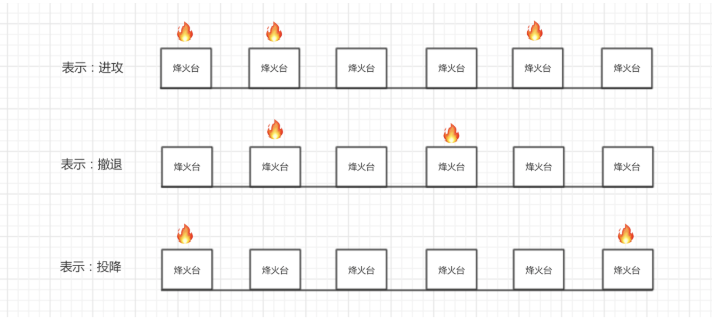
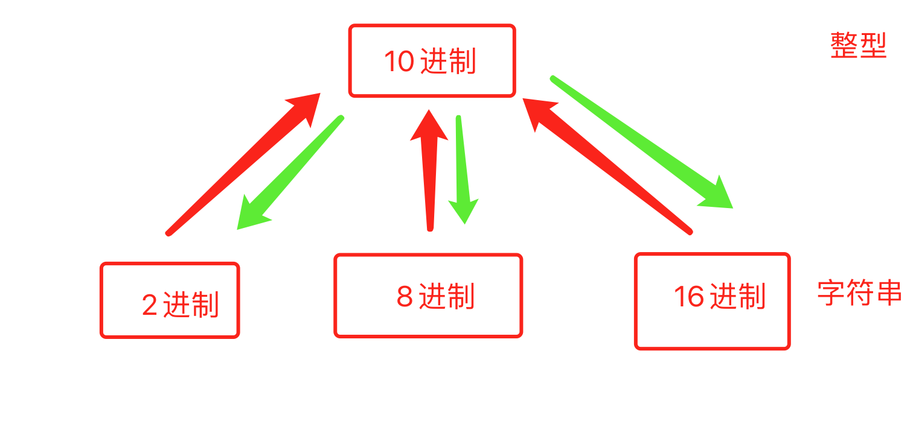
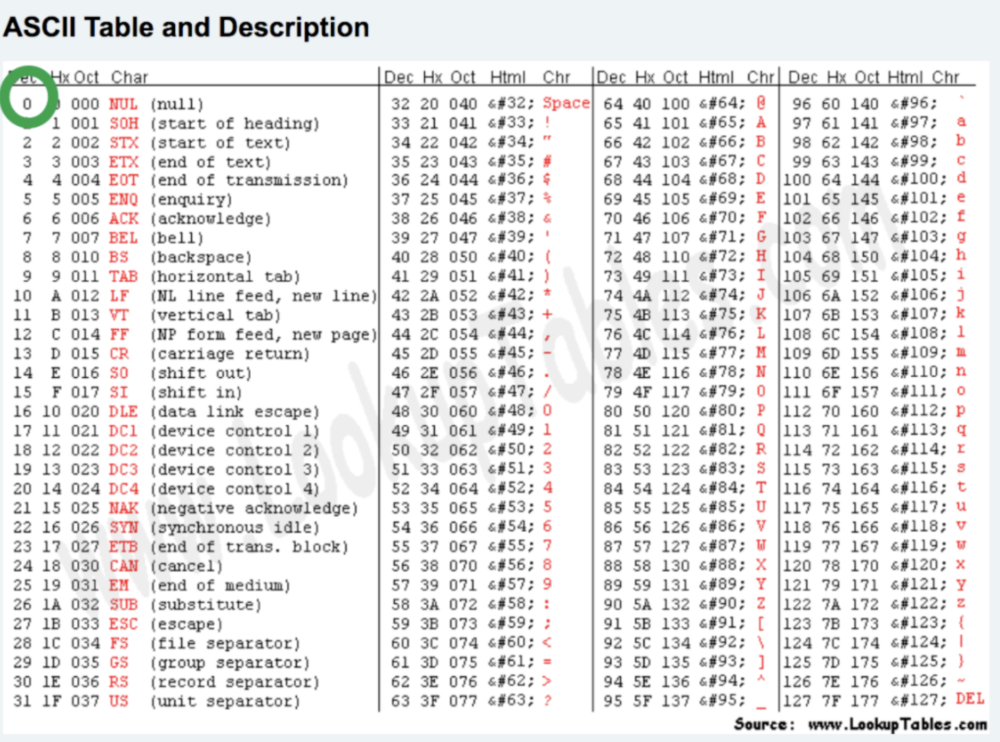
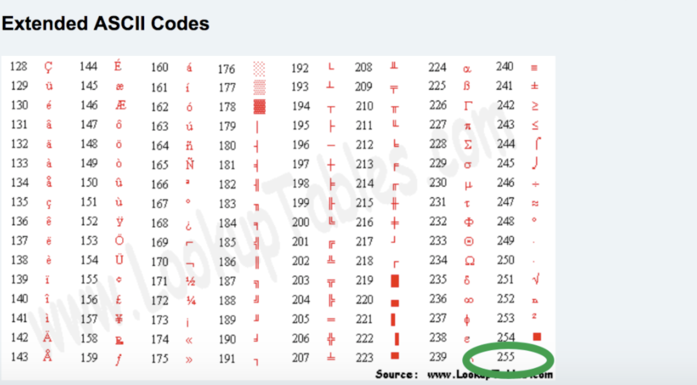

# day01-计算机基础和环境搭建

课程目标：

- 计算机基础知识

- Python环境搭建

课程概要：

- 计算机基础
- 编程的本质
- Python的介绍
- Python环境的搭建

## 1. 计算机基础

### 1.1 基本概念

- 计算机的组成

  ```
  计算机是由多个硬件组合而成，常见的硬件：CPU、硬盘、内存、网卡、显示器、机箱、电源...
  ```

- 操作系统

  ```
  用于协调计算机的各个硬件，让硬件之间进行协调工作，以完成某个目标
  常见的操作系统分类：
  - windows，优点：生态牛、工具多；缺点：略慢、收费。【个人】
  	- xp
  	- win7
  	- win10
  	...
  - linux，优点：资源占用少、免费（用Linux做服务器）；缺点：工具少、告别游戏。【企业服务器】
  	- centos
  	- ubuntu
  	- redhat
  	...
  - mac，优点：生态还可、工具基本都有、用户体验和交互强；缺点：不能玩游戏（底层Linux）
  ```

- 软件（应用程序）

  ```
  安装操作系统之后，安装常用的软件：微信、QQ...
  软件来源：程序员开发、代码编写1.2编程语言
  ```

### 1.2 编程语言

常见编程语言：Java、C#、Python、PHP、C...

- Python语法规则

  ```python
  print("你好")
  ```

- Golang语法规则

  ```go
  fmt.Println("你好")
  ```

### 1.3 编译器/解释器

编译器/解释器，将代码翻译成计算机能够识别的命令。

```
A-Python开发了软件1				B开发了GoLang软件2

	Python解释器					GoLang编译器

					操作系统
			cpu 硬盘 网卡 内存 电源...
```

解释器和编译器的区别：

- 解释器：实时翻译。拿到1000行代码后，解释一句交给操作系统一句。
  - 直接执行用编程语言编写的指令的程序
- 编译器：全文翻译。拿到2000行代码后会将它编译成一个临时文件（计算机能够识别），再把文件交给操作系统读取。
  - 把源代码转换成(翻译)低级语言的程序

Python、PHP、Javascript、Ruby，一般称为**解释型语言**。

C、C++、Go、Java，一般称为**编译型语言**。

## 2. 学习编程的本质

三件事：

- 选择一门编程语言，在自己的电脑上安装该编程语言相关的 编译器/解释器。
- 学习编程语言的语法规则，根据语法规则+业务背景设计并开发你的软件（代码集合）。
- 使用编译器/解释器 运行自己写的代码。

## 3. Python的介绍

### 3.1 语言的分类

- 翻译的维度
  - 解释性语言，Python、PHP、Javascript、Ruby...
  - 编译型语言，C、C++、Go、Java...

- 高低的维度

  - 低级编程语言，代码可以直接被计算机识别。

    ```
    机器语言，“0”、“1”--机器码，交给计算机执行，如：1010000100100。
    汇编语言，MOV、INC，...，指令（代替机器码），交给计算机执行。
    ```

  - 高级编程语言，代码无法直接被计算机识别，但可以通过某种方式转换为计算机可以识别的语言。

    ```
    C、C++、Java、Python、Ruby...这类编程语言在编写时几乎是写英语作文。
    交由相关的编译器或者解释器，翻译成机器码，然后再交给计算机去执行。
    ```

  **注意**：现在基本都使用高级编程语言（开发效率高）。

### 3.2 Python介绍

> Pythonde 创始人为吉多·范罗苏姆（Guido van Rossum）。1989年的圣诞节期间，Guido开始写Python语言的编译器。Python这个名字，来自Guido所挚爱的电视剧Monty Python‘s Flying Circus。他希望这个新的叫做Python的语言，能符合他的理想：创造一种C和Shell之间，功能全面，易学易用，可拓展的语言。

全球众多编程语言中，目前Python位居TIOBE排行榜第三名并且一直呈上升趋势。

- 语法简洁&适合零基础，相比较于其他编程语言Python的学习成本非常低，甚至可以让其他行业的人快速掌握编程技能，通过编程提高工作效率，例如：

​		Excel自动化办公、文件和文件夹的处理等。

- 类库强大，Python自诞生之初就任其自然生长，经过多年的发展，造就其在很多领域都是积累了很多方便的类库，自然也成为了运维自动化、数据分析、机器学习首选编程语言。

- 开发效率高，结合Python语法精炼和类库齐全的特点，所以在使用Python进行开发时可以用更少的代码完成更多的功能，大大提升开发效率。例如：

  Python10行代码实现的功能，用其他语言可能需要100+行才能完成。

### 3.3 Python的解释器种类（了解）

因Python的爆火，很多公司开发了Python的解释器（用来翻译python代码成为计算机能够识别的命令）。

- CPython【主流】，底层由C语言开发出来的Python解释器。
- Jython，是由Java语言开发出来的Python解释器，方便让Python和Java代码做集成。
- IronPython，基于C#语言开发出来的Python解释器，方便让Python和C#代码做集成。
- RubyPython，...
- PyPy，是对CPython的优化，执行效率提高了。引入编译器的功能，本质上将Python代码进行编译，再去执行编译后的代码。
- ...

**注意**：常说的Python解释器，默认指的是CPython解释器。


### 3.4 CPython解释器的版本

主要有两大版本：

- 2.x，目前最新的Python2.7.18（2020后不再维护）
- 3.x，目前最新的3.9.0版本。


## 4. 环境搭建

- Python解释器，将编写的代码翻译成计算机能够识别的指令。
  - 主流CPython
  - 3.9.0版本
- 学习编程本质上的3件事
  - 安装CPython3.9.0版本解释器
  - 学习Python语法并写代码
  - 解释器运行代码

### 4.1 安装Python解释器

#### 4.1.1 mac系统

- 官网下载Python解释器（3.9.0）

```
https://www.python.org/
```

- 安装

```
默认Python解释器安装目录：
/Library/Frameworks/Python.framework/Versions/3.9

在bin目录下有一个python3.9文件，就是Python解释器的启动文件:
/Library/Frameworks/Python.framework/Versions/3.9/bin/python3.9

```

- 写一个简单的Python代码运行解释器

hello.py

```python
name = input("请输入用户名：")
print("欢迎使用NB系统：", name)
```

​	运行代码hello.py文件：

```
- 打开终端
- 终端输入：解释器 代码文件
/Library/Frameworks/Python.framework/Versions/3.9/bin/python3.9 /users/xxx/Documents/hello.py
```

- 【补充】系统环境变量

  ```
  - 假设有30个Python文件要运行
  	/Library/Frameworks/Python.framework/Versions/3.9/bin/python3.9 /users/xxx/Documents/hello1.py
  	...
  	/Library/Frameworks/Python.framework/Versions/3.9/bin/python3.9 /users/xxx/Documents/hello2.py
  	
  - 不用每次都写解释器的路径
  	- 将/Library/Frameworks/Python.framework/Versions/3.9/bin 添加到系统的环境变量中
  		python3.9 /users/xxx/Documents/hello1.py
  		...
  		python3.9 /users/xxx/Documents/hello2.py
  
  - 如何添加系统环境变量：
  	- 默认Python解释器在安装过程中已经自动添加了
  	- 自己添加：
  		- 打开用户目录下的 .bash_profile文件(.zprofile)
  		- 在文件中添加：
  		PATH="/Library/Frameworks/Python.framework/Versions/3.9/bin:${PATH}"
  		export PATH
  ```


#### 4.1.2 windows系统

- 官网下载Python解释器（3.9.0）

```
- https://www.python.org/downloads/release/python-390/
- Windows x86-64 executable installer
```

- 安装

```
Python解释安装目录：D:yaoyk/Python39
Python解释器：D:yaoyk/Python39/python.exe
```

- 写一个简单的Python代码运行解释器

hello.py

```
name = input("请输入用户名：")
print("欢迎使用NB系统：", name)
```

运行代码hello.py文件：

```
- 打开终端
  cmd
- 在终端输入 解释器路径 代码路径
  D:yaoyk/Python39/python.exe D:\yaoyk\PythonProject\projects\hello.py
```

- 优化配置

```
- 假设有30个Python文件要用解释器运行
	D:yaoyk/Python39/python.exe D:\yaoyk\PythonProject\projects\hello.py
	D:yaoyk/Python39/python.exe D:\yaoyk\PythonProject\projects\hello.py
	...
	D:yaoyk/Python39/python.exe D:\yaoyk\PythonProject\projects\hello.py
- 添加系统环境变量中，不用再写Python解释器的路径
- 如何添加系统环境变量：
	- 默认Python解释器在安装过程中已经自动添加
	- 此电脑->右键“属性”->高级系统设置->环境变量->Path
	- 安装Python解释器时勾选 “Add to system path”
```


### 4.2 安装Pycharm编辑器

快速编写代码工具，用Pycharm可以大大提高编写代码的效率 + 用解释器去运行代码。

- 下载Pycharm

```
- mac https://www.jetbrains.com/pycharm/
- windows https://www.jetbrains.com/pycharm/download/other.html
```

- 安装
- 快速使用，写代码+运行
- 破解Pycharm（专业版）


## 总结

1. 了解硬件 & 操作系统 & 软件（应用系统）之间的关系。
2. 了解常见的操作系统都有哪些。
3. 了解编译器和解释器的区别和作用。
4. 编程语言进行分类
5. 了解Python解释器的种类
6. 了解CPython解释器的版本
7. 学会如何安装Python解释器。
8. 了解什么环境变量的作用。
9. 了解Python和Pycharm的区别。

## 作业

1. 简述硬件 & 操作系统 & 软件（应用系统）之间的关系。

   ```
   计算机是由多个硬件组成，例如：CPU、硬盘、内存、网卡、主板等。
   操作系统则是安装在计算机上用于协调各硬件进行配合工作的，他将用户的一些行为转化为计算机能够识别的命令，并协调各个硬件配合完成相关命令。
   软件，是由程序员开发并安装在操作系统的程序（本质上是一大堆的代码），例如：微信、QQ、金山毒霸等。
   ```

2. 列举常见的操作系统都有哪些。

   ```
   常见的操作系统有三类：
   - win：win7、win10、xp 等
   - linux：centos、ubuntu、redhat 等。
   - mac：Catalina、Mojave、Sierra 等。
   ```

3. 简述编译器和解释器的区别和作用。

   ```
   编译器和解释器的作用是将各编程语言的代码进行翻译，从而使得计算机能够识别并执行。
   编译器，全文翻译，将代码编译成`临时文件`，再执行临时文件。
   解释器，实施翻译，对代码实行边解释边执行。
   ```

4. 编程语言进行分类

   ```
   解释的角度：编译型和解释性。
   高低的角度：高级编程语言和低级编程语言。
   ```

5. Python解释器的种类有哪些？

   ```
   CPython、Jython、IronPython、pypy等
   ```

6. CPython解释器的版本有哪些？你现在用的是哪个版本？

   ```
   2.x和3.x，目前课堂上使用的是最新的3.9.0版本。
   ```

7. 系统环境变量的作用是什么？

   ```
   在将某个目录添加至环境变量后，如果在终端想要去运行此目录下的文件，则只需要输入文件名即可（无需再写前缀），系统会自动读取环境变量中的路径并自动拼接。
   ```

8. Python和Pycharm的区别是什么？

   ```
   Python是解释器，用于将Python解释成计算机能够识别的命令。
   Pycharm是IDE（类似编辑器），用于方便快速的编写Python代码并实现运行Python代码的一个工具。
   ```


# day02-快速上手

课程目标：学习Python最基础的语法知识，可以用代码快速实现一些简单的功能。

课程概要：

- 初识编码（密码本）
- 编程初体验
- 输出
- 初识数据类型
- 变量
- 注释
- 输入
- 条件语句

## 1. 编码

计算机中所有的数据本质上都是以0和1的组合来存储。

在计算机中会将中文内存转换成010100100010101...，最终存储到硬盘上。

在计算中有这么一个编码的概念（密码本）。

```
    武     ->      01111111 00011010 010110110
    沛     ->      01001111 10010000 001110100
    齐     ->      11111111 00000000 010101010
```

在计算中有很多种编码。

```
每种编码都有自己的一套密码本，都维护这自己的一套规则，如：
    utf-8编码：
        武     ->      01111111 00011010 010110110
        沛     ->      01001111 10010000 001110100
        齐     ->      11111111 00000000 010101010
    gbk编码：
        武     ->      11111111 00000010
        沛     ->      01001111 01111111
        齐     ->      00110011 10101010
所以，使用的不同的编码保存文件时，硬盘的文件中存储的0/1也是不同的。
```

注意事项：以某个编码的形式保存文件，以后就要以这种编码去打开这个文件，否则就会出现乱码。············

```
UTF-8编码去保存武沛齐：01111111 00011010 010110110 01001111 10010000 001110100 11111111 00000000 010101010
GBK编码形式去打开：乱码
```

## 2. 编程初体验

- 编码必须要保持：保存和打开一致，否则会乱码

- 默认Python解释器是以UTF-8编码的形式打开文件。如果想要修改Python的默认解释器编码，可以：

  ```python
  # -*- coding:utf-8 -*-
  print("哈哈")
  ```

- 建议：所有Python代码文件的都要以UTF-8编码保存和读取。

## 3. 输出

将结果或或内容想要呈现给用户。

```python
print("输出什么信息")
```

关于输出：

- 默认print在尾部会加换行符

```python
print("看着风景美如画")
print("本想吟诗增天下")

输出：
看着风景美如画
本想吟诗增天下
```

- 想要不换行，则可以加end=""

```python
print("看着风景美如画",end=",")
print("本想吟诗增天下",end=".")

输出：
看着风景美如画,本想吟诗增天下.
```

### 练习题

1. 使用print输出自己的姓名
2. 使用print输出
   春眠不觉晓，
   出处闻啼鸟，
   夜来风雨声，
   花落知多少。
3. 是用print输出
   春眠不觉晓，出处闻啼鸟，夜来风雨声，花落知多少。

```python
# -*- coding:utf-8 -*-
print("春眠不觉晓，", end=',')
print("出处闻啼鸟。", end='。')
print("夜来风雨声，", end='，')
print("花落知多少。", end='。')

print("春眠不觉晓，")
print("出处闻啼鸟。")
print("夜来风雨声，")
print("花落知多少。")
```

## 4. 初识数据类型

有int、str、bool 等，写完代码交给Python解释器去运行。

### 4.1 整型（int）

整型，整数

整型，在写代码时用于表示整数相关的东西，例如：年龄、存款、尺寸、手机号等。

一般我们提到的：5、18、22、99、… 等整数 在Python中都称为是整型，且支持 加/减/乘/除/取余/指数 等操作。

```python
print(666)

print(2 + 10)

print(2 * 10)

print(10 / 2)

print(10 % 3)

print(2 ** 4)
```

### 4.2 字符串（str）

字符串，文本信息，必须由引号引起来。

单行字符串

```python
print("中国'北京'昌平区") # 根据实际情况引号套引号时要不同 
print('中国北京昌平区')
```

多行字符串

```python
print("""中国北京昌平区""")
print('''中国北京昌平区''') # 可以换行回车
```

对于字符串：

- 加，两个字符串可以通过加号拼接起来。

```python
print( "alex" + "是金角大王吧" )
```


- 乘，让整形和字符串进行相乘，以实现让字符串重复出现N次并拼接起来。

```python
print(3 * "我想吃饺子")
```

### 4.3 布尔类型

布尔类型中共有两个值：True/False

```python
print(1 > 2)
print(False)

print(1 == 1)
print(True)

# 例子
name = input("请输入你的用户名:")

if name == "alex":
    print("用户登录成功")
else:
    print("用户登录失败")
```

补充：

```python
1 > 2 
1 == 3
"alex" == "eric"
1 == "alex"

1 > "alex"  无法进行比较大小
```

### 4.4 类型转换

- int，整型定义时，必须是数字且无引号
- str，字符串定义时，必须用双引号括起来
- bool，布尔值定义时，只能写True和False

不同的数据类型都有不同的功能，例如：整型可以加减乘除 而 字符串只能加(拼接)和乘法。
如果想要做转换可遵循一个基本规则：想转换什么类型就让他包裹一些。

例如：str(666) = "666"是将整型转换为字符串、int(“888”)是将字符串转 888。

转换为整型：

```python
# 字符串转换为整形（度可度之人）
  int("666")
  int("999")
  "6" + "9" 的结果应该是： "69"
  int("6") + int("9") 的结果是：15

  int("alex是sb") 报错
  
# 布尔类型转换为整形
  int(True)  转换完等于 1
  int(False) 转换完等于 0
```

转换为字符串：

```python
# 整形转字符串
str(345)
str(666) + str(9) 结果为："6669"

# 布尔类型转换为字符串
str(True)  "True"
str(False) "False"
```

转换为布尔类型：

```python
# 整形转布尔
bool(1) True
bool(2) True
bool(0) False
bool(-10) True

# 字符串转布尔
bool("alex") True
bool("砂玻帮你") True
bool("") False
bool(" ") True
```

- 其他所有类型转换为布尔类型时，除了 空字符串、0以为其他都是True。

- 字符串转整形时，只有那种 "988" 格式的字符串才可以转换为整形，其他都报错。

- 想要转换为那种类型，就用这类型的英文包裹一下就行。 

### 练习题

1. 计算整型50乘以10再除以5的商并使用print输出。

2. 判断整型8是否大于10的结果并使用print输出。

3. 计算整型30除以2得到的余数并使用print输出。

4. 使用字符串乘法实现 把字符串”我爱我的祖国”创建三遍并拼接起来最终使用print输出。

5. 判断 字符串”wupeiqi”和”alex”是否相等的结果并使用print输出。

6. 判断 整型666和整型666是否相等的结果并使用print输出。

7. 判断 字符串”666”和整型666是否相等的结果并使用print输出。

8. 看代码写结果（禁止运行代码）：

   ```python
   print( int("100")*3 )
   print( int("123") + int("88") )
   print( str(111) + str(222) )
   print( str(111)*3 )
   print( int("8") > 7 )
   print( str(111) == 111 )
   print( bool(-1) )
   print( bool(0) )
   print( bool("") )
   print( bool("你好") )
   print( True == True)
   print( True == False)
   print( bool("") == bool(0) )
   ```

注意：类型转换不是改变原来值，实际在底层是新创建了一个值。例如有整数 6 ，然后使用 str(6) 转化了一下得到 “6”,实际上这个字符串”6”是依据整数6新创建的。

## 5. 变量

变量，别名和外号，让变量名指向某个值，格式：【变量名 = 值】，可以通过变量名来操作其对应的值。

```python
name = "武沛齐"
print(name) # 武沛齐

age = 18
name = "alex"
flag = 1 > 18
address = "北京昌平" + "沙河"
addr = "北京昌平" + "沙河" + name   # "北京昌平沙河alex"

print(addr)
print(flag)

age = 18
number = 1 == 2
```

注意：

- 给变量赋值 `age = 18`
- 让age代指值 `age=18`

### 5.1 变量名的规范

```python
age = 18
name = "alex"
flag = 1 > 18
address = "北京昌平" + "沙河"
```

三个规范（只要有一条就会报错）：

- 变量名只能由 字母、数字、下划线 组成。

- 不能以数字开头

  ```
  na9me9 = "alex"
  ```

- 不能用Python内置的关键字

  ```
  def = "alex"
  break = 123
  ```

  ```python
  # 关键字
  *[‘and’, ‘as’, ‘assert’, ‘break’, ‘class’, ‘continue’, ‘def’, ‘del’, ‘elif’, ‘else’, ‘except’, ‘exec’, ‘finally’, ‘for’, ‘from’, ‘global’, ‘if’, ‘import’, ‘in’, ‘is’, ‘lambda’, ‘not’, ‘or’, ‘pass’, ‘print’, ‘raise’, ‘return’, ‘try’, ‘while’, ‘with’, ‘yield’]*
  ```

  两个建议：

  - 下划线连接命名（小写）

    ```
    father_name = "wupeiqi"
    brother_age = 19
    ```

  - 见名知意

    ```
    age = 18
    color = "red"
    current_user_name = "吉诺比利"
    ```


### 5.2 变量内存指向关系

内存指向（在电脑的内存中是怎么存储的）

**情景一**

```python
name = "wupeiqi"
```

在计算机的内存中创建一块区域保存字符串”wupeiqi”，name变量名则指向这块区域。


**情景二**

```python
name = "wupeiqi"
name = "alex"
```

在计算机的内存中创建一块区域保存字符串”wupeiqi”，name变量名则指向这块区域。然后又再内存中创建了一块域保存字符串”alex”，name变量名则指向”alex”所在的区域，不再指向”wupeiqi”所在区域（无人指向的数据会被标记为垃圾，由解释器自动化回收）


**情景三**

```python
name = "wupeiqi"
new_name = name
```

在计算机的内存中创建一块区域保存字符串”wupeiqi”，name变量名则指向这块区域。new_name变量名指向name变量，因为被指向的是变量名，所以自动会转指向到name变量代表的内存区域。


**情景四**

```python
name = "wupeiqi"
new_name = name
name = "alex"
```

在计算机的内存中创建一块区域保存字符串”wupeiqi”，name变量名则指向这块区域(灰色线)， 然后new_name指向name所指向的内存区域，最后又创建了一块区域存放”alex”，让name变量指向”alex”所在区域.


**情景五**

```python
num = 18
age = str(num)
```

在计算机的内存中创建一块区域保存整型18，name变量名则指向这块区域。通过类型转换依据整型18再在内存中创建一个字符串”18”, age变量指向保存这个字符串的内存区域。


至此，关于变量的内存相关的说明已讲完，由于大家都是初学者，关于变量的内存管理目前只需了解以上知识点即可，更多关于内存管理、垃圾回收、驻留机制等问题在后面的课程中会讲解。

#### 练习题

1. 看代码结果

   ```python
   alex_length = 3
   wupeiqi_length = 18
   total = alex_length + wupeiqi_length
   print(total)
   ```

2. 按要求写代码

   ```python
   # 假设age为小明的年龄
   age = 18
   # 问：已知小李比小明大3岁，计算小李年龄赋值给ming_age变量并输出。
   ming_age = age + 3
   print(ming_age)
   # 问：已知大刘比小明和小李年龄的和还要大5岁，计算大刘的年龄赋值给liu_age变量并输入。
   liu_age = age + ming_age + 5
   print(liu_age)
   ```

3. 看代码写结果

   ```python
   nickname = "一米八大高个"
   username = nickname
   
   username = "弟弟"
   print(nickname)
   print(username)
   ```

4. 看代码写结果

   ```python
   nickname = "一米八大高个"
   username = nickname
   nickname = "弟弟"
   
   print(nickname)
   print(username)
   ```

5. 看代码写结果

   ```python
   nickname = "一米八大高个"
   username = "弟弟"
   text = username + nickname
   print(text)
   ```

6. 看代码写结果

   ```python
   nickname = "一米八大高个"
   username = nickname
   nickname = "弟弟"
   text = username + nickname
   print(text)
   ```

7. 看代码写结果

   ```python
   string_number = "20"
   num = int(string_number)
   
   data = string_number * 3
   print(data) # "202020"
   
   value = num * 3
   print(value) # 60
   ```

## 6. 注释

写代码时候，如果想要对某写内容进行注释处理，即：解释器忽略不会按照代码去运行。

- 单行注释

  ```python
  # 声明一个name变量
  name = "alex"
  
  age = 19 # 这表示当前用户的年龄
  
  注意：快捷点 command + ?  、   control + ?
  ```

- 多行注释

  ```python
  # 声明一个name变量
  # 声明一个name变量
  # 声明一个name变量
  name = "alex"
  
  
  """
  多行注释内容
  多行注释内容
  多行注释内容
  """
  age = 19
  ```


## 7. 输入

输入，可以实现程序和用户之间的交互。

```PYTHON
# 1. 右边 input("请输入用户名：") 是让用户输入内容。
# 2. 将用户输入的内容赋值给name变量。
name = input("请输入用户名：")

if name == "alex":
  print("登录成功")
else:
  print("登录失败")
```

```PYTHON
data = input(">>>")
print(data)
```

**特别注意**：用户输入的任何内容本质上都是字符串。

1. 提示输入姓名，然后给姓名后面拼接一个“烧饼”，提示输入姓名，然后给姓名后面拼接一个“烧饼”，最终打印结果。

   ```python
   name = input("请输入用户名：")
   text = name + "烧饼"
   print(text)
   ```

2. 提示输入 姓名/位置/行为，然后做拼接并打印：xx 在 xx 做 xx 。

   ```python
   name = input("请输入用户名：")
   address = input("请输入位置：")
   action = input("请输入行为：")
   
   text = name + "在" + address + action
   print(text)
   ```

3. 提示输入两个数字，计算两个数的和。

   ```python
   number1 = input("请输入一个数字：") # "1"
   number2 = input("请输入一个数字：") # "2"
   
   value = int(number1) + int(number2)
   print(value)
   ```


## 8. 条件语句

```
if 条件 :
    条件成立之后的代码...
    条件成立之后的代码...
    条件成立之后的代码...
else:
    条件不成立之后执行的代码...
    条件不成立之后执行的代码...
    条件不成立之后执行的代码...
```

```python
name = input("请输入用户名:")
if name == "alex":
  print("sb")
else:
  print("db")
```

### 8.1  基本条件语句

- 示例1

  ```python
  print("开始")
  if True:
    print("123")
  else:
    print("456")
  print("结束")
  
  # 输出结果
  开始
  123
  结束
  ```

- 示例2

  ```python
  print("开始")
  if 5==5:
    print("123")
  else:
    print("456")
  print("结束")
  ```

- 示例3

  ```python
  num = 19
  if num > 10:
  	print("num变量对应值大于10")
  else:
  	print("num变量对应值不大于10")
  ```

- 示例4

  ```python
  username = "wupeiqi"
  password = "666"
  if username == "wupeiqi" and password == "666":
  	print("恭喜你，登录成功")
  else:
  	print("登录失败")
  ```

- 示例5

  ```python
  username = "wupeiqi"
  
  if username == "wupeiqi" or username == "alex":
  	print("VIP大会员用户")
  else:
  	print("普通用户")
  ```

- 示例6

  ```python
  number = 19
  if number%2 == 1:
  	print("number是奇数")
  else:
  	print("number是偶数")
  ```

  ```python
  number = 19
  data = number%2 == 1
  if data:
  	print("number是奇数")
  else:
  	print("number是偶数")
  ```

- 示例7

  ```python
  if 条件:
    成立
  ```

  ```python
  print("开始")
  if 5 == 5:
    print("5等于5")
  print("结束")
  ```


#### 练习题

1. 提示用户输入用户名和密码，用户名等于"wupeiqi"且密码等于"uuu"就输出登录成功；否则输出登录失败。
2. 猜数字，提示用户输入一个数字，判断数字如果大于10，就输出猜错了；否则输出猜对了。
3. 提示用户输入一个数字，判断是否为偶数，是偶数则输出 偶偶偶数，否则输出 奇奇奇数。

### 8.2 多条件判断

```python
if 条件A:
  A成立，执行此缩进中的所有代码
  ...
elif 条件B:
  B成立，执行此缩进中的所有代码
  ...
elif 条件C:
  C成立，执行此缩进中的所有代码
  ...
else:
  上述ABC都不成立。
```

```python
num = input("请输入数字")
data = int(num)
if data>6:
  print("太大了")
elif data == 6:
  print("刚刚好")
else:
  print("太小了")
```

```python
score = input("请输入分数")
data = int(score)

if data > 90:
  print("优")
elif data > 80:
  print("良")
elif data > 70:
  print("中")
elif data > 60:
  print("差")
else:
  print("不及格")
```

### 8.3条件嵌套

### 

```python
if 条件A:
  ...
elif 条件B:
  ...
```

```python
if 条件A:
    if 条件A1:
        ...
    else：
   	    ...
elif 条件B:
    ...
```

模拟10086客服

```python
print("欢迎致电10086，我们提供了如下服务： 1.话费相关；2.业务办理；3.人工服务")

choice = input("请选择服务序号")

if choice == "1":
    print("话费相关业务")
    cost = input("查询话费请按1;交话费请按2")
    if cost == "1":
        print("查询话费余额为100")
    elif cost == "2":
        print("交互费")
    else:
        print("输入错误")
elif choice == "2":
    print("业务办理")
elif choice == "3":
    print("人工服务")
else:
    print("序号输入错误")
```

## 总结

1. 什么是编码？打开文件时为什么会出现乱码？
2. pycharm如何设置文件编码？
3. python解释器去打开代码文件时，默认使用编码是什么？如何修改？
4. print输入
5. 各数据类型格式 以及 相关之间如何实现转换？
6. 变量的命名规范
7. 用户通过input输的内容均为字符串类型。
8. 条件语句。


## 今日作业

1. 谈谈你了解的编码以及为什么会出现乱码的现象？

   ```python
   编码相当于是一个`密码本`，其中存储着文字和01010的对应关系。
   乱码的出现时因为文件的存储方式和打开方式不一致导致。另外，如何数据丢失也可能会造成乱码。
   假如：
   	武，对应存储的是：100100001000000111。如果文件中的内容丢失只剩下100100001000000，则读取时候就可能出现乱码。
   ```

2. Python解释器默认编码是什么？如何修改？

   ```
   Python解释器默认编码：utf-8
   在文件的顶部通过设置： # -*- coding:编码 -*- 实现修改。
   ```

3. 用print打印出下面内容：

   ```
   ⽂能提笔安天下,
   武能上⻢定乾坤.
   ⼼存谋略何⼈胜,
   古今英雄唯是君。
   ```

   ```python
   print("⽂能提笔安天下,")
   print("武能上⻢定乾坤.")
   print("⼼存谋略何⼈胜,")
   print("古今英雄唯是君。")
   ```

   ```python
   text = """
   ⽂能提笔安天下,
   武能上⻢定乾坤.
   ⼼存谋略何⼈胜,
   古今英雄唯是君。
   """
   print(text)
   ```

4. 变量名的命名规范和建议？

   ```
   三条规范（必须遵循，否则定义变量会报错）
     - 变量名只能由 字母、数字、下划线 组成。
     - 变量名不能以数字开头。
     - 变量名不能是Python内置关键字
   二条建议（遵循可以显得更加专业，不遵循也可以正常运行不报错）
   	- 下划线命名法，多个单词表示的变量名用下划线连接（均小写）
   	- 见名知意，通过阅读变量名就能知道此变量的含义。
   ```

5. 如下那个变量名是正确的？

   ```python
   name = '武沛齐'
   _ = 'alex'
   _9 = "老男孩"
   9name = "宝浪"   # 错误
   oldboy(edu = 666 # 错误
   ```

6. 设定一个理想数字比如：66，让用户输入数字，如果比66大，则显示猜测的结果大了；如果比66小，则显示猜测的结果小了;只有等于66，显示猜测结果正确。

   ```python
   num = input("请输入数字")
   data = int(num)
   if data > 66:
       print("大了")
   elif data < 66:
       print("小了")
   else:
       print("正确")
   ```

7. 提示⽤户输入 "爸爸" ，判断⽤户输入的对不对。如果对, 提示真聪明, 如果不对, 提示你是傻逼么。

   ```python
   text = input("请输入内容")
   if text == "爸爸":
       print("真聪明")
   else:
       print("你是傻逼么")
   ```

8. 写程序，成绩有ABCDE5个等级，与分数的对应关系如下.

   ```python
   A    90-100
   B    80-89
   C    60-79
   D    40-59
   E    0-39
   ```

   要求用户输入0-100的数字后，你能正确打印他的对应成绩等级.

   ```python
   score = input("请输入分数")
   data = int(score)
   
   if data >= 90 and data <= 100:
     print("A")
   elif data >= 80 and data <90:
     print("B")
   elif data >= 60 and data <80:
     print("C")
   elif data >= 40 and data <60:
     print("D")
   elif data >= 0 and data <40:
     print("E")
   else:
     print("输入错误")
   ```

   ```python
   score = input("请输入分数")
   data = int(score)
   
   if 90 <= data <= 100:
       print("A")
   elif 80 <= data < 90:
       print("B")
   elif 60 <= data < 80:
       print("C")
   elif 40 <= data < 60:
       print("D")
   elif 0 <= data < 40:
       print("E")
   else:
       print("输入错误")
   ```


# day03-Python基础

课程目标：掌握Python基础中的必备语法知识。

课程概要：

- 循环语句
- 字符串格式化
- 运算符（面试题）

## 1. 循环语句

- while循环
- for循环（后期）

```python
while 条件:
    ...
    ...
    ...
```

```python
print("123")
while 条件:
  ...
  ...
  ...
print(456)
```


### 1.1 循环语句基本使用

示例1：

```python
print("开始")
while True:
    print("Alex是个小都比")
print("结束")

# 输出：
开始
Alex是个小都比
Alex是个小都比
Alex是个小都比
Alex是个小都比
...
```

示例2：

```python
print("开始")
while 1 > 2:
	print("如果祖国遭受到侵犯，热血男儿当自强。")
print("结束")

# 输出：
开始
结束
```

示例3：

```python
data = True
print("开始")
while data:
	print("如果祖国遭受到侵犯，热血男儿当自强。")
print("结束")

# 输出：
开始
如果祖国遭受到侵犯，热血男儿当自强。
如果祖国遭受到侵犯，热血男儿当自强。
如果祖国遭受到侵犯，热血男儿当自强。
...
```

示例4：

```python
print("开始")
flag = True
while flag:
	print("滚滚黄河，滔滔长江。")
	flag = False
print("结束")

# 输出：
开始
滚滚黄河，滔滔长江。
结束
```

示例5：

```python
print("开始")
num = 1
while num < 3:
	print("滚滚黄河，滔滔长江。")
	num = 5
print("结束")

# 输出：
开始
滚滚黄河，滔滔长江。
结束
```

示例6：

```python
print("开始")
num = 1
while num < 5:
	print("给我生命，给我力量。")
	num = num + 1
print("结束")

# 输出：
开始
给我生命，给我力量。
给我生命，给我力量。
给我生命，给我力量。
给我生命，给我力量。
结束
```

```
练习题：重复3次输出我爱我的祖国。
num = 1
while num < 4:
	print("我爱我的祖国")
	num = num + 1
	
我爱我的祖国
我爱我的祖国
我爱我的祖国
```

### 1.2 综合小案例

请实现一个用户登录系统，如果密码错误则反复提示让用户重新输入，直到输入正确才停止。

```python
# 请实现一个用户登录系统，如果密码错误则反复提示让用户重新输入，直到输入正确才停止。

print("开始运行路飞系统")

flag = True
while flag:
    user = input("请输入用户名：")
    pwd = input("请输入密码：")
    if user == "wupeiqi" and pwd == "luffy":
        print("登录成功")
        flag = False
    else:
        print("用户名或密码错误")

print("系统结束")
```

#### 练习题

1. 补充代码实现
   猜数字，设定一个理想数字比如：66，一直提示让用户输入数字，如果比66大，则显示猜测的结果大了；如果比66小，则显示猜测的结果小了;只有输入等于66，显示猜测结果正确，然后退出循环。

   ```python
     number = 66
     flag = True
     while flag:
     	...
   ```

2. 使用循环输出1~100所有整数。

3. 使用循环输出 1 2 3 4 5 6   8 9 10，即：10以内除7以外的整数。

4. 输出 1~100 内的所有奇数。

5. 输出 1~100 内的所有偶数。

6. 求 1~100 的所有整数的和。

7. 输出10 ~ 1 所有整数。

```python
# 1. 猜数字，设定一个理想数字比如：66，一直提示让用户输入数字，如果比66大，则显示猜测的结果大了；如果比66小，则显示猜测的结果小了;只有输入等于66，显示猜测结果正确，然后退出循环。
"""
data = True
while data:
    num = input("请输入数字：")
    num = int(num)
    if num > 66:
        print("大了")
    elif num < 66:
        print("小了")
    else:
        print("正确")
        data = False
"""

# 2. 使用循环输出1~100所有整数。
"""
num = 1
while num < 101:
    print(num)
    num = num + 1
"""
# 3. 使用循环输出 1 2 3 4 5 6   8 9 10，即：10以内除7以外的整数。
"""
num = 1
while num < 11:
    if num == 7:
        pass
    else:
        print(num)
    num = num + 1
"""
"""
num = 1
while num < 11:
    if num != 7:
        print(num)
    num = num + 1
"""
# 4. 输出 1~100 内的所有奇数。
"""
num = 1
while num < 101:
    if num % 2 == 1:
        print(num)
    num = num + 1
"""

# 5. 输出 1~100 内的所有偶数。
"""
num = 1
while num < 101:
    if num % 2 == 0:
        print(num)
    num = num + 1
"""
# 6. 求 1~100 的所有整数的和。
"""
total = 0 # 0 + 1 /  0 + 1 + 2 / 0 + 1 + 2 + 3 ...
num = 1
while num < 101:
    total = total + num
    num = num + 1
print(total)
"""
# 7. 输出 10 ~ 1 所有整数。
"""
num = 10
while num > 0:
    print(num)
    num = num - 1
"""
```

### 1.3 break

break，用于在while循环中帮你终止循环。

```python
print("开始")
while True:
	print("1")
  break
	print("2")
print("结束")

# 输出
开始
1
结束
```

通过示例来更深入理解break的应用。

示例1：

```python
print("开始")
while True:
	print("红旗飘飘，军号响。")
	break
	print("剑已出鞘，雷鸣电闪。")
	print("从来都是狭路相逢勇者胜。")
print("结束")
```

示例2：

```python
print("开始")
i = 1
while True:
	print(i)
	i = i + 1
	if i == 101:
		break
print("结束")

# 输出
开始
1
2
...
100
结束
```

示例3：

```python
print("开始运行系统")
while True:
	user = input("请输入用户名：")
	pwd =  input("请输入密码：")
	if user == 'wupeiqi' and pwd = "oldboy":
		print("登录成功")
		break
	else:
		print("用户名或密码错误，请重新登录")
print("系统结束")

# 输出
开始运行系统
>>> 用户名
>>> 密码
正确，登录成功
	系统结束
不正确，一直循环输出
```

所以，以后写代码时候，想要结束循环可以通过两种方式实现了，即：条件判断 和 break关键字，两种在使用时无好坏之分，只要能实现功能就行。

### 1.4 continue

continue，在循环中用于 结束本次循环，开始下一次循环。

```python
print("开始")
while True:
  print(1)
  continue
  print(2)
  print(3)
print("结束")
```

示例1：

```python
print("开始")
while True:
	print("红旗飘飘，军号响。")
	continue
	print("剑已出鞘，雷鸣电闪。")
	print("从来都是狭路相逢勇者胜。")
print("结束")

# 输出
开始
红旗飘飘，军号响。
红旗飘飘，军号响。
红旗飘飘，军号响。
红旗飘飘，军号响。
...
```

示例2：

```python
print("开始")
i = 1
while i < 101:
	if i == 7:
		i = i + 1
		continue
	print(i)
	i = i + 1
print("结束")

# 输出
开始
1
2
3
4
5
6
8
9
10
...
100
结束
```

示例3：

```python
print("开始")
i = 1
while True:
	if i == 7:
		i = i + 1
		continue
	print(i)
	i = i + 1
	if i == 101:
		break
print("结束")

# 输出
开始
1
2
3
4
5
6
8
9
10
...
100
结束
```

写在最后，对于break和continue都是放在循环语句中用于控制循环过程的，一旦遇到break就停止所有循环，一旦遇到continue就停止本次循环，开始下次循环。

当然，通过如果没有了break和continue，我们用while条件的判断以及其他协助也能完成很多功能，有了break和continue可以在一定程度上简化我们的代码逻辑。


### 1.5 while else

当while后的条件不成立时，else中的代码就会执行。

```python
while 条件:
  代码
else:
  代码
```

```python
while False:
  pass
else:
  print(123)
```

```python
num = 1
while num < 5:
  print(num)
  num = num + 1
else:
  print(666)

# 输出 
1
2
3
4
666
```

```python
while True:
  print(123)
	break
else:
  print(666)

# 输出
123
```


## 2.字符串格式化

字符串格式化，使用跟便捷的形式实现字符串的拼接。

### 2.1 %

#### 2.1.1 基本格式化操作

```python
name = "武沛齐"
# 占位符
# text = "我叫%s，今年18岁" %"武沛齐"
text = "我叫%s，今年18岁" %name
```

```python
name = "武沛齐"
age = 18

# text = "我叫%s，今年%s岁" %("武沛齐",18)
# text = "我叫%s，今年%s岁" %(name,age)
text = "我叫%s，今年%d岁" %(name,age)
```

https://www.cnblogs.com/wupeiqi/articles/5484747.html

```python
message = "%(name)s你什么时候过来呀？%(user)s今天不在呀。" % {"name": "死鬼", "user": "李杰"}
print(message)
```

#### 2.1.2 百分比

```python
text = "兄弟，这个片我已经下载了90%了，居然特么的断网了"
print(text)
```

```python
text = "%s，这个片我已经下载了90%%了，居然特么的断网了" %"兄弟"
print(text)
# 输出：
兄弟，这个片我已经下载了90%了，居然特么的断网了
```

一旦字符串格式化中存现百分比的显示，请一定要呀加 %% 以实现输出 %。


### 2.2 format（推荐）

```python
text = "我叫{0}，今年18岁".format("武沛齐")

text = "我叫{0}，今年{1}岁".format("武沛齐",18)

text = "我叫{0}，今年{1}岁，真是的姓名是{0}。".format("武沛齐",18)
```

```python
text = "我叫{}，今年18岁".format("武沛齐")

text = "我叫{}，今年{}岁".format("武沛齐",18)

text = "我叫{}，今年{}岁，真是的姓名是{}。".format("武沛齐",18,"武沛齐")
```

```python
text = "我叫{n1}，今年18岁".format(n1="武沛齐")

text = "我叫{n1}，今年{age}岁".format(n1="武沛齐",age=18)

text = "我叫{n1}，今年{age}岁，真是的姓名是{n1}。".format(n1="武沛齐",age=18)
```

```python
text = "我叫{0}，今年{1}岁"
data1 = text.format("武沛齐",666)
data2 = text.format("alex",73)
```

```python
text = "我叫%s，今年%d岁"
data1 = text %("武沛齐",20)
data2 = text %("alex",84)
```


### 2.3 f

到Python3.6版本，更便捷。

```python
text = f"嫂子喜欢{'跑步'}，跑完之后满身大汗"
```

```python
action = "跑步"
text = f"嫂子喜欢{action}，跑完之后满身大汗"
```

```python
name = "喵喵"
age = 19
text = f"嫂子的名字叫{name}，今年{age}岁"
print(text)
```

```python
text = f"嫂子的名字叫喵喵，今年{19 + 2}岁"
print(text)
```

```python
# 在Python3.8引入
text = f"嫂子的名字叫喵喵，今年{19 + 2=}岁"
print(text)
```

```python
# 进制转换
v1 = f"嫂子今年{22}岁"
print(v1)

v2 = f"嫂子今年{22:#b}岁"
print(v2)

v3 = f"嫂子今年{22:#o}岁"
print(v3)

v4 = f"嫂子今年{22:#x}岁"
print(v4)
```

```python
# 理解
text = f"我是{'alex'}，我爱大铁锤"

name = "alex"
text = f"我是{name}，我爱大铁锤"

name = "alex"
text = f"我是{ name.upper() }，我爱大铁锤"

# 输出：我是ALEX，我爱大铁锤
```


## 3. 运算符

提到运算符，我想大家首先想到的就是加、减、乘、除之类， 本节要系统的跟大家来聊一聊，我们写代码时常见的运算符可以分为5种：

- 算数运算符，例如：加减乘除
  

  ```python
  print( 9//2 )
  ```

- 比较运算符，例如：大于、小于
  

  注意：python3中不支持 `<>`

  ```python
  if 1 >2:
    pass
  while 1>2:
    pass
  
  data = 1 == 2
  ```

- 赋值运算，例如：变量赋值
  

  ```python
  num = 1
  while num < 100:
    print(num)
    # num = num + 1
    num += 1
  ```

- 成员运算，例如：是否包含
  

  ```python
  v1 = "le" in "alex"  # True/False
  # 让用户输入一段文本，检测文本中是否包含敏感词。
  text = input("请输入内容：")
  if "苍老师" in text:
    print("少儿不宜")
  else:
    print(text)
  ```

- 逻辑运算，例如：且或非
  

  ```python
  if username == "alex" and pwd == "123":
    pass
  
  data = 1 > 2
  if not data:
    pass
  ```

  

### 3.1 运算符优先级

运算符的优先级有很多，常见的没几个，推荐你记住3个即可：

- 算数优先级优先级 大于 比较运算符

  ```python
  if 2 + 10 > 11:
  	print("真")
  else:
  	print("假")
  ```

- 比较运算符优先级 大于 逻辑运算符

  ```python
  if 1>2 and 2<10:
  	print("成立")
  else:
  	print("不成立")
  ```

- 逻辑运算符内部三个优先级 not > and > or

  ```python
  if not 1 and 1>2 or 3 == 8:
  	print("真")
  else:
  	print("假")
  ```

上述这3个优先级从高到低总结：`加减乘除 > 比较 > not and or `。绝招：加括号。


### 3.2 面试题

逻辑运算中：and  or

```python
v1 = name == "alex" and pwd == "123"
# v1 = True and False

if name == "alex" and pwd == "123":
  pass
```


```python
v2 = "wupeiqi" and "alex"

# 第一步：将and前后的只转换为布尔值 True and True
# 第二步：判断本次操作取悦于谁？由于前面的是True，所以本次逻辑判断取决于后面的值。
# 所以，后面的只等于多少最终结果就是多少。 v2 = "alex"


v3 = "" and "alex"
# 第一步：将and前后的只转换为布尔值 False and True
# 第二步：判断本次操作取悦于谁？由于前面的是False，所以本次逻辑判断取决于前面的值。
# 所以，前面的只等于多少最终结果就是多少。 v3 = ""

v4 = 1 or 8 
# 第一步：将and前后的只转换为布尔值 True or True
# 第二步：判断本次操作取悦于谁？由于前面的是True，所以本次逻辑判断取决于前面的值。
# v4 = 1

v5 = 0 or 8 
# 第一步：将and前后的只转换为布尔值 False or True
# 第二步：判断本次操作取悦于谁？由于前面的是False，所以本次逻辑判断取决于后面的值。
# v5 = 8
```


### 练习题

```python
v1 = 1 or 2
v2 = -1 or 3
v3 = 0 or -1
v4 = 0 or 100
v5 = "" or 10
v6 = "wupeiqi" or ""
v7 = 0 or ""

print(v1,v2,v3,v4,v5,v6,v7)
1 -1 -1 100 10 wupeiqi

# or，看第一个值，如果第一个值为真，结果就应该是第一个值，否则就结果就是第二个值。
```

```python
v1 = 4 and 8
v2 = 0 and 6
v3 = -1 and 88
v4 = "" and 7
v5 = "武沛齐" and ""
v6 = "" and 0
v7 = 0 and "中国"

print(v1,v2,v3,v4,v5,v6,v7)
8 0 88    0

# and，看第一个值，如果第一个值真，结果就应该是第二个值，否则结果就是第一个值。
```

### 面试题

如果多个and 和or的情况，先计算and再计算or.

```python
v1 = 0 or 4 and 3 or 7 or 9 and 6
     0 or 3 or 7 or 9 and 6
     0 or 3 or 7 or 6
     3 or 7 or 6
     3 or 6
     3
v2 = 8 or 3 and 4 or 2 and 0 or 9 and 7
		 8
  
  
v3 = 0 or 2 and 3 and 4 or 6 and 0 or 3
		 4
```

先计算not，在计算and，最后计算or

```python
v4 = not 8 or 3 and 4 or 2
		 4
```


## 总结

1. while循环语句
2. break和continue关键字的作用
3. 三种字符串格式化的方式
4. 基本运算符（逻辑运算符涉及的相关面试题）


## 今日作业

1. 判断下列逻辑语句的True,False

   ```python
   1 > 1 or 3 < 4 or 4 > 5 and 2 > 1 and 9 > 8 or 7 < 6 的结果为：True
   not 2 > 1 and 3 < 4 or 4 > 5 and 2 > 1 and 9 > 8 or 7 < 6 的结果为：False
   ```

2. 求出下列逻辑语句的值。

   ```python
   8 or 3 and 4 or 2 and 0 or 9 and 7  的结果为：8
   0 or 2 and 3 and 4 or 6 and 0 or 3  的结果为：4
   ```

3. 下列结果是什么？

   ```python
   6 or 2 > 1 的结果为：6
   3 or 2 > 1 的结果为：3
   0 or 5 < 4 的结果为：False
   5 < 4 or 3 的结果为：3
   2 > 1 or 6 的结果为：True
   3 and 2 > 1 的结果为：True
   0 and 3 > 1 的结果为：0
   2 > 1 and 3 的结果为：3
   3 > 1 and 0 的结果为：0
   3 > 1 and 2 or 2 < 3 and 3 and 4 or 3 > 2 的结果为：2
   ```

4. 实现用户登录系统，并且要支持连续三次输错之后直接退出，并且在每次输错误时显示剩余错误次数（提示：使⽤字符串格式化）。

   ```python
   """
   count = 0
   while count < 3:
       count += 1
       user = input("请输入用户名：")
       pwd = input("请输入密码：")
       if user == "wupeiqi" and pwd == "123":
           print("成功")
           break
       else:
           message = "用户名或者密码错误，剩余错误次数为{}次".format(3 - count)
           print(message)
   """
   
   """
   count = 3
   while count > 0:
       count -= 1
       user = input("请输入用户名：")
       pwd = input("请输入密码：")
       if user == "wupeiqi" and pwd == "123":
           print("成功")
           break
       else:
           message = "用户名或者密码错误，剩余错误次数为{}次".format(count)
           print(message)
   """
   ```

5. 猜年龄游戏 
   要求：允许用户最多尝试3次，3次都没猜对的话，就直接退出，如果猜对了，打印恭喜信息并退出。

   ```python
   count = 0
   while count < 3:
       count += 1
       age = input("请输入年龄：")
       age = int(age)
       if age == 73:
           print("恭喜你猜对了")
           break
       else:
           print("猜错了")
   
   print("程序结束")
   ```

   

6. 猜年龄游戏升级版
   要求：允许用户最多尝试3次，每尝试3次后，如果还没猜对，就问用户是否还想继续玩，如果回答Y，就继续让其猜3次，以此往复，如果回答N，就退出程序，如何猜对了，就直接退出。

   ```python
   count = 0
   while count < 3:
       count += 1
       age = input("请输入年龄：")
       age = int(age)
       if age == 73:
           print("恭喜你猜对了")
           break
       else:
           print("猜错了")
   
       if count == 3:
           choice = input("是否想继续玩(Y/N)？")
           if choice == "N":
               break
           elif choice == "Y":
               count = 0
               continue
           else:
               print("内容输入错误")
               break
   
   print("程序结束")
   ```

   

# day04-进制和编码

课程目标：讲解计算机中一些必备的常识知识，让学员了解一些常见名词背后的含义（重在理解）。

课程概要：

- python代码的运行方式
- 进制
- 计算机中的单位
- 编码


## 1.Python代码运行方式

- 脚本式

  ```python
  python3 ~/PycharmProjects/day03/6.作业题讲解.py
  ```

- 交互式

  ```python
  python3
  ```

  


## 2.进制

计算机中底层所有的数据都是以 `010101`的形式存在（图片、文本、视频等）。

- 二进制

  ```python
  0
  1
  10
  ```

  

- 八进制

- 十进制

- 十六进制


### 2.1 进制转换



```python
v1 = bin(25) # 十进制转换为二进制
print(v1) # "0b11001"

v2 = oct(23) # 十进制转换为八进制
print(v2) # "0o27"

v3 = hex(28) # 十进制转换为十六进制
print(v3) # "0x1c"
```

```python
i1 = int("0b11001",base=2) # 25

i2 = int("0o27",base=8) # 23 

i3 = int("0x1c",base=16) # 28 
```


## 3. 计算机中的单位

由于计算机中本质上所有的东西以为二进制存储和操作的，为了方便对于二进制值大小的表示，所以就搞了一些单位。

- b（bit），位

  ```
  1，1位
  10，2位
  111，3位
  1001，4位
  ```

- B（byte），字节

  ```
  8位是一个字节。
  
  10010110，1个字节
  10010110 10010110，2个字节
  ```

- KB（kilobyte），千字节

  ```
  1024个字节就是1个千字节。
  
  10010110 11010110  10010111 .. ，1KB
  1KB = 1024B= 1024 * 8 b
  ```

- M（Megabyte），兆

  ```
  1024KB就是1M
  1M= 1024KB = 1024 * 1024 B = 1024 * 1024 * 8 b
  ```

- G（Gigabyte），千兆

  ```
  1024M就是1G
  1 G=  1024 M=  1024 *1024KB = 1024 * 1024 * 1024 B =  1024 * 1024 * 1024 * 8 b
  ```

- T（Terabyte），万亿字节

  ```
  1024个G就是1T
  ```

- ...其他更大单位 PB/EB/ZB/YB/BB/NB/DB 不再赘述。


<span style="color:red;">做个小练习</span>：

- 假设1个汉字需要2个字节(2B=16位来表示，如：1000101011001100)，那么1G流量可以通过网络传输多少汉字呢？（计算机传输本质上也是二进制）

  ```
  1G = 1024M = 1024 * 1024KB = 1024 * 1024 * 1024 B
  每个汉字需要2个字节表示
  1024 * 1024 * 1024/2 = ?
  ```

- 假设1个汉字需要2个字节(2B=16位来表示，如：1000101011001100)，那么500G硬盘可以存储多少个汉字？

  ```python
  500G = 500 * 1024M = 500 * 1024 * 1024KB = 500 * 1024 * 1024 * 1024 B
  500 * 1024 * 1024 * 1024 / 2 = ?
  ```

  

## 4.编码

编码，文字和二进制之间的一个对照表。


### 4.1 ascii编码

ascii规定使用1个字节来表示字母与二进制的对应关系。

```
00000000
00000001    w
00000010    B
00000011    a
...
11111111

2**8 = 256
```






### 4.2 gb-2312编码

gb-2312编码，由国家信息标准委员会制作（1980年）。

gbk编码，对gb2312进行扩展，包含了中日韩等文字（1995年）。

在与二进制做对应关系时，由如下逻辑：

- 单字节表示，用一个字节表示对应关系。2**8 = 256
- 双字节表示，用两个字节表示对应关系。2**16 = 65536种可能性。


### 4.3 unicode

unicode也被称为万国码，为全球的每个文字都分配了一个码位（二进制表示）。

- ucs2 

  ```
  用固定的2个字节去表示一个文字。
  
  00000000 00000000     悟
  ...
  
  2**16 = 65535
  ```

- ucs4

  ```
  用固定的4个字节去表示一个文字。
  00000000 00000000 00000000 00000000  无
  ...
  2**32 = 4294967296
  ```

  

```
文字     十六进制            二进制 
 ȧ        0227           1000100111
 ȧ        0227         00000010 00100111                       ucs2
 ȧ        0227         00000000 00000000 00000010 00100111     ucs4
 
 乔       4E54           100111001010100
 乔       4E54         01001110 01010100                       ucs2
 乔       4E54         00000000 00000000 01001110 01010100     ucs4
 
 😆      1F606        11111011000000110
 😆      1F606        00000000 00000001 11110110 00000110      ucs4
```


无论是ucs2和ucs4都有缺点：浪费空间？

```python
文字     十六进制     二进制
A        0041      01000001
A        0041      00000000 01000001
A        0041      00000000 00000000 00000000 01000001
```

unicode的应用：在文件存储和网络传输时，不会直接使用unicode，而在内存中会unicode。

### 4.4 utf-8编码

包含所有文字和二进制的对应关系，全球应用最为广泛的一种编码（站在巨人的肩膀上功成名就）。

本质上：utf-8是对unicode的压缩，用尽量少的二进制去与文字进行对应。

```
  unicode码位范围            utf-8      
   0000 ~ 007F              用1个字节表示
   0080 ~ 07FF              用2个字节表示
   0800 ~ FFFF              用3个字节表示
  10000 ~ 10FFFF            用4个字节表示
```

具体压缩的流程：

- 第一步：选择转换模板

  ```
    码位范围（十六进制）                转换模板
     0000 ~ 007F              0XXXXXXX
     0080 ~ 07FF              110XXXXX 10XXXXXX
     0800 ~ FFFF              1110XXXX 10XXXXXX 10XXXXXX
    10000 ~ 10FFFF            11110XXX 10XXXXXX 10XXXXXX 10XXXXXX
    
    例如：
        "B"  对应的unicode码位为 0042，那么他应该选择的一个模板。
        "ǣ"  对应的unicode码位为 01E3，则应该选择第二个模板。
        "武" 对应的unicode码位为 6B66，则应该选择第三个模板。
        "沛" 对应的unicode码位为 6C9B，则应该选择第三个模板。
        "齐" 对应的unicode码位为 9F50，则应该选择第三个模板。
         😆  对应的unicode码位为 1F606，则应该选择第四个模板。            
  
  注意：一般中文都使用第三个模板（3个字节），这也就是平时大家说中文在utf-8中会占3个字节的原因了。
  ```

- 第二步：在模板中填入数据

  ```
  - "武"  ->  6B66  ->  110 101101 100110
  - 根据模板去套入数据
  	1110XXXX 10XXXXXX 10XXXXXX
  	1110XXXX 10XXXXXX 10100110
  	1110XXXX 10101101 10100110
  	11100110 10101101 10100110
  在UTF-8编码中 ”武“  11100110 10101101 10100110
  
  - 😆  ->  1F606  ->  11111 011000 000110
  - 根据模板去套入数据
  	11110000 10011111 10011000 10000110
  ```

  

### 4.5 Python相关的编码

```
字符串（str）     "alex媳妇叫铁锤"             unicode处理               一般在内存
字节（byte）      b"alexfdsfdsdfskdfsd"      utf-8编码 or gbk编码       一般用于文件或网络处理
```

```python
v1 = "武"

v2 = "武".encode("utf-8")
v2 = "武".encode("gbk")
```

将一个字符串写入到一个文件中。

```python
name = "嫂子热的满身大汗"
data = name.encode("utf-8")

# 打开一个文件
file_object = open("log.txt",mode="wb")
# 在文件中写内容
file_object.write(data)
# 关闭文件
file_object.close()
```


## 总结

本章的知识点属于理解为主，了解这些基础之后有利于后面知识点的学习，接下来对本节所有的知识点进行归纳总结：

1. 计算机上所有的东西最终都会转换成为二进制再去运行。

2. ascii编码、unicode字符集、utf-8编码本质上都是字符与二进制的关系。

   - ascii，字符和二进制的对照表。
   - unicode，字符和二进制（码位）的对照表。
   - utf-8，对unicode字符集的码位进行压缩处理，间接也维护了字符和二进制的对照表。

3. ucs2和ucs4指的是使用多少个字节来表示unicode字符集的码位。

4. 目前最广泛的编码为：utf-8，他可以表示所有的字符且存储或网络传输也不会浪费资源（对码位进行压缩了）。

5. 二进制、八进制、十进制、十六进制其实就是进位的时机不同。

6. 基于Python实现二进制、八进制、十进制、十六进制之间的转换。

7. 一个字节8位

8. 计算机中常见单位b/B/KB/M/G的关系。

9. 汉字，用gbk编码需要用2个字节；用utf-8编码需要用3个字节。

10. 基于Python实现将字符串转换为字节（utf-8编码）

    ```python
    # 字符串类型
    name = "武沛齐"
    
    print(name) # 武沛齐
    # 字符串转换为字节类型
    data = name.encode("utf-8")
    print(data) # b'\xe6\xad\xa6\xe6\xb2\x9b\xe9\xbd\x90'
    
    # 把字节转换为字符串
    old = data.decode("utf-8")
    print(old)
    ```

11. 基于Python实现将字符串转换为字节（gbk编码）

    ```python
    # 字符串类型
    name = "武沛齐"
    print(name) # 武沛齐
    # 字符串转换为字节类型
    data = name.encode("gbk")
    # print(data) # b'\xe6\xad\xa6\xe6\xb2\x9b\xe9\xbd\x90'  utf8，中文3个字节
    print(data) # b'\xce\xe4\xc5\xe6\xc6\xeb'              gbk，中文2个字节
    
    # 把字节转换为字符串
    old = data.decode("gbk")
    print(old)
    ```

    


