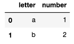
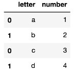
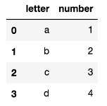
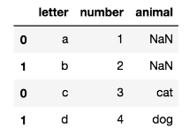
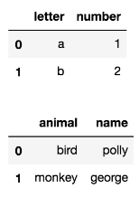
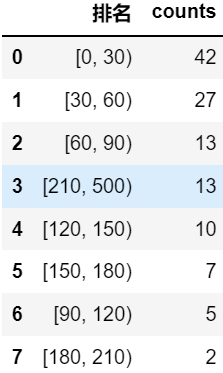

# **开发小笔记**

```python
# -*- coding:utf-8 -*-
"""
Description:
@author: Yaoyk
@date: 2022-06-12
"""
```


## 一、**算法**

### **二分查找**

- 思想：思想:取一个索引开头left,取一个索引末尾(len(队列)-1)right,让你的值跟(left + right)//2(middle)比。如果索引middle值比你查的值大,把middle赋值给right,反之把middle赋值给left。

**（1）该数组，必须是有序：**

1. 二分查找依赖的是**顺序表结构**，即**数组**。
2. 二分查找针对的是有序数据，因此只能用在插入、删除操作不频繁，一次排序多次查找的场景中。

**（2）对数据量大小有要求**：

1. 数据量太小不适合二分查找，与直接遍历相比效率提升不明显。但有一个例外，就是数据之间的比较操作非常费时，比如数组中存储的都是组成长度超过100的字符串。
2. 数据量太大也不适合用二分查找，因为数组需要连续的空间，若数据量太大，往往找不到存储如此大规模数据的连续内存空间。

**（3）一般要求找到的是某一个值或一个位置**


## 二、Jupyter快捷操作


|   Markdown    |         功能          |
| :-----------: | :-------------------: |
|      m/y      |      切换状态栏       |
|     -空格     |       无序列表        |
|    1.空格     |       有序列表        |
| ```python ``` |    插入python代码     |
|  **代码块**   |       **功能**        |
|      dd       |      删除单元格       |
|   L/shift+L   | 切换行号/切换所有行号 |
|    shift+m    |      合并单元格       |
| ctrl+shift+-  |      拆分单元格       |
|      a/b      |      插入单元格       |

### 1. Jupyter Notebook有两种mode

- Enter：进入edit模式
- Esc：进入command模式

### 2. Command命令快捷键：

- A：在上方增加一个cell
- B：在下方增加一个cell
- X：剪切该cell
- C：复制该cell
- V：在该cell下方粘贴复制的cell
- Shift-V：在该cell上方粘贴复制的cell
- L：隐藏、显示当前cell的代码行号
- shift-L：隐藏/显示所有cell的代码行号
- O：隐藏该cell的output
- DD：删除这个cell
- Z：撤销删除操作
- Y：转为code模式
- M：转为markdown模式
- R：转为raw模式
- H：展示快捷键帮助
- Shift-Enter：运行本单元，选中下个单元 新单元默认为command模式
- Ctrl-Enter 运行本单元
- Alt-Enter 运行本单元，在其下插入新单元 新单元默认为edit模式
- OO：重启当前kernal
- II：打断当前kernal的运行
- shift+上/下：向上/下选中多个代码块
- 上/下：向上/下选中代码块
- F：查找替换

### 3. Edit命令快捷键：

- Tab：代码补全
- ctrl]或Tab：缩进（向右）
- ctrl[或shift-Tab：反缩进（向左）
- ctrl A：全选
- ctrl D：删除整行
- ctrl Z：撤销


## 三、**Python** Q&A

### **1. Pandas→mysql**

```markdown
Q: Pandas to Mysql AttributeError: ‘Timestamp‘ object has no attribute ‘translate‘
```

```python
rst['ds'] = rst['ds'].apply(lambda x: x.strftime('%Y-%m-%d %H:%M:%S'))

warn_day_hour['date_day'] = warn_day_hour['date_day'].astype(str)
```


### **2. pandas高级接口--时间(.dt)**

```python
dt.year

dt.month

dt.day

dt.hour

dt.minute

dt.second

dt.week

# (dt.weekofyear和dt.week一样)分别返回日期的年、月、日、小时、分、秒及一年中的第几周
```


### **3. 提取每小时，切片**

```python
for m in range(6,24):
    a=0
    for i in range(len(df)):
        if int(df.iloc[i]['计划时间']**[:2])** == m:
            a+=df.iloc[i]['承载人数']
    print(a)
```


### **4. 去重**

#### （1）去除完全重复的行数据

```python
data.drop_duplicates(inplace=True)
```

#### （2）去除某几列重复的行数据

```python
data.drop_duplicates(subset=['A','B'],keep='first',inplace=True)
```

**subset：** 列名，可选，默认为None

**keep：** {‘first’, ‘last’, False}, 默认值 ‘first’

**first：** 保留第一次出现的重复行，删除后面的重复行。

**last：** 删除重复项，除了最后一次出现。

**False：** 删除所有重复项。

**inplace：**布尔值，默认为False，是否直接在原数据上删除重复项或删除重复项后返回副本。（inplace=True表示直接在原来的DataFrame上删除重复项，而默认值False表示生成一个副本。）

#### （3）去除重复列

```python
df_merge_out_plan_tmp = df_merge_out_plan_tmp.T.drop_duplicates().T
```


### **5. 表关联**

（1）多表

```python
# 4表关联, projid
df_merge = reduce(lambda x, y: pd.merge(x, y, on=['PROJID']), [df_1, df_2, df_3, df_4])  # PROJID*4表
```

（2）两表

```python
df_merge1 = pd.merge(df_1, df_2, how='inner')

pd.merge(df_1,df_2,on=['id','subject_id'])
```


### **6. 删除指定列**

```python
df = df.drop(columns=['date', 'month'])
```

```python
df.drop(df.index[0], inplace=True)    # 删除第1行
df.drop(df.index[0:3], inplace=True)   # 删除前3行
df.drop(df.index[[0, 2]], inplace=True) # 删除第1第3行
```


### **7. 删除空值行**、列

（1）

```python
df_approve_out = df_approve_out[~(df_approve_out['anomaly_style'].isnull())] #删掉空行

df = df.dropna(axis=0)  # 删除有空值的行，使用参数axis=0

df = df.dropna(axis=1) #删除有空值的列，使用参数axis=1
```

（2）

```python
# 删除anomaly_style空值行

unique_anomaly_style = df_approve_out['anomaly_style'].astype(str).unique()

unique_anomaly_style = [i for i in unique_anomaly_style if i != '']

df_approve_out = df_approve_out[df_approve_out['anomaly_style'].isin(unique_anomaly_style)]

df = df.dropna(subset=['name','team'])
```


### **8. 排序**

pandas>>>>>>>>>>>

inplace：是否修改原始DataFrame

当 **inplace = False** 时，返回为修改过的数据，原数据不变。

当 **inplace = True** 时，返回值为 None，直接在原数据上进行操作。


升：

```python
df.sort_values(by='price', inplace=True)
```

降：

```python
df.sort_values(by='price', inplace=True, ascending=False)
```

```python
data.sort_values(by='AdmissionDate')    # 日期升序
```

```python
# python>>>>>>>>>>>>>>

# sort的参数reverse 可以控制排序规则，reverse为True 时是降序， reverse为False时是升序（默认），运行如图所示的程序，进行升序排序。

a.sort(reverse=False)
```


### **9. dataframe为空**

```python
if not df.empty:

# 如果df为空，则 df.empty 返回 True，反之 返回False。

rst = rst.where(rst.notnull(), None)      # 若dataframe有空值，则转换为None写入
```


### **10. 重新索引**

```python
# 不保留原来的索引，drop=True
df = df.reset_index(drop=True)
# 原始数据中某些列有None，报错，加inplace=True
df = df.reset_index(drop=True, inplace=True)
```


### **11. 时间转换**

```python
df['日期'] = pd.to_datetime(df['日期'], format='%Y-%m-%d')  #转化为时间格式
```


### **12. 保留两位**小数

```python
df_merge = df_merge.round({'wait_time': 2}) # 保留两位

df_merge = round(df_merge['wait_time'], 2) # 保留两位
```


### **13. 获取周几**

```python
df = pd.DataFrame(pd.date_range(start='2020-05-01', end='2020-06-05'))

df[1] = df[0].dt.dayofweek + 1

df.head(10)

#########################
# dt的其他常用属性和方法如下：

df['日期'].dt.day   # 提取日期

df['日期'].dt.year # 提取年份

df['日期'].dt.hour # 提取小时

df['日期'].dt.minute # 提取分钟

df['日期'].dt.second # 提取秒

df['日期'].dt.week # 一年中的第几周

df['日期'].dt.weekday # **返回一周中的星期几，0代表星期一，6代表星期天**

df['日期'].dt.dayofyear # 返回一年的第几天

df['日期'].dt.quarter # 得到每个日期分别是第几个季度。

df['日期'].dt.is_month_start # 判断日期是否是每月的第一天

df['日期'].dt.is_month_end # 判断日期是否是每月的最后一天

df['日期'].dt.is_leap_year # 判断是否是闰年

df['日期'].dt.month_name() # 返回月份的英文名称

df['日期'].dt.to_period('Q') # M 表示月份，Q 表示季度，A 表示年度，D 表示按天

df['日期'].dt.weekday_name # 返回星期几的英文 由于pandas版本问题，改变pandas版本在cmd中输入：pip install --upgrade pandas==0.25.3

Series.dt.normalize() # 函数将给定系列对象中的时间转换为午夜。
```


### **14. pop删除函数**

```python
popped_num = t1.pop(0)   

#pop()函数，从列表取出第0个元素将其存储在popped_num，并删除
```


### **15. 空值赋0**

```python
mydf['列名']=mydf['列名'].fillna(0)
```

python中，如何初始化不同的变量类型为空值

| 变量类型 |  空值   |
| :------: | :-----: |
|  字符串  |   “ ”   |
|   数值   | 0或None |
|   列表   |   []    |
|   字典   |   {}    |
|   元组   |   ()    |


```python
# 遇到None

df.isnull() # 查找
```


### 16. 列重命名

#### (1) 部分列重命名

```python
# 部分列重命名
# 没有指定inplace=True， df本身的列名并没有改变。
df.rename(columns={'a': 'A'})
# 原数据会改变
df.rename(columns={'a': 'A'}, inplace=True)
# 通过赋值对新数据列改名
df2 = df.rename(columns={'a': 'A'})
```

#### (2) 全部列重命名

```python
# 全部列重命名，直接改变了原始数据
df.columns = ['a1', 'b1', 'c1', 'd1']
```

#### (3) str 批量修改列名

```python
# str 批量修改列名
df.columns = df.columns.str.replace('1', '2')
```

### 17.1 取整(python)

#### （1）向下取整

向下取整直接用内建的 `int()` 函数即可：

```python
>>> a = 3.75
>>> int(a)
3
```

#### （2）四舍五入

对数字进行四舍五入用 `round()` 函数：

```python
>>> round(3.25); round(4.85)
3.0
5.0
```

#### （3）向上取整

向上取整需要用到 `math` 模块中的 `ceil()` 方法:

```python
>>> import math
>>> math.ceil(3.25)
4.0
>>> math.ceil(3.75)
4.0
>>> math.ceil(4.85)
5.0
```

#### （4）分别取整数部分和小数部分

有时候我们可能需要分别获取整数部分和小数部分，这时可以用 `math` 模块中的 `modf()` 方法，该方法返回一个包含小数部分和整数部分的元组：

```python
>>> import math
>>> math.modf(3.25)
(0.25, 3.0)
>>> math.modf(3.75)
(0.75, 3.0)
>>> math.modf(4.2)
(0.20000000000000018, 4.0)
```

### 17.2 取整(pandas)

#### (1)将数值四舍五入到N位小数

```python
df['a'].round(N)
```

#### (2)向上舍入

```python
np.ceil(df['a'])

df['a'].apply(np.ceil)
```

#### (3)向下舍入

```python
df['a'].apply(np.floor)
```

#### (4)四舍五入到最接近的千位数

```python
# pandas round()方法实际上允许输入负数。负输入指定小数点左侧的位置数。例如：
# 四舍五入（小数=-1）：四舍五入到最接近的十
# 四舍五入（小数=-2）：四舍五入到最接近的百位数

# 要四舍五入到最接近的千位数，只需设置decimals=-3
df['a'].round(-3)
```

#### (5)用不同的条件对数据框架进行取整

```python
# round()方法中的decimals参数可以是整数值，也可以是字典。这使得同时对多个列进行取整变得容易。

# 可以将第一列四舍五入到2位小数，并将第二列四舍五入到最接近的千位

df.round({'a':2, 'b':-3})
```

### 18. 输出excel

#### (1) 输出单个sheet

```python
import pandas as pd
 
df = pd.DataFrame({
    '销量': [10, 20],
    '售价': [100.123, None],
}, index=['aaa', 'bbb'])
df.index.name = '货号'
df.to_excel('tb.xlsx',            # 路径和文件名
            sheet_name='tb1',     # sheet 的名字
            float_format='%.2f',  # 保留两位小数
            na_rep='我是空值')     # 空值的显示
```

#### (2)不输出 index

```python
df.to_excel('tb.xlsx', index=False)
```

#### (3)输出多个sheet, 并设置输出的日期格式 (不输出时分秒)

```python
import pandas as pd
from datetime import datetime
 
df1 = pd.DataFrame(
    {'日期': [datetime(2020, 1, 1), datetime(2020, 1, 2)],
     '销量': [10, 20]}
)
 
df2 = pd.DataFrame(
    {'日期': [datetime(2020, 2, 1), datetime(2020, 2, 2)],
     '销量': [15, 25]}
)
 
with pd.ExcelWriter(
    'tb.xlsx',
    datetime_format='YYYY-MM-DD'  # 只显示年月日, 不显示时分秒
) as writer:
    df1.to_excel(writer, sheet_name='1月')  # Sheet1
    df2.to_excel(writer, sheet_name='2月')  # Sheet2
```

### 19. 分组

(1)求平均

```python
df_time_servicet = df_tmp_servicet.groupby(['DSC_CITY', 'DSC_ADM_REGION', 'HANDER_DEPTNAME', 'SERVICENAME', 'banjie_month', 'INFOTYPE'], as_index=False)['time_limit'].mean()
```

(2)统计

```python
df_node_num_region = df_node_tmp_region.groupby(['PROJID', 'DSC_CITY', 'DSC_ADM_REGION', 'banjie_month'], as_index=False)['NODE_NAME'].count()
```

```markdown
by：用于确定 groupby 的组。 如果 by 是一个函数，它会在对象索引的每个值上调用。 如果传递了 dict 或 Series，则 Series 或 dict VALUES 将用于确定组（Series 的值首先对齐；参见 .align() 方法）。 如果传递了长度等于所选轴的列表或 ndarray，则按原样使用这些值来确定组。 一个标签或标签列表可以通过 self 中的列传递给 group。 请注意，元组被解释为（单个）键。

axis：沿行 (0) 或列 (1) 拆分。

level：如果轴是MultiIndex(层次化)，则按一个或多个特定级别进行分组。

as_index：对于聚合输出，返回具有组标签作为索引的对象。仅与DataFrame输入相关。as index=False是有效的sql风格的分组输出。

sort：对组键进行排序。 关闭此功能可获得更好的性能。 请注意，这不会影响每组内的观察顺序。 Groupby 保留每个组内的行顺序。

group_keys：当调用apply时，将组键添加到index以识别片段。

squeeze：如果可能，降低返回类型的维数，否则返回一致的类型。

observed：这仅适用于任何 groupers 是分类的。 如果为真：仅显示分类分组的观察值。 如果为 False：显示分类分组的所有值。

dropna：如果为 True，并且组键包含 NA 值，则 NA 值连同行/列将被删除。 如果为 False，NA 值也将被视为组中的键。
```


### 20. 合并

```python
# 初始化两个DataFrame对象
df1 = pd.DataFrame([['a', 1], ['b', 2]],
                columns=['letter', 'number'])

df2 = pd.DataFrame([['c', 3], ['d', 4]],
                  columns=['letter', 'number'])

display(df1)
display(df2)
```




#### （1）纵向连接DataFrame对象

##### 	a. 两个DataFrame对象的列完全相同

```python
# 合并对象
pd.concat([df1, df2])
```

concat默认纵向连接DataFrame对象， 并且合并之后不改变每个DataFrame子对象的index值， 合并之后的DataFrame中index的值0和1重复了两次



```python
# 如果希望重新设置合并之后的DataFrame对象的index值， 可以添加ignore_index=True参数：
pd.concat([df1, df2], ignore_index=True)
```



##### b. 两个DataFrame对象的列不完全相同

```python
# 初始化DataFrame对象
df1 = pd.DataFrame([['a', 1], ['b', 2]],
                columns=['letter', 'number'])

df3 = pd.DataFrame([['c', 3, 'cat'], ['d', 4, 'dog']],
                  columns=['letter', 'number', 'animal'])

display(df1)
display(df3)


# df1中没有animal列， 所以在合并之后的DataFrame对象里， 所对应的元素都被设置成了NaN
```


```python
# 合并对象
pd.concat([df1, df3], sort=False)  # sort=False : 列的顺序维持原样， 不进行重新排序。
```



df1中没有animal列， 所以在合并之后的DataFrame对象里， 所对应的元素都被设置成了NaN。

如果只想合并相同的列， 我们可以添加上join='inner'参数：

```python
pd.concat([df1, df3], join='inner')
```


#### （2）横向合并DataFrame对象

通过设置axis=1, 可以横向合并两个DataFrame对象

```python
# 初始化DataFrame对象
df1 = pd.DataFrame([['a', 1], ['b', 2]],
                columns=['letter', 'number'])

df4 = pd.DataFrame([['bird', 'polly'], ['monkey', 'george']],
                  columns=['animal', 'name'])

display(df1)
display(df4)
```



```python
# 合并对象
pd.concat([df1, df4], axis=1)
```


### 21. .isin()

#### (1) 直接根据条件进行索引

​	isin()接受一个列表，判断该列中元素是否在列表中。

```python
import numpy as np
import pandas as pd
df=pd.DataFrame(np.random.randn(4,4),columns=['A','B','C','D'])
df
Out[189]: 
          A         B         C         D
0  0.289595  0.202207 -0.850390  0.197016
1  0.403254 -1.287074  0.916361  0.055136
2 -0.359261 -1.266615 -0.733625 -0.790208
3  0.164862 -0.649637  0.716620  1.447703
df['E'] = ['aa', 'bb', 'cc', 'cc']
df
Out[191]: 
          A         B         C         D   E
0  0.289595  0.202207 -0.850390  0.197016  aa
1  0.403254 -1.287074  0.916361  0.055136  bb
2 -0.359261 -1.266615 -0.733625 -0.790208  cc
3  0.164862 -0.649637  0.716620  1.447703  cc
df.E.isin(['aa','cc'])
Out[192]: 
0     True
1    False
2     True
3     True
Name: E, dtype: bool
df[df.E.isin(['aa','cc'])]
Out[193]: 
          A         B         C         D   E
0  0.289595  0.202207 -0.850390  0.197016  aa
2 -0.359261 -1.266615 -0.733625 -0.790208  cc
3  0.164862 -0.649637  0.716620  1.447703  cc

```

#### (2) 根据多条件进行索引

​	此时用&（交集）或者|（并集）进行连接

```python
df[df.E.isin(['aa'])|df.E.isin(['cc'])]
Out[194]: 
          A         B         C         D   E
0  0.289595  0.202207 -0.850390  0.197016  aa
2 -0.359261 -1.266615 -0.733625 -0.790208  cc
3  0.164862 -0.649637  0.716620  1.447703  cc
df[df.E.isin(['aa'])]
Out[195]: 
          A         B        C         D   E
0  0.289595  0.202207 -0.85039  0.197016  aa
```

#### (3) 通过字典的形式传递多个条件

```python
{‘某列’:[条件],‘某列’:[条件],}
```

```python
df['D'] = [1,2,3,4]
df[df.isin({'D':[0,3],'E':['aa','cc']})]
Out[200]: 
    A   B   C    D    E
0 NaN NaN NaN  NaN   aa
1 NaN NaN NaN  NaN  NaN
2 NaN NaN NaN  3.0   cc
3 NaN NaN NaN  NaN   cc

```

#### (4)~相当于is not in

```python
df[~(df.E=='cc')]
Out[202]: 
          A         B         C  D   E
0  0.289595  0.202207 -0.850390  1  aa
1  0.403254 -1.287074  0.916361  2  bb
```

### 22. 列表去空

```python
mytest = [i for i in test if i != '']
```

### 23. value_counts

```
value_counts = df_1['SERVICENAME'].value_counts()
```


```python
df_rank['排名'].value_counts().rename_axis('排名').reset_index(name='counts')
```



### 24. apply()

```python
new_df = df[len(df['Title'].split(" "))>=4]
```

```python
# create a new column
df['num_words_title'] = df.apply(lambda x : len(x['Title'].split(" ")),axis=1)
# simple filter on new column
new_df = df[df['num_words_title']>=4]
```

```python
new_df = df[df.apply(lambda x : len(x['Title'].split(" "))>=4,axis=1)]
```


## 四、**MySQL**

### **1.判断周几**

```mysql
select if(dayofweek(curdate()) = 1,7,dayofweek(curdate()) -1);
```

### 2. 查询近x天/周/月/季/年

```mysql
# 今天
select * from 表名 where to_days(时间字段名) = to_days(now());

# 昨天
SELECT * FROM 表名 WHERE TO_DAYS( NOW( ) ) - TO_DAYS(时间字段名) <= 1;

#7天
SELECT * FROM 表名 where DATE_SUB(CURDATE(), INTERVAL 7 DAY) <= date(时间字段名);

#近30天
SELECT * FROM 表名 where DATE_SUB(CURDATE(), INTERVAL 30 DAY) <= date(时间字段名);

#本月
SELECT * FROM 表名 WHERE DATE_FORMAT( 时间字段名, '%Y%m' ) = DATE_FORMAT( CURDATE( ) , '%Y%m' );

#上一月
SELECT * FROM 表名 WHERE PERIOD_DIFF( date_format( now( ) , '%Y%m' ) , date_format( 时间字段名, '%Y%m' ) ) =1;

#查询本季度数据
select * from `ht_invoice_information` where QUARTER(create_date)=QUARTER(now());

#查询上季度数据
select * from `ht_invoice_information` where QUARTER(create_date)=QUARTER(DATE_SUB(now(),interval 1 QUARTER));

#查询本年数据
select * from `ht_invoice_information` where YEAR(create_date)=YEAR(NOW());

#查询上年数据
select * from `ht_invoice_information` where year(create_date)=year(date_sub(now(),interval 1 year));

#查询当前这周的数据

SELECT name,submittime FROM enterprise WHERE YEARWEEK(date_format(submittime,'%Y-%m-%d')) = YEARWEEK(now());

#查询上周的数据
SELECT name,submittime FROM enterprise WHERE YEARWEEK(date_format(submittime,'%Y-%m-%d')) = YEARWEEK(now())-1;

#查询当前月份的数据
select name,submittime from enterprise   where date_format(submittime,'%Y-%m')=date_format(now(),'%Y-%m');

#查询距离当前现在6个月的数据

select name,submittime from enterprise where submittime between date_sub(now(),interval 6 month) and now();

#查询上个月的数据
select name,submittime from enterprise   where date_format(submittime,'%Y-%m')=date_format(DATE_SUB(curdate(), INTERVAL 1 MONTH),'%Y-%m');

select * from ` user ` where DATE_FORMAT(pudate, ' %Y%m ' ) = DATE_FORMAT(CURDATE(), ' %Y%m ' ) ;

select * from user where WEEKOFYEAR(FROM_UNIXTIME(pudate,'%y-%m-%d')) = WEEKOFYEAR(now());

select * 
from user 
where MONTH (FROM_UNIXTIME(pudate, ' %y-%m-%d ' )) = MONTH (now());

select * 
from [ user ] 
where YEAR (FROM_UNIXTIME(pudate, ' %y-%m-%d ' )) = YEAR (now())
and MONTH (FROM_UNIXTIME(pudate, ' %y-%m-%d ' )) = MONTH (now());

select * 
from [ user ] 
where pudate between 上月最后一天
and 下月第一天
where   date(regdate)   =   curdate();


select   *   from   test   where   year(regdate)=year(now())   and   month(regdate)=month(now())   and   day(regdate)=day(now());

SELECT date( c_instime ) ,curdate( )
FROM `t_score`
WHERE 1
LIMIT 0 , 30;
```

### 3、建表

```sql
-- y_test.qlt_qlsx definition

CREATE TABLE `qlt_qlsx` (
  `ROWGUID` varchar(50) NOT NULL COMMENT '权力唯一标识',
  `UPDATE_DATE` datetime NOT NULL COMMENT '写入同步时间',
  `UPDATE_TYPE` varchar(1) NOT NULL COMMENT '权力更新类型',
  `QL_KIND` varchar(2) NOT NULL COMMENT '权力事项类型',
  `QL_ATT` varchar(2) DEFAULT NULL COMMENT '权力属性',
  `UNUnifyDo_Other` varchar(1) DEFAULT NULL COMMENT '不接入统一办件库其他原因',
  `IsHasOwnFlow` varchar(2) DEFAULT NULL COMMENT '是否个性化流程（仅用于乡镇延伸事项）',
  `bszn_url` varchar(150) DEFAULT NULL COMMENT '办事指南URL',
  `NoSuit_ReasonDesc` text COMMENT '不适宜网上申报原因描述',
  `business_regulate` text COMMENT '业务审查规范',
  PRIMARY KEY (`tongID`,`ROWGUID`,`UPDATE_DATE`) USING BTREE,
  KEY `tongID_index` (`tongID`) USING BTREE,
  KEY `ROWGUID_index` (`ROWGUID`) USING BTREE,
  KEY `UPDATE_DATE_index` (`UPDATE_DATE`) USING BTREE,
  KEY `qlt_qlsx_index` (`tongID`,`ROWGUID`,`UPDATE_DATE`) USING BTREE,
  KEY `QL_INNER_CODE_index` (`QL_INNER_CODE`) USING BTREE,
  KEY `ql_kind_index` (`QL_KIND`,`QL_MAINITEM_ID`,`QL_SUBITEM_ID`) USING BTREE
) ENGINE=InnoDB DEFAULT CHARSET=utf8 ROW_FORMAT=COMPRESSED KEY_BLOCK_SIZE=8 COMMENT='权力信息发布表';
```


## 五、**Linux**

### 1. 查看行号

```shell
set nu

set number
```

### 2. 搜索关键字

vim工具

```markdown
1、进入vi中，编辑模式中先按下键盘上"esc"跳转成命令输入模式

2、输入斜杠"/"，这时屏幕会跳转到底部，输入栏出现"/"

3、输入你需要查找的关键字，回车键

4、如果要继续查找下一个关键字，输入n

5、查找上一个关键字，输入N（大写）

```


## 六、windows

### 1. 查看文件前几行

在Window10的[PowerShell](https://so.csdn.net/so/search?q=PowerShell&spm=1001.2101.3001.7020)里，使用 type XXX|Select -First n 表示查找XXX文件的前n条记录，而 type XXX|Select -Last n 表示查找XXX文件的最后n条记录。

#### （1）统计的文件的总行数

```markdown
cmd
find /V "" /C FileList.txt
```


#### (2)查看文件的前10行

```markdown
powershell
type FileList.txt|Select -First 10
```


#### (3)查看文件的最后10行

```markdown
powershell
type FileList.txt|Select -Last 10
```


## 七、ERROR

1. AssertionError: 3 columns passed, passed data had 4 columns

```markdown
使用pandas.DataFrame构造函数时每个子列表被解释为一行的事实
```

2. AttributeError: ‘NoneType‘ object has no attribute ‘reset_index‘

```python
# 原始
df.sort_values(['datatime'],inplace=True).reset_index(drop=True）
```

```python
# 修改后
df.sort_values(['datatime'],inplace=True)
df.reset_index(drop=True，inplace=True）
```

3. not all arguments converted during string formatting,not all arguments converted during string formatting

检查mysql “%s”数量是否对应；检查功能函数返回值的字段数是否对应

## 八、XML转JSON

```python
#	将python对象编码成Json字符串
#   json库dumps()是将dict转化成json格式,loads()是将json转化成dict格式。
#   dumps()方法的ident=1,格式化json
parser_data = xmltodict.parse(xml_file)
json_conversion = json.dumps(parser_data, indent=4, ensure_ascii=False)
json_conversion = json_conversion.replace("null", "''")
```

### 九、数学符号

```markdown
Α α：阿尔法 Alpha。

Β β：贝塔 Beta。

Γ γ：伽玛 Gamma。

Δ δ：德尔塔 Delte 。

Ε ε：艾普西龙 Epsilon。

Ζ ζ  ：捷塔 Zeta。

Ε η：依塔 Eta。

Θ θ：西塔 Theta。

Ι ι：艾欧塔 Iota。

Κ κ：喀帕 Kappa。

∧ λ：拉姆达 Lambda。

Μ μ：缪 Mu。

Ν ν：拗 Nu。

Ξ ξ：克西 Xi。

Ο ο：欧麦克轮 Omicron。

∏ π：派 Pi。

Ρ ρ：柔 Rho。

∑ σ：西格玛 Sigma。

Τ τ：套 Tau。

Υ υ：宇普西龙 Upsilon。

Φ φ：fai Phi。

Χ χ：器 Chi。

Ψ ψ：普赛 Psi。

Ω ω：欧米伽 Omega。
```

